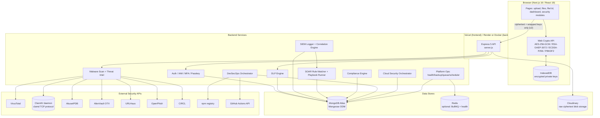
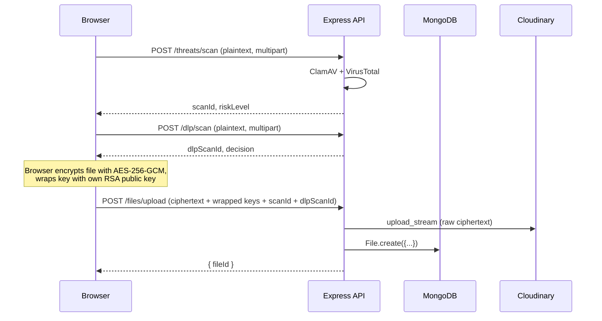
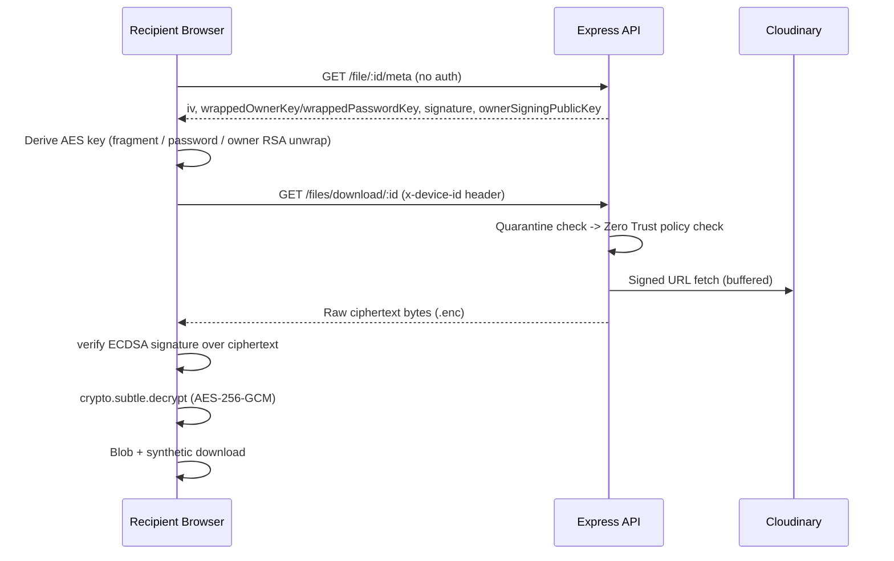

# SecureShare — Complete Project Explanation & Interview Guide

> This document is written so you (the person who built this) can explain every
> subsystem in an interview with precision — what happens internally, why each
> technology/algorithm/pattern was chosen, what happens on failure, and what the
> honest trade-offs and limitations are. Every claim below is grounded in the
> actual source code in this repository (file paths and function names are
> cited throughout). Where the implementation is a deliberate simplification,
> a stub, or has a known gap, that is called out explicitly and honestly —
> that honesty is itself a strength in an interview: it shows you understand
> the difference between "demo-real" and "production-real," and you can speak
> to exactly what would need to change to go from one to the other.

## Table of Contents

1. [Project Overview](#chapter-1-project-overview)
2. [Complete Architecture](#chapter-2-complete-architecture)
3. [Project Structure](#chapter-3-project-structure)
4. [Authentication](#chapter-4-authentication)
5. [Zero-Knowledge Encryption](#chapter-5-zero-knowledge-encryption)
6. [Upload Flow](#chapter-6-upload-flow)
7. [Download Flow](#chapter-7-download-flow)
8. [Every Feature](#chapter-8-every-feature)
9. [Database](#chapter-9-database)
10. [Frontend](#chapter-10-frontend)
11. [Backend](#chapter-11-backend)
12. [Security](#chapter-12-security)
13. [API Walkthrough](#chapter-13-api-walkthrough)
14. [Interview Preparation (200 Q&A)](#chapter-14-interview-preparation)
15. [Code Walkthrough](#chapter-15-code-walkthrough)
16. [Architecture Decisions](#chapter-16-architecture-decisions)
17. [Deployment](#chapter-17-deployment)
18. [Improvements](#chapter-18-improvements)

---

## Chapter 1: Project Overview

### 1.1 What problem SecureShare solves

SecureShare is a **zero-knowledge, security-instrumented file-sharing platform**.
Strip away the enterprise-security modules for a moment and the core product is
simple: a user uploads a file, gets a share link, and a recipient downloads it —
with an expiry, a download limit, and optionally a password. That core loop is
implemented twice in this codebase (`File.encryptionVersion` 1 and 2), and the
difference between those two versions *is* the thesis of the project:

- **v1 (legacy)**: the server encrypts the file with a **single, global RSA
  keypair** (`backend/generateKeys.js`, `backend/keys/{public,private}.pem`).
  The server generates the AES key, the server holds the private key, the
  server can decrypt any file. This is "encryption at rest," not zero-knowledge.
- **v2 (current)**: the browser generates the AES key, encrypts the file with
  Web Crypto (`frontend/lib/crypto/fileEncryption.ts`), and only ever sends
  **ciphertext plus wrapped keys** to the server. The server's own RSA
  keypair is irrelevant to v2 — each *user* has their own per-account RSA
  keypair (`frontend/lib/crypto/rsa.ts`), generated in the browser, whose
  private half never leaves IndexedDB. The server cannot decrypt a v2 file
  even if compromised, subpoenaed, or careless — because it never had the key.

That is the actual problem SecureShare solves: **most consumer/enterprise file
sharing tools (Google Drive, Dropbox, WeTransfer, SharePoint) encrypt data at
rest and in transit, but the *provider* holds the keys.** A cloud provider
breach, a subpoena, an insider, or a misconfigured bucket permission all expose
plaintext, because the provider *can* decrypt. SecureShare's v2 architecture
removes that capability from the server by design — the value proposition is
"we (the platform operator) cannot read your files even if we wanted to, even
under legal compulsion, even if our database and Cloudinary account are fully
breached" — because the AES file key only ever exists in plaintext inside a
user's own browser memory.

On top of that zero-knowledge core, the project layers a genuinely large set
of enterprise security-operations tooling — malware scanning, DLP, SIEM/SOAR
automation, threat intelligence, compliance, DevSecOps, cloud security posture
management, identity/adaptive-auth, and platform operations. Chapter 8 covers
each in depth. The unifying design idea across all of them (documented
explicitly in code comments across `services/compliance`, `services/devsecops`,
and `services/cloud`) is: **since this project has no real multi-tenant
customer footprint (no external AWS account, no external GitHub org to scan),
every "enterprise security tool" module honestly scans *this application
itself*** — its own git history, its own `server.js` config, its own
`docker-compose.yml`, its own database state — rather than faking a scan of
some pretend customer environment. That is a deliberate and defensible design
choice worth explaining directly if asked: "is this real or a mock?" The
honest answer, subsystem by subsystem, is in Chapter 8.

### 1.2 Why this was built

Beyond the "provider can't read your files" pitch, this project was built to
demonstrate — in a single, coherent codebase — the full breadth of what an
enterprise security engineering team actually owns in a modern SaaS company:
identity and access management, cryptographic engineering, secure file
handling, detection engineering (SIEM), automated response (SOAR), data loss
prevention, threat intelligence integration, compliance automation, supply
chain security (DevSecOps/SBOM), cloud security posture management, and
platform reliability operations (health checks, backups, metrics, job queues).
Most portfolio projects pick one of these. SecureShare's scope is to show how
they compose: a single `SecurityEvent` stream (Chapter 8.3) feeds a
correlation engine, which feeds a SOAR automation engine, which acts on files,
sessions, devices, and compliance controls — the same event bus that logs a
login failure also logs a malware detection, a DLP violation, and a compliance
control regression.

### 1.3 Existing solutions and their limitations

| Product | What it protects against | What it does **not** protect against |
|---|---|---|
| Google Drive / Dropbox / OneDrive | Data in transit (TLS), data at rest on disk (server-side encryption) | Provider access — Google/Dropbox/Microsoft hold the keys and can (and under legal process, must) decrypt your data |
| WeTransfer / SendAnywhere | Simple, low-friction sharing | No malware scanning, no DLP, no zero-knowledge — plaintext sits on their servers |
| Enterprise DLP suites (Symantec DLP, Microsoft Purview) | Sensitive-data detection at the perimeter | Usually bolted onto existing storage that the vendor/IT can still decrypt; heavyweight, siloed from a SIEM/SOAR loop |
| Standalone SIEM (Splunk) / SOAR (Palo Alto XSOAR) | Detection and automated response | Not integrated with the actual file storage layer — a separate product, separate data model, separate team |

SecureShare's differentiation is architectural, not just feature-count: the
zero-knowledge encryption boundary is enforced at the point of upload/download
(client-side crypto), and the security-operations tooling (SIEM/SOAR/DLP/threat
intel) is wired directly into that same file lifecycle, not bolted on as a
separate product.

### 1.4 Enterprise use cases

- **Regulated data exchange** (legal, healthcare, fintech) where the sender
  needs cryptographic proof the platform operator never had access to
  plaintext — relevant to GDPR Article 32, HIPAA's technical safeguards, and
  SOC 2's confidentiality criteria (all of which are literally modeled in
  `backend/services/compliance/seedFrameworks.js`).
- **Whistleblower / sensitive-document intake** where DLP (Chapter 8.2) flags
  accidental inclusion of credentials or PII before a file is even encrypted,
  and malware scanning protects the recipient.
- **Internal security operations demonstration**: the SIEM/SOAR/compliance/
  DevSecOps/cloud modules double as a live demonstration of a security
  program's instrumentation — useful in an interview as "I built the thing a
  security engineering team would use to monitor itself," not just "I built a
  file uploader."

---

## Chapter 2: Complete Architecture

### 2.1 High-level system diagram



### 2.2 Frontend architecture

Next.js 16 App Router (`frontend/app/**/page.tsx`), React 19, Tailwind CSS v4,
shadcn/ui primitives (`frontend/components/ui/`) plus a hand-built design
system layer (`frontend/components/design/`: `DataTable`, `StatCard`,
`SecurityScoreGauge`, `ProgressTimeline`, etc.). State management is
deliberately simple: **no Redux/Zustand/React Query** — every page uses plain
`useState`/`useEffect`/`useMemo`/`useCallback` and calls `axios` directly. The
one piece of genuinely global state is cryptographic: `CryptoKeyContext`
(`frontend/context/CryptoKeyContext.tsx`) holds the unlocked in-memory RSA/ECDSA
private keys for the session, and `useRole()` (`frontend/hooks/useRole.ts`)
derives RBAC state from the JWT for UI gating.

There is no `middleware.ts` — route protection is 100% client-side, per page,
via either an inline `useEffect` token check or the `RequireRole` component
(`frontend/components/rbac/RoleGuard.tsx`) for admin-tier pages. This is a
conscious architectural trade-off explained in Chapter 16: since the *real*
authorization boundary is the backend (`requireAdmin`/`requireRole`
middleware, which re-check the database on every request rather than trusting
the JWT), client-side route gating only needs to be UX-good, not
security-critical — a forged/stale role claim can hide/show a button, but can
never grant a real backend capability.

### 2.3 Backend architecture

Express 5 (`backend/server.js`) with ~19 route modules, each pairing one
`controllers/*.controller.js` (thin HTTP layer: parse request, call service,
shape response) with one or more `services/**/*.js` (business logic, pure
where possible) and one or more `models/*.js` (Mongoose schemas). The design
language repeats deliberately across the "Phase 10/11/12" domains (Compliance/
Cloud/DevSecOps): one **orchestrator** function per domain
(`runAssessment`/`runCloudScan`/`runDevSecOpsScan`), one **unified finding
model** per domain (`ComplianceAssessment`/`CloudFinding`/`DevSecOpsFinding`),
and one **report generator** per domain producing CSV/JSON/PDF via `pdfkit` —
this consistency is intentional and documented in code comments as mirroring
an earlier phase's convention.

Every security-relevant action funnels through one function:
`logSecurityEvent()` (`backend/services/siem/siemLogger.js`) — this is the
event bus. It persists a `SecurityEvent`, runs correlation
(`services/siem/correlationEngine.js`), and fires SOAR
(`services/soar/soarEngine.js`) without blocking the HTTP response.

### 2.4 Database architecture

MongoDB (Mongoose ODM). There is no separate relational store, no separate
search index, no separate time-series database — MongoDB is used for
transactional data (`User`, `File`, `Session`), append-only event logs
(`SecurityEvent`, `ComplianceAssessment` history), and periodic snapshots
(`PlatformMetricSnapshot`, `PlatformHealthSnapshot`, `SecurityScoreSnapshot`,
`DevSecOpsScoreSnapshot`) alike. Chapter 9 documents every model.

### 2.5 Storage architecture

File **ciphertext** (never plaintext, for v2) is stored in Cloudinary as a
`resource_type: "raw"` blob via `cloudinary.uploader.upload_stream`
(`backend/utils/cloudinary.js`, called from `file.controller.js`). No local
disk storage is used for uploaded files in the current architecture (the
`backend/cron/cleanup.js` job's local-disk-deletion branch is dead code — see
Chapter 6.6). Server-side backups (`backend/services/platform/backupManager.js`)
write real ZIP archives to local disk (`backups/` directory) — a genuinely
different, unrelated storage path used only for database/config backups, not
user files.

### 2.6 Security architecture

Layered, not monolithic:

1. **Transport**: HTTPS (terminated by Vercel/Render/reverse proxy — not
   configured inside the Node process itself).
2. **Application-layer crypto**: AES-256-GCM + RSA-OAEP-3072 + ECDSA-P256,
   entirely client-side for v2 (Chapter 5).
3. **AuthN/AuthZ**: JWT + session revocation table + RBAC re-checked against
   the DB on every privileged request (Chapter 4).
4. **Content security**: malware scanning (ClamAV + VirusTotal) and DLP
   (19 regex/heuristic detectors) at upload time (Chapter 6).
5. **Zero Trust**: per-file access policy (`File.policy`: country/IP/device/
   business-hours/approval restrictions), evaluated on every download
   (Chapter 7).
6. **Detection & response**: SIEM correlation + SOAR automated playbooks
   (Chapter 8.3).
7. **Governance**: compliance framework automation, DevSecOps supply-chain
   scanning, cloud security posture scanning (Chapter 8.4–8.6).

Honest gap, stated plainly for interview credibility: **the Express app itself
does not use `helmet`**, and CORS is configured with no origin restriction
(`cors()` with no options, `server.js`). Ironically, the platform's own
`configScanner.js` (Cloud Security module) would flag "no helmet" as a finding
if it scanned this app the way it self-scans other config — see Chapter 12 and
Chapter 18 for the fix.

### 2.7 Cloud architecture

Two deployment paths exist in the repo:

- **Docker Compose** (coherent, working): `docker-compose.yml` builds the
  backend image and runs `mongo:7` alongside it; `backend/Dockerfile` is a
  non-root, two-stage build with a real `HEALTHCHECK` against `/api/health`.
- **Vercel serverless** (`backend/vercel.json` + `backend/api/index.js`): this
  path is **currently broken** — `api/index.js` imports `../app.js`, which
  does not exist in the repository, and `server.js` never exports an Express
  `app` (it calls `app.listen()` directly). This is worth being upfront about
  if asked about deployment: the Docker/Render path is the one that
  demonstrably works today.

The frontend deploys to Vercel independently of the backend.

### 2.8 Communication between frontend and backend

Plain REST over JSON (`axios`, `frontend/lib/api.js` — a bare
`axios.create({baseURL})` with **no interceptors**; every page manually attaches
`Authorization: Bearer <token>` from `localStorage`). One exception: file
ciphertext download (`frontend/app/file/[id]/page.tsx`) uses native `fetch()`
directly for binary-safe `ArrayBuffer` handling.



### 2.9 Communication with MongoDB

Mongoose connects once at boot (`server.js`, async, chained to seeding of
default frameworks/playbooks and startup scans). No connection pooling
configuration is overridden — Mongoose's defaults apply. Every model file
declares its own indexes (see Chapter 9).

### 2.10 Communication with Cloudinary

`backend/utils/cloudinary.js` configures the SDK once from
`CLOUDINARY_CLOUD_NAME/API_KEY/API_SECRET`. Uploads use
`cloudinary.uploader.upload_stream({resource_type:"raw"}, cb)` piped from a
`streamifier` readable stream built from the in-memory ciphertext buffer.
Downloads fetch via a **signed URL**
(`cloudinary.url(id, {resource_type:"raw", secure:true, sign_url:true})`) and a
raw `https.get`, buffered fully server-side before forwarding to the client —
not a true stream-through-proxy.

### 2.11 Communication with ClamAV

`backend/services/clamavScanner.js` speaks the **clamd INSTREAM protocol**
directly over a raw TCP `net.Socket` — no CLI shell-out, no npm wrapper
library. It chunks the buffer into 64KB pieces, each prefixed by a 4-byte
big-endian length, terminated by a zero-length chunk, per the clamd wire
protocol. Connect timeout 3000ms, scan timeout 15000ms. Any transport failure
degrades to `status: "unavailable"` rather than failing the upload — a
deliberate graceful-degradation choice (Chapter 6.3).

---

## Chapter 3: Project Structure

```
SecureShare/
├── backend/
│   ├── server.js                 # Express app entrypoint, middleware order, route mounts
│   ├── api/index.js              # Broken Vercel serverless entrypoint (imports nonexistent app.js)
│   ├── generateKeys.js           # One-time script: generates the legacy global v1 RSA keypair
│   ├── keys/{public,private}.pem # The legacy v1 server RSA keypair
│   ├── controllers/              # HTTP layer — one file per domain, thin, calls services
│   ├── routes/                   # Express routers — wire middleware (auth/requireAdmin/requireRole) to controllers
│   ├── middleware/                # auth.middleware, requireAdmin, requireRole, rateLimit, redisClient, metrics, requestContext
│   ├── models/                   # Mongoose schemas — ~45 models across every domain
│   ├── services/
│   │   ├── iam/                  # login risk scoring, TOTP, recovery codes, session issuance, network intel
│   │   ├── dlp/                  # DLP engine, 19 detectors, confidence engine, masking
│   │   ├── siem/                 # event catalog, siemLogger, correlationEngine
│   │   ├── soar/                 # ruleMatcher, playbookRunner, soarEngine, 22 actions
│   │   ├── threatIntel/          # YARA-like engine, MITRE mapping, 6 real provider integrations
│   │   ├── compliance/           # 8 seeded frameworks, control evaluators, evidence, risk scoring, reports
│   │   ├── devsecops/            # repo/dependency/secret/SAST/container/IaC/pipeline scanners, SBOM generator
│   │   ├── cloud/                # asset discovery, config scanner, attack surface, cert monitor, score engine
│   │   └── platform/             # health checker, metrics collector, queue (BullMQ), scheduler, backup manager, alerts
│   ├── utils/                    # cloudinary config, fileHashes, magicBytes, geoLookup, getClientIp, legacy encrypt/decrypt
│   ├── cron/cleanup.js           # hourly expired-file sweep (has a real gap — see Ch.6.6)
│   └── tests/                    # Jest-style tests per subsystem (dlp, iam, soar, cloud, compliance, devsecops, threatIntel)
│
├── frontend/
│   ├── app/                      # Next.js App Router pages (dashboard, upload, files, file/[id], soar, security, ...)
│   ├── components/
│   │   ├── ui/                   # shadcn primitives
│   │   ├── design/               # hand-built design system (DataTable, StatCard, SecurityScoreGauge, ...)
│   │   ├── rbac/RoleGuard.tsx     # RoleGuard / AdminOnly / RequireRole
│   │   └── shell/                 # AppShell, SidebarNav, Topbar, navItems.ts
│   ├── lib/
│   │   ├── crypto/                # aes, rsa, ecdsa, pbkdf2, fileEncryption, signature, keyStorage, hash, base64
│   │   ├── api.js                 # bare axios instance, no interceptors
│   │   ├── auth.ts                # decodeJwtPayload, getRoleFromToken (display-only, never trusted)
│   │   └── errors.ts              # apiErrorMessage/Status/Code normalization
│   ├── hooks/useRole.ts           # single source of truth for frontend RBAC state
│   └── context/                   # CryptoKeyContext (unlocked private keys), ThemeContext
│
└── docker-compose.yml, backend/Dockerfile   # the one coherent deployment path
```

Files communicate through two channels only: **HTTP/JSON** (frontend ↔
backend) and **direct function calls within a process** (controller → service
→ model, all in the same Node process — there is no internal microservice
network). The one asynchronous, decoupled channel inside the backend itself is
the SIEM event bus: any service can call `logSecurityEvent(...)` without
knowing or caring what (if anything) correlates or automates on it — that
decoupling is what let the SOAR/compliance/cloud/DevSecOps subsystems be added
in later "phases" without modifying the code that emits events.

---

## Chapter 4: Authentication

### 4.1 Registration

**`POST /api/auth/register`** → `backend/routes/auth.routes.js` →
`register()` in `backend/controllers/auth.controller.js:25-75`.

1. Destructure `{name, email, password, publicKey, signingPublicKey}`. The
   last two are the client-generated E2E public keys (Chapter 5) — sent at
   registration time so a brand-new account already has crypto material.
2. Presence-validate `name/email/password` (400 if missing) — **there is no
   email-format regex validation**, only presence + `toLowerCase().trim()`
   normalization.
3. Load the global `SecurityPolicy` (cached in-process, 15s TTL) and run
   `evaluatePasswordPolicy(policy, password)`
   (`backend/services/iam/policyEngine.js:69-84`): minimum length (default 6),
   and if `policy.requirePasswordComplexity`, requires
   uppercase+lowercase+digit+symbol. This is enforced **only at registration**
   — not retroactively on existing users, which is a documented limitation.
4. Check for an existing user by normalized email — 409 if found.
5. **Hash the password**: `bcrypt.hash(password, 10)` — `bcryptjs`, 10 salt
   rounds. Why bcrypt over something like Argon2? bcrypt is battle-tested,
   has no external native-binding install fragility (a recurring design value
   in this codebase — see the YARA and container-scanning choices in Chapter
   8), and 10 rounds is a reasonable default cost for a Node event-loop that
   must also serve concurrent requests.
6. Create the `User` document with `name`, `normalizedEmail`, the password
   hash, and — only if non-empty strings were provided —
   `publicKey`/`signingPublicKey`.
7. Fire-and-forget `logSecurityEvent({type:"register", ip, country})` — errors
   are caught and logged, never block the response.
8. Respond `201 {message:"Registered"}`. Duplicate-key race (`err.code ===
   11000`) → 409; anything else → 500.

### 4.2 Password hashing

bcrypt (via `bcryptjs`), cost factor 10, used identically for the account
password (`auth.controller.js`), recovery codes
(`services/iam/recoveryCodes.js`), and per-file share passwords on legacy v1
files (`file.controller.js`). A single hashing convention across the whole
app, rather than picking a different scheme per feature.

### 4.3 Login and JWT creation

**`POST /api/auth/login`** → `login()` in `auth.controller.js:77-240` — this
is the most complex single function in the backend because login is where
**adaptive/risk-based authentication** lives. Full step sequence:

1. Normalize email, require both fields, `User.findOne({email})` — 401
   `"Invalid"` if not found (deliberately generic — no user enumeration).
2. `bcrypt.compare(password, user.password)` — on mismatch, calls
   `recordLoginFailure(user._id, req, "bad_password")`
   (`services/iam/loginFailureTracker.js`) then 401 `"Invalid"`.
3. Resolve `ip` (`utils/getClientIp.js`) and `country`
   (`utils/geoLookup.js:resolveCountry` — reads CDN headers like
   `cf-ipcountry`/`x-vercel-ip-country`, no external geo-IP database).
4. `evaluateCountryPolicy` — **hard 403 block** if the resolved country is set
   and not in `policy.allowedCountries` (when that list is non-empty). If the
   country can't be resolved, the policy **fails open** (login is allowed) —
   a real code/comment inconsistency: `geoLookup.js`'s comment claims "fails
   closed," but `policyEngine.js:18-23` actually returns `{allowed:true}` when
   country is null. Worth being upfront about this if asked to explain the
   country-restriction feature precisely.
5. Parallel-fetch (`Promise.all`): the `Device` doc (if a `deviceId` was
   supplied), the user's most recent prior `Session`, any active `IOC` record
   matching this IP (threat intel), whether the user has any registered
   `Passkey`, and `checkNetworkIntel(ip)` (a local, offline VPN/Tor heuristic
   — explicitly not backed by an external IP-intelligence API, to avoid adding
   a third-party dependency on the login critical path).
6. `evaluateDevicePolicy` — hard 403 block if `policy.blockUntrustedDevices`
   and the device is new/unrecognized, or if an `allowedDeviceIds` allow-list
   excludes it.
7. **Login risk scoring** (`services/iam/loginRiskEngine.js:scoreLogin`) —
   weighted sum, capped at 100:
   `isNewDevice +20, ipIocMatch +40, countryChanged +15, isVpn +20, isTor +35,
   impossibleTravel +40`. Thresholds: ≥80 Critical, ≥55 High, ≥25 Medium, else
   Low. **Impossible travel** = last session's country differs from the
   current one *and* the gap between logins is 0–120 minutes
   (`detectImpossibleTravel`) — a country-level heuristic, not true
   lat/long/velocity math, because the only geo signal available is a
   CDN-header country code.
8. **MFA decision** — `baseMfaRequired = mfa.enabled && !deviceMfaTrusted`;
   `stepUpForced = mfa.enabled && deviceMfaTrusted && (risk is High/Critical
   || user.forceMfaOnNextLogin)`. This is the key adaptive-auth idea: even a
   device that's been "trusted for MFA" for 30 days can be forced through MFA
   again if the login looks risky, or if a SOAR playbook (Chapter 8.3) flagged
   the account via `forceMfaOnNextLogin`.
9. If MFA is needed, sign a **short-lived challenge token**:
   `jwt.sign({id, deviceId, purpose:"mfa"}, JWT_SECRET, {expiresIn:"5m"})` and
   respond `202 {mfaRequired:true, mfaToken}`. This token deliberately has no
   `sid` claim and a distinct `purpose`, so it can never be replayed as a real
   session token even if leaked.
10. **Session-limit enforcement**: if the new session would meet/exceed
    `policy.maxSessions`, the *oldest active session is silently revoked*
    (not a login denial).
11. Calls the shared session/JWT issuance path,
    `issueSessionAndToken(user, req, {...})`
    (`services/iam/sessionIssuer.js:23-140`):
    - Updates or creates the `Device` record (new devices default
      `trusted:true` — trust is bootstrapped by successfully authenticating
      with the account password at all).
    - Creates a fresh `Session` document: `sessionId = crypto.randomUUID()`.
    - **Signs the real JWT**:
      ```js
      jwt.sign(
        { id: user._id, sid: sessionId, isAdmin: !!user.isAdmin, role: user.role || "user" },
        process.env.JWT_SECRET
      )
      ```
      Library: `jsonwebtoken`. **No `expiresIn`** — the session token does not
      expire on its own; the only ways it stops working are explicit
      revocation, device removal, session-limit eviction, or the idle-timeout
      policy check (see 4.4). `isAdmin`/`role` in the payload are explicitly
      "UI convenience claims only" per code comments — every privileged route
      re-checks the User document fresh from the database, never trusts these
      claims for authorization.
12. Responds `200 {token, user:{email,name}, passwordExpired,
    mfaSetupRequired, stepUpRecommended, riskLevel}`.

### 4.4 `auth.middleware.js` — token verification and session revocation

`backend/middleware/auth.middleware.js:6-43`:

1. Requires an `Authorization` header — 403 if absent (note: 403, not 401,
   for *every* auth failure in this middleware — a stylistic choice, not a
   401/403 semantic split).
2. `jwt.verify(token, JWT_SECRET)` → `req.user = decoded` (the whole payload).
3. **Session/Zero-Trust check** — only if `decoded.sid` exists (older tokens
   issued before session-tracking pass through unchecked): looks up
   `Session.findOne({sessionId: decoded.sid})`; missing or `revoked` → 403
   `"Session revoked"`. Then `evaluateSessionTimeout(policy,
   session.lastActiveAt)` — if idle past `policy.sessionTimeoutMinutes`, marks
   the session revoked and returns 403 `"Session expired due to inactivity"`.
   This check runs **before** refreshing `lastActiveAt`, so a session isn't
   invalidated by its own heartbeat. Otherwise, `lastActiveAt` is updated
   fire-and-forget (not awaited) — an extra DB write on every authenticated
   request, but never blocks the request on its own completion.
4. Any thrown error (bad signature, malformed token, `jwt.verify` expiry for
   the 5-minute MFA token) → 403 `"Invalid token"`.

### 4.5 MFA (TOTP)

`backend/services/iam/totp.js` wraps **`otplib` v13**'s free-function API
(`generateSecret`, `verify`, `generateURI`). Flow
(`backend/controllers/mfa.controller.js`):

- **Setup**: generates a secret into `user.mfa.pendingSecret` (not yet active),
  returns a QR code (`qrcode` package, `toDataURL`) and the raw otpauth URI.
- **Verify (enrollment)**: requires a valid code against `pendingSecret`; on
  success, generates 10 recovery codes, promotes `pendingSecret → secret`,
  sets `enabled:true`, stores only the **bcrypt hashes** of the recovery
  codes, and returns the plaintext codes **exactly once**.
- **Disable**: requires the current account **password** re-verified via
  `bcrypt.compare` — this specifically prevents a hijacked, unattended session
  from silently turning off MFA.
- **verifyLogin** (the actual second factor, unauthenticated route since the
  caller has no session yet): verifies the 5-minute MFA challenge token,
  checks `purpose === "mfa"`, then tries the TOTP code first and a recovery
  code (`consumeRecoveryCode`, single-use) as fallback. Success calls the same
  `issueSessionAndToken` used by password login — **one shared session-issuance
  code path for password, MFA, and passkey logins.**

### 4.6 Passkeys (WebAuthn)

`backend/controllers/passkey.controller.js` using `@simplewebauthn/server`.
Registration excludes already-registered credential IDs
(`excludeCredentials`) so one authenticator can't be re-enrolled.
**`loginOptions` deliberately returns generic authentication options even for
an email that doesn't exist** — anti-enumeration by design, matching the
generic `"Invalid"` password-login error. Verification checks the stored
authenticator `counter` for replay/cloning protection and updates it on
success, then calls `issueSessionAndToken` — same shared path again.

### 4.7 RBAC (Role-Based Access Control)

Roles (`User.role` enum): `user, moderator, security_analyst, administrator,
org_owner` — layered **additively** on top of the original `User.isAdmin`
boolean, never replacing it (`ADMIN_ROLES = ["administrator","org_owner"]` in
`requireAdmin.js` — passes if `isAdmin===true` **OR** role is in that set).

- **`requireAdmin.js`**: re-fetches `User.findById(req.user.id).select("isAdmin
  role")` fresh from the database on every request — deliberately does not
  trust the JWT's `isAdmin`/`role` claims, because privileges can change after
  a token (which never expires) was issued.
- **`requireRole(...roles)`**: same re-fetch pattern, finer-grained — the only
  usage is `PATCH /api/iam/users/:id/role` gated to `requireRole("org_owner")`
  only, since granting roles (including admin) is the most sensitive action
  in the system and reserved to the top tier.
- Most self-service routes (`/sessions`, `/devices`, `/passkeys`, `/mfa`) need
  only `auth`, scoped to `req.user.id` — there is no cross-account admin
  visibility beyond the dedicated `/api/iam/*` admin endpoints.

### 4.8 Logout

There is no dedicated `/logout` endpoint found as a single action distinct
from session revocation — logging out is modeled as **revoking a session**:
`DELETE /api/sessions/:sessionId` (`session.controller.js:revokeSession`) sets
`revoked:true` on that `Session` document, and the next request bearing that
JWT fails at the `auth.middleware.js` session check (4.4). The SOAR action
`logoutUser.js` (Chapter 8.3) achieves the same effect at scale by revoking
*all* of a user's active sessions in one automated response.

### 4.9 Token validation summary

| Concern | Mechanism |
|---|---|
| Signature/expiry | `jwt.verify` (real JWTs never expire; only the 5-min MFA challenge token does) |
| Revocation | `Session.revoked` flag, checked on every request with a `sid` claim |
| Idle timeout | `evaluateSessionTimeout` compares `lastActiveAt` against `policy.sessionTimeoutMinutes` |
| Privilege changes | Never trusted from the JWT — `requireAdmin`/`requireRole` re-query the User document |
| Brute force | A single **global** rate limiter (100 req/15 min/IP, `express-rate-limit`, in-memory store) applies to `/api/*` — **there is no stricter, dedicated limiter on `/auth/login` or `/mfa/verify-login`**, a real gap discussed in Chapter 12 and 18 |

---

## Chapter 5: Zero-Knowledge Encryption

### 5.1 First principles

**Symmetric encryption** (e.g. AES) uses one key to both encrypt and decrypt.
It's fast and suited to bulk data, but the key must somehow reach every party
who needs to decrypt — the "key distribution problem."

**Asymmetric encryption** (e.g. RSA) uses a mathematically related key pair: a
public key (safe to share, encrypts) and a private key (must stay secret,
decrypts). It solves key distribution but is slow and has strict message-size
limits (RSA can't directly encrypt an arbitrary-size file).

**Why SecureShare needs both**: files can be megabytes to gigabytes — RSA
can't encrypt that directly. So the pattern (standard "hybrid encryption") is:
generate a random AES key, encrypt the *file* with AES (fast, no size limit),
then encrypt (**"wrap"**) the small AES key itself with RSA. Only the tiny
wrapped key needs asymmetric crypto; the bulk data uses fast symmetric crypto.
This is exactly what SecureShare's v2 scheme does, and it's why the `File`
model has both a `wrappedOwnerKey` (RSA-wrapped) and ciphertext bytes
(AES-encrypted) as separate artifacts.

**AES-GCM vs AES-CBC**: GCM is an *authenticated* mode — it produces a
ciphertext plus a tag that proves the ciphertext hasn't been tampered with;
decryption fails outright if even one bit was flipped. CBC is not authenticated
— it will "successfully" decrypt tampered ciphertext into garbage plaintext
with no built-in signal that something is wrong. This exact distinction is why
the two versions in this codebase behave differently under integrity attack
(v2's AES-256-GCM throws on tamper; v1's AES-256-CBC does not, which is one
reason v1 is legacy).

### 5.2 Two coexisting schemes: v1 (legacy) vs v2 (zero-knowledge)

`File.encryptionVersion` (1 or 2) selects the entire code path, in both the
upload (`uploadFileV1`/`uploadFileV2`) and download
(`downloadFileV1`/`downloadFileV2`) controllers.

#### v1 — legacy, server-side, NOT zero-knowledge

- **Where the AES key is generated**: the **server**, `crypto.randomBytes(32)`
  (`backend/utils/legacy/encrypt.js:6-8`), 256-bit, plus `crypto.randomBytes(16)`
  as the IV.
- **Cipher**: AES-256-CBC (`crypto.createCipheriv`).
- **RSA keypair**: **one global, server-wide** 2048-bit keypair, generated
  once by the standalone script `backend/generateKeys.js`
  (`crypto.generateKeyPairSync("rsa", {modulusLength:2048, ...})`), PEM-encoded
  to `backend/keys/{public,private}.pem` (env-var overrides
  `RSA_PUBLIC_KEY`/`RSA_PRIVATE_KEY` take priority if set). This is **not**
  per-user — every v1 file on the entire server is wrapped with the same
  public key.
- **Key wrapping**: server-side, `crypto.publicEncrypt({key: publicKey,
  padding: crypto.constants.RSA_PKCS1_OAEP_PADDING}, aesKey)`
  (`file.controller.js:170-173`) — RSA-OAEP padding, but using Node's default
  OAEP hash (SHA-1), **not** the SHA-256 that v2's client-side code explicitly
  specifies. This is a real, citable algorithm difference between the two
  versions.
- **Why this is not zero-knowledge**: the server receives the raw plaintext
  buffer (`req.file.buffer`), generates the key itself, and holds the private
  key needed to reverse everything. Anyone with server or private-key access
  (an operator, an attacker who breaches the server, a legal subpoena served
  on the operator) can decrypt **every v1 file ever uploaded**, because one
  static keypair unlocks all of them.
- **Integrity**: relies only on server-side hashing for threat-intel matching
  (`utils/fileHashes.js` — SHA-256/SHA1/MD5), not on a cryptographic
  authentication tag — CBC mode has none.
- **The RSA keypair mismatch fix** (commit `eb13d86`): v1's upload and
  download could resolve the RSA key from divergent sources (env var vs. PEM
  file, or a rotated key after redeploy), causing `crypto.privateDecrypt` to
  throw a generic OAEP-padding error indistinguishable from "wrong password."
  The fix added `fingerprintRsaKey()` — a SHA-256 hash of the DER SPKI form of
  the key — computed at upload time and stored as `File.rsaKeyFingerprint`.
  At download time, the currently-loaded private key is fingerprinted and
  compared *before* attempting `privateDecrypt`; a mismatch now returns a
  clear `500 {code:"RSA_KEY_MISMATCH"}` instead of a confusing crypto error.
  Files uploaded before this fix simply have no fingerprint and skip the
  check (backward compatible).

#### v2 — current, client-side, genuinely zero-knowledge

- **Where the AES key is generated**: the **browser**,
  `crypto.subtle.generateKey({name:"AES-GCM", length:256}, true,
  ["encrypt","decrypt"])` (`frontend/lib/crypto/aes.ts:8-10`) — Web Crypto
  API, one fresh 256-bit key per file, extractable so it can be wrapped/
  exported for sharing.
- **File encryption**: `frontend/lib/crypto/fileEncryption.ts` — a random
  96-bit IV (`crypto.getRandomValues(new Uint8Array(12))`, the recommended
  GCM IV length), `crypto.subtle.encrypt({name:"AES-GCM", iv}, key, data)`.
  The GCM authentication tag is appended automatically by SubtleCrypto.
- **RSA keypair**: **per-user**, generated in the browser,
  `crypto.subtle.generateKey({name:"RSA-OAEP", modulusLength:3072,
  publicExponent:[1,0,1], hash:"SHA-256"}, true, ["wrapKey","unwrapKey"])`
  (`frontend/lib/crypto/rsa.ts:11-22`) — **3072-bit**, deliberately above the
  2048-bit minimum per an explicit code comment (a larger security margin
  since these keys are meant to last the life of an account, not rotate
  often). Generated once at account setup (`CryptoKeyContext.tsx`); the public
  half is uploaded via `PATCH /users/publickey` to `User.publicKey`; **the
  private half never leaves the browser** in plaintext.
- **Where/how the private key is protected**: exported as PKCS8, encrypted
  with an AES-GCM key derived from the user's **login password** via
  PBKDF2-SHA256 at **210,000 iterations** (`frontend/lib/crypto/pbkdf2.ts`,
  `keyStorage.ts`), and persisted only in **IndexedDB** — explicitly never in
  `localStorage`, and never transmitted to the server in any form. To use the
  key during a session, the user "unlocks" it (re-enters their password,
  `UnlockKeyModal`), which derives the same PBKDF2 key in-memory, decrypts the
  private key, and holds it only in `CryptoKeyContext` for that session.
- **Key wrapping**: entirely client-side,
  `crypto.subtle.wrapKey("raw", aesKey, rsaPublicKey, {name:"RSA-OAEP"})`
  (`rsa.ts:42-45`) → `wrappedOwnerKey`. The server only ever receives this
  already-wrapped base64 blob; it has no cryptographic operation to perform.
- **How sharing works** — there is **no recipient-public-key re-wrapping** in
  this codebase (confirmed by searching for `recipientPublicKey`/
  `shareWithUser`/re-wrap logic — none exists). Instead:
  - **No password**: the raw AES key is exported and embedded as a base64url
    URL fragment (`/file/{id}#k=...`). Fragments are never sent in any HTTP
    request (confirmed: the ciphertext fetch never includes `location.hash`),
    so the key transits only through however the link itself is shared
    (e.g., a messaging app) — a deliberate reliance on the URL-fragment
    convention (fragments aren't sent to servers or logged in typical access
    logs).
  - **With a password**: `wrapAESKeyWithPassword`
    (`pbkdf2.ts:36-46`) derives an AES-GCM key via PBKDF2-SHA256 (210,000
    iterations, random salt) from the share password and wraps the AES key
    with it; the server stores `wrappedPasswordKey`/`keySalt`/
    `passwordKeyIvHint`/`keyIterations` but never sees or validates the
    password itself — an incorrect password simply makes the client-side
    AES-GCM unwrap fail.
  - `wrappedOwnerKey` exists purely so the **uploader** can re-decrypt their
    own file later from their dashboard — it is not a sharing mechanism with
    a second identity.
- **How decryption works** (browser, `frontend/app/file/[id]/page.tsx`):
  fetch metadata → obtain the AES key via fragment, password, or owner-RSA
  unwrap → fetch ciphertext bytes (raw `fetch`, not axios) →
  `crypto.subtle.decrypt` (throws on tamper or wrong key, itself the integrity
  check) → construct a `Blob` and trigger a synthetic download link. Plaintext
  never touches the server at any point in this flow.
- **How integrity is verified — two layers**:
  1. **AES-GCM's built-in authentication tag** — any bit-flip in the
     ciphertext or IV makes `crypto.subtle.decrypt` throw; this alone proves
     the ciphertext wasn't corrupted or tampered with *since encryption*.
  2. **ECDSA-P256-SHA256 digital signatures** (Phase 2,
     `frontend/lib/crypto/ecdsa.ts` / `signature.ts`) — a **separate** signing
     keypair per user (not the RSA encryption keypair; signing and encryption
     keys are kept cryptographically distinct, standard practice). At upload,
     `signEncryptedFile(ciphertext, signingPrivateKey)` signs the
     **ciphertext** (deliberately, not the plaintext, so a downloader can
     reject a corrupted/tampered blob *before* ever attempting to derive or
     use the AES key) via `crypto.subtle.sign({name:"ECDSA", hash:"SHA-256"},
     ...)`. At download, `verifyEncryptedFileSignature` checks this signature
     against the uploader's public signing key (`ownerSigningPublicKey`,
     returned in file metadata); a failed check throws `"TAMPERED"` and blocks
     decryption entirely, before the AES key is even touched. A SHA-256 hash
     of the ciphertext (`File.fileHash`) is also stored, but is explicitly
     documented in code as informational only — never itself trusted as the
     basis for verification (the signature is the trust anchor, not the bare
     hash).

### 5.3 Is v2 *really* zero-knowledge? The one honest exception

Tracing the full data flow end to end: yes, with **one explicit, narrow, and
deliberately-documented exception**. Before encryption, the plaintext file is
sent to the server **twice**, for scanning only:

1. `POST /threats/scan` — malware scanning (ClamAV + VirusTotal hash lookup).
2. `POST /dlp/scan` — data-loss-prevention pattern matching.

Both endpoints scan the buffer **in memory for the duration of that single
request** and never persist plaintext to disk or the database — only the
resulting `ThreatScan`/`DLPScan` documents (verdicts, masked findings) survive.
The upload page's own code comment calls this out directly: *"this is the one
deliberate exception to 'the server never sees plaintext'... scanned in memory
for the duration of this single request and never persisted."* This is an
honest, bounded trade-off: you cannot scan encrypted bytes for malware
signatures or credit-card numbers without first seeing the plaintext, and
SecureShare chooses to accept that narrow window (a single request's memory
lifetime) rather than skip malware/DLP scanning altogether. It is a legitimate
answer to "is this really zero-knowledge?" — **the file at rest and in the
database is zero-knowledge; the file in flight during the pre-encryption scan
step is not**, and that's a conscious, disclosed trade-off, not an oversight.

v1, by contrast, is **not zero-knowledge in any sense** — it is ordinary
server-side encryption-at-rest, kept only for backward compatibility with
files uploaded before the v2 scheme existed.

### 5.4 Versioning and crypto-agility

`File.algorithm` stores the literal cipher string (e.g. `"AES-256-GCM"|"AES-256-CBC"`)
even though today it's implied by `encryptionVersion` — explicitly for future
crypto-agility (a v3 could be introduced without a schema migration, per the
field's own schema comment). There is no automatic v1→v2 migration path; both
remain independently downloadable indefinitely through their respective
controller functions.

### 5.5 Summary table

| | v1 (legacy) | v2 (current) |
|---|---|---|
| AES key generated by | Server | Browser |
| AES mode | AES-256-CBC | AES-256-GCM |
| RSA keypair | One global server keypair (2048-bit) | Per-user (3072-bit) |
| RSA padding | OAEP (default/SHA-1) | OAEP-SHA256 |
| Key wrapping performed by | Server | Browser |
| Private key storage | Server disk/env var | Browser IndexedDB, PBKDF2-password-encrypted |
| Server sees plaintext? | Always | Only transiently during pre-encryption malware/DLP scan |
| Integrity check | None cryptographic (hashes for threat intel only) | AES-GCM auth tag + ECDSA-P256 signature over ciphertext |
| Zero-knowledge? | No | Yes, with the disclosed scanning exception |

---

## Chapter 6: Upload Flow

### 6.1 Route and multer

`POST /files/upload` (`backend/routes/file.routes.js:21`) →
`auth` middleware → `multer().single("file")` (no options — buffers the
**entire file in memory**, no disk write, no explicit multer-level size limit
or mimetype filter) → `uploadFile()` (`file.controller.js:80`).

### 6.2 Client-side sequence (v2, the current path)

From `frontend/app/upload/page.tsx`, the browser drives this exact order:

1. User selects a file → `ProgressTimeline` UI tracks the stages below.
2. **`POST /threats/scan`** — plaintext, multipart. Server runs
   `runThreatScan()` (§6.3). Returns a `scanId` + `riskLevel`.
3. **`POST /dlp/scan`** — plaintext, multipart. Server runs `runDLPScan()`
   (Chapter 8.2). Returns a `dlpScanId` + `decision`. If `decision ===
   "require_approval"`, the UI shows a modal and the user must call
   `POST /dlp/scans/:id/acknowledge` before continuing; `"block"` stops the
   flow outright with no override.
4. **Client-side encryption** (Chapter 5.2): generate AES-256-GCM key →
   encrypt file → fetch own RSA public key (`GET /users/publickey`) → wrap
   AES key → optionally wrap with a share password, or export the raw key for
   a URL-fragment link → optionally sign the ciphertext with the ECDSA
   signing key.
5. **`POST /files/upload`** — multipart body: the ciphertext blob,
   `encryptionVersion=2`, `algorithm`, base64 IV, `wrappedOwnerKey`, optional
   password-wrap fields, optional signature fields, `scanId`, `dlpScanId`,
   `maxDownloads`, `expiryHours`, optional JSON `policy` (Zero Trust rules,
   Chapter 8.7). The raw AES key is never included.

### 6.3 Malware scan — `runThreatScan()` (`services/threatScanService.js:32`)

1. `detectFileType(buffer)` (`utils/magicBytes.js`) — inspects the first bytes
   against a signature table (PDF/PNG/JPEG/GIF/BMP/WEBP/PE-MZ/ELF/GZIP/RAR/
   7z/ZIP/RTF), falling back to `text/plain` (printable heuristic) or
   `application/octet-stream`.
2. `isMimeMismatch()` — flags only when both the claimed and detected MIME are
   *specific* and differ (generic/empty claims are never flagged, to avoid
   false positives from browsers that don't set a MIME type).
3. Extension checked against dangerous-extension and macro-extension lists.
4. `isEncryptedZip(buffer)` — inspects the ZIP local-file-header
   general-purpose bit flag for the AES/ZipCrypto encryption bit.
5. **ClamAV and VirusTotal run in parallel** (`Promise.all`):
   - **ClamAV** (`services/clamavScanner.js`) — real clamd INSTREAM TCP
     protocol (Chapter 2.11). Any transport failure (daemon not running,
     timeout) is caught and downgraded to `status:"unavailable"` — **it never
     fails the upload**; in an environment without ClamAV installed, malware
     scanning silently reports "unavailable" and the pipeline proceeds on
     other signals alone. This is a deliberate availability-over-completeness
     trade-off, not a bug.
   - **VirusTotal** (`services/virusTotalLookup.js`) — a **hash-only** lookup
     (`GET /api/v3/files/{sha256}`) against VT's existing database; the file
     itself is never uploaded to VirusTotal. Skipped entirely if
     `VIRUSTOTAL_API_KEY` is unset.
6. `classifyRisk()` (`services/riskEngine.js`) — pure function, strict
   priority order (malware detected → Critical; disguised executable →
   Critical; dangerous extension + macros/encrypted-archive/mismatch →
   Critical; dangerous extension or type alone → High; macros+mismatch →
   High; VT suspicious → High; macros alone → Medium; encrypted archive alone
   → Medium; mismatch alone → Medium; else → Low).
7. `shouldQuarantine(riskLevel)` — **Critical or High only**.

### 6.4 DLP scan invocation point

`runDLPScan()` (Chapter 8.2 has full detector-by-detector detail) runs
synchronously against the same plaintext buffer, in the *separate* pre-flight
request (`POST /dlp/scan`), not inline during `/files/upload` itself for v2.
(v1's single synchronous upload path runs both scans inline, since v1 has
plaintext in hand at upload time regardless.)

### 6.5 Threat Intelligence enrichment (async, v2 only)

After the `File` document is created, v2's upload handler fires
`runThreatIntelScanAsync(scan, dlpScan, file, userId)`
**fire-and-forget, not awaited** — this runs strictly after the HTTP response
has already been sent. It correlates file hashes against 6 real external
threat-intel providers plus a local IOC database (Chapter 8.5), runs the
YARA-like rule engine (against extracted text only — binary content is not
YARA-scanned in this automatic path), maps hits to MITRE ATT&CK techniques,
and computes a `threatScore`. The `File` document is patched with these
fields *after the fact* — a client that reads the file record immediately
after upload will not yet see enriched threat-intel data; it appears
asynchronously, typically within seconds.

### 6.6 Cloud upload and metadata persistence

Ciphertext is piped directly to Cloudinary
(`cloudinary.uploader.upload_stream({resource_type:"raw"}, cb)` from a
`streamifier` stream over the in-memory buffer) — no local disk write, no
folder parameter (Cloudinary auto-assigns the `public_id`). The `File`
document is then created with all crypto metadata (v1 or v2 fields, Chapter
5.5), scan/DLP/threat-intel status fields, and the optional Zero Trust
`policy` subdocument (Chapter 8.7). The `ThreatScan`/`DLPScan` documents are
stamped `consumedByUpload: true` and linked via `scanId`/`dlpScanId` — this
prevents replaying one pre-flight scan result across multiple uploads.

**A real, citable gap**: `backend/cron/cleanup.js` runs hourly
(`node-cron`, `"0 * * * *"`) and deletes `File` documents whose `expiresAt`
has passed via `File.deleteMany(...)` — but it **never calls
`cloudinary.uploader.destroy()`** on the corresponding `cloudinaryId` first.
Contrast this with `finalizeDownload()` (called when a download exhausts
`maxDownloads`) and the explicit delete/revoke controller paths, which *do*
call Cloudinary's destroy API. The practical effect: expiry-based cleanup
deletes the MongoDB record but **orphans the ciphertext blob in Cloudinary
storage indefinitely** — a real bug worth naming directly if asked about
lifecycle management, and a concrete, well-scoped item for Chapter 18's
improvement list. The same file also contains a dead code branch that tries
to delete from a local `uploads/` directory that the upload pipeline never
actually writes to (leftover from before Cloudinary was integrated).

### 6.7 Audit logging and SIEM events

Every upload path (fire-and-forget, never blocking the response) logs an
unconditional `upload` SIEM event, plus conditional events:
`file_quarantined` if the malware scan flagged Critical/High risk,
`dlp_blocked`/`dlp_warning` per the DLP decision. These feed the correlation
engine and SOAR automation described in Chapter 8.3.

### 6.8 Failure modes at every step

| Step | Failure | Result |
|---|---|---|
| DLP `block`/`require_approval` (v1, or v2 without ack) | Sensitive data detected | `422`, upload rejected before encryption/storage |
| ClamAV unreachable | Daemon down/timeout | `status:"unavailable"`, upload proceeds (graceful degradation) |
| ClamAV/VT flags malware | Risk = Critical/High | File **is still created**, but `quarantined:true` — download is blocked, not the upload itself |
| Cloudinary upload throws | Network/API error | Generic `500`, no `File` document created, no retry |
| A DLP detector or YARA rule throws | Bug in one detector/rule | Caught individually; that detector/rule is skipped, the rest of the scan continues |
| Threat-intel enrichment throws | Any error in the async post-upload step | Caught, logged, **never surfaces to the client** — the response was already sent |

---

## Chapter 7: Download Flow

### 7.1 Route

`GET /file/download/:id` (`file.routes.js:22`) — **intentionally has no
`auth` middleware**, since anonymous recipients of a share link must be able
to download without an account.

### 7.2 Step-by-step (`downloadFile()`, `file.controller.js:513`)

1. `File.findById` — 404 if missing.
2. `revoked` → 410 Gone; `expiresAt` passed → 410 Gone.
3. `downloadCount >= maxDownloads` → 403 `download_limit_reached`.
4. **Build the Zero Trust context** (`buildDownloadContext`): client IP,
   country, `deviceId` (from `x-device-id` header), parsed browser/OS from
   `user-agent`, and a **best-effort** JWT decode from the `Authorization`
   header if present — since the route is unauthenticated, a missing or
   invalid token is treated as "anonymous," not rejected.
5. **Quarantine check — runs before the policy engine, unconditionally.** If
   `file.quarantined`, logs a deny entry + a `download_denied` SIEM event
   (category THREAT, severity HIGH) and returns `403 {error:"quarantined"}`.
   The only unblock path is an explicit owner-triggered release endpoint.
6. **Zero Trust policy evaluation**
   (`evaluateDownloadPolicy(file.policy, context)`, Chapter 8.7 has full
   detail) — if no policy is set, always allow (preserves pre-Zero-Trust
   behavior). Otherwise checks, in order, country → IP → business hours →
   device allow-list → max-device count → require-approval, and the **first
   failing check wins** with a specific denial reason logged to `file.logs`
   and SIEM.
7. Branch on `encryptionVersion` → `downloadFileV1` or `downloadFileV2`.

### 7.3 v1 download (server decrypts)

1. If `passwordHash` is set, `bcrypt.compare` the query-string password —
   403 on mismatch.
2. Increment `downloadCount`, append a log entry, log `download_allowed`.
3. Fetch ciphertext from Cloudinary via a **signed URL**
   (`sign_url:true`) and a raw `https.get`, **buffered fully in memory**
   before any processing (not streamed through to the client).
4. **RSA key-mismatch pre-check** (Chapter 5.2) — compare the current
   private key's fingerprint against `file.rsaKeyFingerprint` *before*
   attempting decryption, to fail with a clear `RSA_KEY_MISMATCH` error
   instead of a confusing OAEP-padding exception.
5. `crypto.privateDecrypt` (RSA-OAEP) unwraps the AES key; `decryptBuffer()`
   (AES-256-CBC) decrypts the file using the unwrapped key + stored IV.
6. Sends the fully-buffered plaintext via `res.send()` with
   `Content-Disposition: attachment`.
7. On `res.on("finish")`, `finalizeDownload()` destroys the Cloudinary object
   if the download count has now hit the max, and sets `revoked:true`.

### 7.4 v2 download (server never decrypts)

1. Same download-count/log/SIEM bookkeeping as v1.
2. Fetches ciphertext from Cloudinary identically (signed URL + buffered
   `https.get`).
3. Sets `Content-Disposition: attachment; filename="${filename}.enc"` (the
   `.enc` suffix signals to the client this is still encrypted) and sends the
   **raw ciphertext bytes, unmodified** — a pure pass-through. The server has
   zero visibility into plaintext.
4. All cryptography happens in the browser (`frontend/app/file/[id]/page.tsx`):
   fetch `GET /file/:id/meta` (unauthenticated, lightweight — no download-count
   bump, only exposes a boolean `hasPolicy` flag rather than actual policy
   rules, to prevent an anonymous requester from enumerating access
   restrictions) → obtain the AES key via URL fragment / password / owner-RSA
   unwrap → verify the ECDSA signature over the ciphertext (**before**
   touching the key — a failed check throws `"TAMPERED"` and halts) → fetch
   ciphertext bytes via raw `fetch()` (binary-safe) with an `x-device-id`
   header → `crypto.subtle.decrypt` → construct a `Blob` and trigger a
   synthetic `<a download>` click.
5. Same `finalizeDownload` cleanup on completion.



### 7.5 Failure modes

| Failure | Result |
|---|---|
| File quarantined | `403 {error:"quarantined"}` before policy engine even runs |
| Zero Trust policy denies | `403 {error:"policy_denied", reason}` with the specific failing rule |
| RSA keypair mismatch (v1) | `500 {code:"RSA_KEY_MISMATCH"}`, detected proactively |
| Cloudinary fetch fails | `500` with the error message — **but** the download counter and log entry were already written beforehand, so a failed fetch still counts against `maxDownloads` (a minor, citable inconsistency) |
| Wrong share password (v1) | `403` "Wrong password" |
| Wrong AES key / tampered ciphertext (v2) | `crypto.subtle.decrypt` throws client-side; download fails with no plaintext ever assembled |
| Signature verification fails (v2) | Client throws `"TAMPERED"` before decryption is even attempted |

---

## Chapter 8: Every Feature

Each section: problem solved → architecture → implementation → flow →
security → advantages → limitations → future improvements.

### 8.1 Malware Detection

**Problem**: a zero-knowledge platform can't rely on antivirus scanning
ciphertext at rest — scanning has to happen at the one moment plaintext
exists (pre-encryption, in the browser's upload request).
**Architecture**: `services/threatScanService.js` orchestrates magic-byte
sniffing, extension/macro/encrypted-archive heuristics, and two parallel
external signals — ClamAV (real-time signature engine, via raw clamd
INSTREAM protocol over TCP) and VirusTotal (hash-reputation lookup only).
**Implementation**: see Chapter 6.3 for the full function-by-function trace.
**Security**: quarantine is enforced at the *download* boundary
(`file.quarantined` gate, checked before Zero Trust policy), not by refusing
the upload — this preserves the audit trail (you can see what was uploaded
and why it was blocked) rather than silently vanishing the attempt.
**Advantages**: layered signal (signature-based + reputation-based +
heuristic), graceful degradation if ClamAV is unavailable, VirusTotal never
receives the actual file (hash-only, preserving some confidentiality even for
this scan).
**Limitations**: ClamAV's signature database is only as good as its last
update in the deployed container; VirusTotal hash lookups only catch
*previously seen* malware (a hash-unique novel payload returns "unknown"); no
sandboxed dynamic/behavioral analysis.
**Future improvements**: dynamic sandboxing (e.g. CAPEv2) for zero-day
detection, periodic ClamAV database refresh automation, YARA integration
using a real libyara binding (see 8.5) for deeper static signature matching.

### 8.2 Data Loss Prevention (DLP)

**Problem**: prevent users from accidentally uploading credentials, PII, or
financial data — and reduce false positives enough that the feature doesn't
get ignored (the credit-card detector was the concrete case study here).
**Architecture**: `services/dlp/dlpEngine.js` runs a buffer through
`extractScannableText()` (magic-byte-aware; refuses to text-scan PDFs/ZIPs/
binaries even if their extension or claimed MIME says otherwise — this
defeats MIME spoofing) and then 19 detectors
(`services/dlp/detectors/*.js`).
**Detectors** (id — severity — technique):
- `email` (Low) — plain regex, no validation
- `phone` (Low) — regex requiring a country/area-code shape
- `credit_card` (Critical, but **confidence-scored**) — Luhn checksum +
  `confidenceEngine.js` (see below)
- `aadhaar` (High) — 12-digit shape, first digit restricted 2–9 (UIDAI rule),
  no Verhoeff checksum (documented limitation)
- `pan` (High) — India PAN shape (5 letters/4 digits/1 letter), no structural
  category validation
- `passport` (High) — deliberately broad, documented as trading precision
  for recall
- `iban` (High) — shape + compacted-length filter, **no ISO 7064 mod-97
  checksum** (documented limitation)
- `swift_bic` (Medium) — shape + a 40-char context window requiring the word
  "swift"/"bic" nearby
- `aws_access_key` / `aws_secret_key` (Critical) — known AWS prefix list /
  40-char base64 candidate gated by a nearby `aws_secret_access_key` keyword
- `github_token` / `gitlab_token` / `google_api_key` / `openai_api_key`
  (Critical) — vendor-specific prefix patterns
- `jwt_token` (High) — requires the header segment to start with `eyJ`
- `pem_private_key` / `certificate` (Critical / Low) — full PEM block match
  with header-only fallback for truncated files
- `password_assignment` / `env_secret` (High) — `key=value`/`key: value`
  patterns filtered against a placeholder-value blocklist (`changeme`,
  `xxxxx`, etc.)

**Confidence engine** (`services/dlp/confidenceEngine.js`) — built
specifically to fix credit-card false positives (commit `bc7eda0`): a bare
Luhn-valid 16-digit regex match fires on things like a ride-share "Ride ID"
or invoice number that happens to be a well-known Luhn-valid test card number
(e.g. `4111111111111111`). The engine scores each candidate: **+40** base,
**+40** if Luhn-valid, **+20** if a card-context keyword (visa, cvv, card
number, etc.) appears within 60 characters, and **forces the score to 0** if
a false-positive-id keyword (ride id, invoice number, booking id, etc.)
appears nearby with *no* card-context keyword also present. Score → HIGH
(>70) / MEDIUM (>40) / LOW confidence → block / warn / allow.
**Policy resolution** (`dlpPolicyConfig.js`): four decisions — `allow`,
`warn`, `require_approval` (upload paused pending
`POST /dlp/scans/:id/acknowledge`), `block` (no override possible). Each
detector has a default action by severity, with per-detector overrides
(credentials/keys always `block` regardless of severity default) — but a
per-instance confidence-derived `decisionHint` (currently only set by
`credit_card`) takes priority over the blanket override, which is exactly how
a low-confidence "Ride ID" escapes the otherwise-hardcoded `credit_card:
block` rule.
**Masking**: `maskUtils.js`'s `maskValue()` ensures raw matched values never
leave the detection function — findings only ever carry masked samples
(first/last couple characters visible, rest asterisked).
**Text-file support / binary exclusion** (`textFileSupport.js`): the
credit-card false-positive bug that motivated the confidence engine had a
second half — PDFs' xref tables are mostly printable ASCII and could
misclassify as "scannable text," causing spurious matches inside compressed
PDF streams. The fix hard-excludes known binary-container magic-byte
signatures (PDF/ZIP/RAR/7z/gzip/ELF/PE/RTF) before the printable-ratio
fallback heuristic ever runs — verified by `dlpBinaryContainers.test.js`,
including a MIME-spoofing test (a PDF renamed to `.txt` is still excluded).
**Limitations**: no real text extraction for PDF/DOCX content (they're
skipped entirely, not parsed — DLP coverage is limited to genuinely plaintext
files under a 5MB cap); IBAN/Aadhaar lack real checksum validation.
**Future improvements**: real PDF/Office text extraction (e.g. `pdf-parse`,
`mammoth`), IBAN mod-97 and Aadhaar Verhoeff checksum validation, ML-based
context classification to replace keyword-window heuristics.

### 8.3 SIEM (Security Information and Event Management)

**Problem**: every subsystem (auth, files, DLP, compliance, cloud, DevSecOps)
generates security-relevant events — without a single event bus, correlating
"a new device logged in, then a download was denied five minutes later" would
require bespoke cross-service code in every feature.
**Architecture**: one function, `logSecurityEvent()`
(`services/siem/siemLogger.js`), is the sole write path (confirmed: 14
different controllers call it). It (1) resolves severity/category/canonical
type via a static `TYPE_META` lookup table of ~90 event types
(`services/siem/eventCatalog.js`), (2) persists a `SecurityEvent`, (3) runs
`correlateEvent()`, (4) fires `runSoarEngine()` **without awaiting it**. It
never throws — every call site can log fire-and-forget.
**Correlation engine** (`services/siem/correlationEngine.js`) — three
hardcoded, unit-tested rules evaluated against the owner's last 24h of
events: `malware-blocked-download` (a download denied on a file that was
quarantined or flagged Critical/High within 24h → Critical incident),
`repeated-dlp-violations` (3+ DLP block/warn events within 1 hour → High
incident), `new-device-then-denied` (a new device followed by a denied
download/policy violation within 1 hour → Medium incident). A match creates
or appends to an `Incident` document and stamps a `correlationId` back onto
the matched `SecurityEvent`s.
**Security**: `metadata` is documented as "never raw file content" — the SIEM
event stream is metadata-only by design, so even a SIEM database breach
doesn't leak file contents.
**Advantages**: a single consistent event taxonomy across 90+ event types and
16 categories, decoupled from every emitter — SOAR/compliance/cloud modules
were added in later phases without touching the code that emits events.
**Limitations**: correlation is backward-looking only (last 24h), just 3
hardcoded rules (no user-configurable correlation rule builder), and
correlation runs synchronously inside the request that logs the triggering
event (adds latency, though it's a single indexed query).
**Future improvements**: a rule-authoring UI for custom correlation logic,
streaming/windowed correlation (e.g. a real CEP engine) instead of a
point-in-time 24h backward scan, event retention/archival policy.

### 8.4 SOAR (Security Orchestration, Automation, and Response)

**Problem**: detecting an incident is only half the job — someone has to
*act* on it (quarantine the file, revoke sessions, notify the user) or the
SIEM is just a dashboard.
**Architecture**: `soarEngine.js` is called by `siemLogger.js` for every
event. `ruleMatcher.js` maps an event to a `trigger` value (some mappings are
conditional on `event.metadata`, e.g. `login_failed` only becomes
`MULTIPLE_FAILED_LOGINS` if `metadata.recentFailureCount >= 3`), matches
enabled `AutomationRule`s whose `trigger` matches and whose `conditions`
(a `{field, operator, value}` DSL: eq/neq/gt/gte/lt/lte/contains/in) **all**
pass, sorted by ascending `priority`. `playbookRunner.js` executes a matched
rule's `Playbook` steps **sequentially, awaited, one at a time** — a failed
step with `continueOnFailure:false` halts the remaining steps; otherwise the
loop continues. Overall status is `completed` (all succeeded), `failed`
(none succeeded), or `partial` (mixed).
**Recursion guard**: every event a SOAR action itself emits is tagged
`category:"AUTOMATION"`, and `soarEngine.js`'s very first line refuses to
process any event already in that category — automation can never
re-trigger itself.
**Default playbooks** (`seedPlaybooks.js`, idempotent seed + additive
top-ups): Malware Response (quarantine → mark high-risk → notify → audit
log), Credential Leak Response (revoke session → logout → notify),
DLP Response (block download → notify → audit log), Suspicious Device
Response (**disabled by default**), Known Malicious IOC Response (quarantine
→ raise incident → notify admin), Account Lockdown Response (require MFA
step-up → notify), Critical Risk Response (require MFA step-up → raise
incident → notify), plus Compliance/Cloud/DevSecOps response playbooks added
in later phases.
**Every action, and whether it's real or a stub** (interview-critical
honesty, verified directly in `services/soar/actions/*.js`):

| Action | Real effect |
|---|---|
| `quarantineFile` | Real: `File.quarantined=true, riskLevel="Critical"` |
| `deleteFile` / `blockDownload` | Real, but both are a soft-delete alias for `File.revoked=true` — functionally identical today, kept as distinct names for playbook readability |
| `revokeSession` / `logoutUser` | Real: sets `Session.revoked=true` (one session vs. all of a user's sessions) |
| `disableDevice` | Real: `Device.revoked=true, trusted=false` |
| `markFileHighRisk` | Real: `File.riskLevel="Critical"` |
| `raiseIncident` | Real: creates a standalone `Incident` |
| `notifyUser` / `notifyAdmin` | Real, but **in-app `Notification` documents only** |
| `sendEmail` | **A pure alias for `notifyUser`** — no SMTP/nodemailer exists anywhere in this codebase; the action's own code comment and the `Notification` model's schema comment both say so explicitly |
| `requireMfaStepUp` | Real: `User.forceMfaOnNextLogin=true`, consumed at next login (Chapter 4.3) |
| `assignComplianceOwner` | Real: reassigns failed `ComplianceControl` ownership |
| `generate*Report` (compliance/cloud/devsecops) | Real: calls the actual scan/scoring engine and persists a report document |
| `rerun*Scan`/`rerun*Assessment` | Real: calls the real orchestrator, but does not persist a report (cheap recheck) |
| `blockDeployment` | **Explicitly advisory/simulated** — its own comment states there is no real CI/CD system in this project to actually gate; it only flags metadata on `DevSecOpsFinding` docs |

**Advantages**: a genuinely working automation engine with real database
side effects for the large majority of actions, full audit trail
(`AutomationExecution` records every step's result).
**Limitations**: two actions are honestly stubbed (`sendEmail`,
`blockDeployment`) because there's no real SMTP transport or CD system in
this project; the schema doesn't actually enforce that an `AutomationRule`
carries *either* inline actions *or* a playbook reference (only enforced,
loosely, at the controller layer per the model's own comment).
**Future improvements**: wire a real SMTP provider (SES/SendGrid) behind
`sendEmail`, a rule-builder UI, a "dry run" simulation mode for testing new
playbooks against historical events without executing real actions.

### 8.5 Threat Intelligence

**Problem**: local malware scanning only catches known signatures; matching
observed IOCs (IPs, hashes, domains, URLs) against external threat feeds adds
a second, continuously-updated layer.
**Architecture**: `services/threatIntel/` — `iocLookupService.js` checks the
local `IOC` collection first (offline-first, no network needed), then fans
out to 6 provider modules via `Promise.allSettled` (one provider's failure
never breaks another). **All six are genuinely real HTTP integrations**,
verified directly against their source:
- **VirusTotal** — `api/v3/files|domains|urls`, header `x-apikey`.
- **AbuseIPDB** — `api/v2/check`, header `Key`, abuse-score thresholds at 75/25.
- **AlienVault OTX** — `indicators/{type}/{value}/general`, header
  `X-OTX-API-KEY`.
- **URLHaus** — form-POST to the free abuse.ch feed, no key required.
- **OpenPhish** — fetches the full public feed text (`feed.txt`), cached
  in-memory 30 minutes, then substring-matched (note: this is a flat feed,
  not a per-lookup API).
- **CIRCL hashlookup** — NSRL known-good hash lookup (a *negative* signal —
  "this hash is known-benign").
Every provider degrades to `"skipped"` if its API key env var is unset
(verified directly by `tests/threatIntel.test.js`, which deletes each key and
asserts the skip), and to `{status:"error"}` on network failure — never
throws.
**MITRE ATT&CK mapping** (`mitreMapping.js`) — a **static, hardcoded lookup
table** of 15 curated techniques, each with keyword lists; `mapToMitre()`
does simple substring matching. Explicitly documented as *not* the full
600+-technique ATT&CK corpus — an honestly-scoped simplification.
**YARA engine** (`yaraEngine.js`) — **explicitly not real YARA.** The file's
own header comment states native `libyara` bindings require a compiled
binary that isn't guaranteed to install cleanly across environments, so this
implements a practical subset: a custom `strings:`/`condition:` DSL parser
supporting `"any/all/N of them"` semantics, matched via plain
`String.includes()`/`RegExp.test()` against extracted text (never binary
content). Seeded with 3 demo rules (PowerShell `-EncodedCommand`, Office
macro auto-execution, ransom-note phrasing).
**Threat score**: `min(100, iocMatches*20 + yaraMatches*25 +
(severity==="Critical" ? 20 : 0))`.
**Security note for interview honesty**: the *code paths* to each provider
are genuinely real, but whether their API keys are actually populated in a
given deployment's environment is a separate, external fact — the providers
are architecturally real integrations, not proof that a live deployment has
live keys.
**Limitations**: OpenPhish is a flat feed, not queryable per-indicator like
the others; YARA is a simplified DSL, not the industry-standard engine;
MITRE mapping is keyword-based, not ML/NLP-based.
**Future improvements**: a real `node-yara`/libyara binding behind a feature
flag, a broader/generative MITRE mapping model, provider result caching to
reduce redundant external calls for the same indicator.

### 8.6 Zero Trust (per-file access policy)

**Problem**: a share link, once created, is otherwise usable by anyone who
has it, forever (until expiry/download-limit) — Zero Trust adds
context-aware restrictions per file.
**Architecture**: `File.policy` subdocument — `allowedCountries[]`,
`allowedIPs[]`, `allowedDevices[]`, `businessHours{enabled,startHour,
endHour}` (UTC, supports overnight wraparound), `maxDevices`,
`requireApproval`. `evaluateDownloadPolicy()` short-circuits to `allow` if no
policy is set (all fields empty), otherwise evaluates each rule in a fixed
order and returns the **first failing check** with a specific denial reason,
logged to both `file.logs` and SIEM (`category:"ZERO_TRUST"`).
**Security**: evaluated on every single download attempt, after the
quarantine check but before the actual decrypt/stream logic — an attacker
who has the share link and even the decryption key (fragment/password) still
cannot download outside the policy's allowed context.
**Limitations**: `maxDevices` and `requireApproval` depend on the client
supplying an honest `x-device-id` header and (for `requireApproval`) being
authenticated — an anonymous or device-ID-spoofing client has weaker
guarantees under those two specific rules; country resolution depends on
CDN headers, not a maintained geo-IP database.
**Future improvements**: server-derived device fingerprinting (not purely
client-supplied), a real geo-IP database as a fallback when CDN headers are
absent, per-rule audit dashboards.

### 8.7 Identity & IAM (adaptive authentication)

Covered in depth in Chapter 4. The distinguishing architectural idea:
**risk score, not a fixed rule, drives MFA requirement** — the same user, on
the same "trusted" device, can be forced through step-up MFA if the current
login looks anomalous (impossible travel, VPN/Tor, matching IOC), and a SOAR
playbook can force this on any future login via `forceMfaOnNextLogin` without
needing a dedicated "lock this account" code path.

### 8.8 RBAC

Covered in Chapter 4.7. Key interview point: **authorization is never
JWT-trust-based** — `requireAdmin`/`requireRole` re-fetch the User document
from the database on every privileged request, specifically because the
session JWT never expires and privileges can change mid-session.

### 8.9 Compliance

**Problem**: demonstrate automated, evidence-backed compliance posture
rather than a static checklist / manual attestation spreadsheet.
**Architecture**: `services/compliance/seedFrameworks.js` seeds **8 real,
correctly-cited frameworks** — ISO/IEC 27001:2022, SOC 2 Type II, GDPR,
HIPAA Security Rule, PCI DSS v4.0, NIST CSF 2.0, CIS Controls v8, OWASP ASVS
— each with real controls (e.g. ISO A.8.24, SOC2 CC6.1, HIPAA
164.312(a)(1), GDPR Art.32, PCI 8.4) mapped to one of 20 evaluator
functions.
**How a control is actually evaluated — genuinely automated, not manual
attestation**: `services/compliance/evidenceCollector.js`'s
`buildComplianceContext()` runs ~30 real parallel MongoDB aggregate queries
against this application's own live collections — e.g. the MFA control
literally computes `User.countDocuments({"mfa.enabled":true})` divided by
total users. `controlEvaluators.js`'s 20 pure functions consume this context
and return `{status: PASS/FAIL/PARTIAL/NOT_APPLICABLE, score, details,
recommendations}`. This means a compliance score genuinely reflects live
application state, not canned demo numbers.
**Risk scoring** (`riskScoring.js`): weighted-severity sum
(`CRITICAL:25, HIGH:15, MEDIUM:8, LOW:3, INFO:1` × a FAIL=1/PARTIAL=0.5/PASS=0
status multiplier), clamped 0-100.
**Reports**: real CSV/JSON/PDF (via `pdfkit`) with executive summary, per-
framework scores, a 14-day trend, and a color-coded control list.
**Policy governance** (`policyEvaluator.js`): 5 named policies with
append-only versioning (never mutated in place) and an approval workflow.
**Security implication**: a compliance-control regression (e.g. MFA adoption
drops below a threshold) is itself a SIEM event that can trigger a SOAR
playbook (`Compliance Failure Response`) — governance is wired into the same
detect-and-respond loop as everything else, not a separate silo.
**Limitations**: 8 frameworks' worth of control *logic* is real, but the
frameworks themselves aren't independently audited/certified — this is
self-assessment tooling, not a substitute for an actual external SOC 2 audit.
**Future improvements**: exportable evidence packages formatted for auditor
consumption, configurable custom frameworks, control-owner workflow/SLA
tracking.

### 8.10 Cloud Security (CSPM/ASM)

**Problem**: demonstrate cloud security posture management and attack
surface monitoring **honestly**, given this project has no real multi-cloud
customer footprint to scan.
**Architecture**: `services/cloud/cloudScanOrchestrator.js` runs asset
discovery → config scan → certificate monitor → attack surface scan → threat
intel correlation → score engine. Per `models/Asset.js`'s own code comment:
*"not a multi-cloud resource, since this project has no AWS/GCP/Azure
footprint to enumerate."* Concretely:
- **Asset discovery** — self-discovery of the running Express/Next.js stack:
  the API server, MongoDB, every route file's endpoints (parsed via regex
  over real route source), the frontend origin, Cloudinary/ClamAV (if
  configured), the Dockerfile, and each `docker-compose.yml` service.
- **Config scanner** — 20 rules that are genuine static introspection of the
  actual running app: reads real `server.js` source and `package.json` to
  check for helmet, wide-open CORS, rate limiting, JWT secret length, and
  regex-checks `iam.routes.js`/`soar.routes.js`/`compliance.routes.js` for
  `requireAdmin` presence.
- **Attack surface scanner** — makes **real outbound HTTP probes** (Node's
  built-in `fetch`) against SecureShare's *own* deployed base URL for
  known-sensitive paths (`/admin`, `/.env`, `/.git/config`), never a
  caller-supplied target.
- **Certificate monitor** — **real TLS connections** (Node's `tls` module)
  to configured domains, reading the actual peer certificate's expiry/issuer/
  cipher, with 30/15/7-day/expired alert tiers.
- **Score engine** — same weighted-open-findings formula pattern as
  DevSecOps (below); `identityScore`/`complianceScore` are literally reused
  from the IAM and Compliance subsystems (cross-subsystem composition, not
  re-derived).
**Security implication**: this is a legitimately real, working self-scan tool
using the same techniques a commercial CSPM/ASM tool would (regex-based
config introspection, real TLS handshakes, real HTTP probes) — a fair and
defensible interview claim.
**Limitations**: no actual AWS/Azure/GCP SDK integration; would need real
cloud-provider credentials and API calls to inventory a customer's actual
cloud resources — the current scope is exactly one deployment's own stack.
**Future improvements**: a real AWS Config/Azure Resource Graph/GCP Asset
Inventory integration behind the same `Asset`/`CloudFinding` models (the
schema is already generic enough to support it).

### 8.11 DevSecOps (Supply Chain Security)

**Problem**: same honesty constraint as Cloud Security — no external
GitHub org, no container registry, no CI system to scan by default — so the
tool scans **its own actual repository and git history**.
**Architecture**: `services/devsecops/devSecOpsOrchestrator.js` runs
repository → dependency → secret → SAST → container → IaC → pipeline →
artifact-security → risk-engine, in order. Concretely, all real analysis of
real files:
- **Repository scanner** — real `git` CLI commands
  (`execFileSync("git", [...])`) against the actual repo.
- **Dependency scanner** — reads the two real `package.json` manifests,
  checks against a small curated offline advisory table, runs
  Levenshtein-distance typosquat detection, and — if enabled — makes a
  **real live HTTP call** to `registry.npmjs.org` to flag outdated versions.
- **Secret scanner** — walks the real repo file tree with 15 real secret
  regexes plus Shannon-entropy detection for generic high-entropy tokens;
  deliberately skips `.env` files so it never persists a real production
  secret.
- **SAST scanner** — 10 real regex-based vulnerability rules (SQLi via
  concatenation, `eval()`, SSRF, path traversal, etc.) over actual
  `.js/.ts/.tsx` source.
- **Container/IaC scanners** — parse the actual `Dockerfile` and
  `docker-compose.yml` (regex/line-based, no Docker daemon) for EOL images,
  missing `USER`/`HEALTHCHECK`, `--privileged`, public port bindings.
  Explicitly honest that Terraform/Kubernetes support only activates if such
  files exist — "they don't today, so that's reported honestly rather than
  faked."
- **SBOM generator** — **genuinely real**: parses the actual
  `package-lock.json` (both apps) and emits valid **CycloneDX 1.5** and
  **SPDX 2.3** documents with real component names/versions/PURLs/SHA hashes
  decoded from npm's SRI integrity strings.
- **Pipeline monitor** — detects real CI config files; if `GITHUB_TOKEN`/
  `GITHUB_REPO` are set, makes a **real GitHub Actions API call** for the
  latest run.
- **Artifact security** — since there's no real build pipeline producing
  binaries, treats the two `package-lock.json` files as "artifacts" and
  computes a real SHA-256 + HMAC signature — its own comment is candid that
  this is "an integrity/tamper-detection mechanism, not a code-signing PKI
  certificate."
**Risk formula**: weighted sum
(`repository:0.25, dependency:0.25, secret:0.2, container:0.2, pipeline:0.1`),
each itself `100 - Σ severityWeight` over open findings.
**Limitations**: no real container-registry/image scanning (no Trivy/Grype
equivalent against an actual image), no live SCA against a CVE/NVD feed
(only a small curated advisory table plus live npm-registry version checks).
**Future improvements**: real CVE/NVD or OSV.dev feed integration, real
container image scanning via Trivy, Kubernetes manifest support if/when such
files exist in the repo.

### 8.12 Platform Operations

**Problem**: an enterprise security platform also needs to monitor and
operate *itself* — health, backups, metrics, scheduled jobs.
**Architecture**:
- **Health checker** — real probes: `mongoose.connection.db.admin().ping()`,
  `ioredis.ping()`, a raw clamd `zPING` TCP check, `cloudinary.api.ping()`,
  and a real `fetch()` against the deployed frontend URL. Deliberately never
  checks host CPU/disk/memory, since the app deploys to managed
  platforms (Vercel/Render/Atlas) with no VM to introspect — an explicit,
  documented scope decision.
- **Backup manager** — real ZIP archives (via `archiver`) of live MongoDB
  collections plus a SHA-256 checksum, written to local disk. **No restore
  function exists** ("no destructive restore is implemented, per spec," per
  the file's own header) — this is backup-creation-and-verification only.
- **Metrics collector** — in-memory ring buffers (capped arrays, not
  Prometheus/StatsD — `prom-client` is not a dependency), periodically
  snapshotted into MongoDB for history that survives restarts.
- **Queue** (`queue.js`) — real **BullMQ** over Redis when `REDIS_URL` is
  set; when Redis is absent, jobs run inline/awaited immediately instead
  (same `PlatformJob` record either way) — an honest, working fallback, not
  a silent failure.
- **Scheduler** — real `node-cron` jobs: daily compliance assessment (3am),
  daily cloud scan (4am), daily DevSecOps scan (5am), health check every 5
  minutes, nightly full backup (2am).
- **Alert engine** — 9 rules over health/metrics state, upserting
  `PlatformAlert` documents and feeding the same SIEM→SOAR pipeline as
  everything else.
**Limitations**: backups aren't restorable and (in the Docker Compose path)
aren't even volume-mounted, so they don't survive container recreation;
metrics have no Prometheus/Grafana integration; the scheduler's "next run"
estimate is a hand-rolled approximation, not derived from a real cron
library API.
**Future improvements**: implement `restoreBackup`, mount the backups volume
in Compose, add a real `/metrics` Prometheus endpoint, offsite (S3) backup
storage instead of local disk.

---

## Chapter 9: Database

MongoDB via Mongoose, ~45 models. Grouped by domain:

**Identity/Auth**: `User` (email, bcrypt password hash, `publicKey`/
`signingPublicKey` for E2E crypto, `isAdmin` + `role` enum layered
additively, `mfa{enabled,secret,pendingSecret,recoveryCodeHashes}`,
`forceMfaOnNextLogin`, `passwordChangedAt`), `Session` (`sessionId` unique —
embedded as JWT `sid`, `revoked`, `lastActiveAt`, device/geo context),
`Device` (`deviceId`, `trusted`, `mfaTrustedUntil`, `revoked`), `Passkey`
(WebAuthn credential, `counter` for clone detection, excludes `publicKey`
from list responses), `WebAuthnChallenge` (TTL-indexed, 5-minute auto-expiry
via Mongo's `expires` option — no cron needed).

**Files**: `File` — the largest model, split cleanly by `encryptionVersion`:
v1 fields (`encryptedKey`, `iv`, `rsaKeyFingerprint`, `passwordHash`) vs. v2
fields (`wrappedOwnerKey`, `wrappedPasswordKey`, `keySalt`, `keyIterations`
default 210000, `passwordKeyIvHint`, `algorithm`, optional signature fields).
Shared: `owner`, `oneTime`, `maxDownloads`, `downloadCount`, `revoked`,
`expiresAt`. Malware fields (`scanId`, `scanStatus`, `riskLevel`,
`quarantined`), DLP fields (`dlpScanId`, `dlpStatus`, `dlpRisk`,
`dlpDecision`), threat-intel fields (`threatIntelScanId`, `threatScore`,
`threatConfidence`, `iocMatchCount`), Zero Trust `policy` subdocument, and a
`logs[]` array recording every access attempt (allow or deny) with
ip/device/country/decision/reason.

**Security Operations**: `SecurityEvent` (the SIEM event — `type` enum ~90
values, `siemType`, `severity`, `category` 16-value enum, `correlationId`,
`metadata` Mixed — indexed `{owner,createdAt}`, `{owner,severity,createdAt}`,
`{owner,correlationId}`), `Incident` (groups events by `ruleId`, tracks
`automationStatus`/`executedPlaybooks`/`actionTimeline` from SOAR),
`AutomationRule` (trigger enum, condition DSL, inline actions or
`playbookId`, `priority`), `Playbook` (reusable named ordered steps),
`AutomationExecution` (per-run audit trail, snapshots names so it survives
source deletion), `Notification` (in-app only — no email transport exists).

**DLP/Threat**: `DLPScan`, `ThreatScan`, `ThreatIntelScan`, `YaraRule`, `IOC`.

**Compliance**: `ComplianceFramework`, `ComplianceControl` (unique on
framework+controlId), `ComplianceAssessment` (history preserved every run,
never overwritten), `ComplianceEvidence`, `CompliancePolicy` (append-only
versioned), `ComplianceReport`.

**DevSecOps**: `DevSecOpsFinding` (unified store across all scanner
categories), `Repository`, `PipelineRun`, `SBOMDocument`, `ArtifactSignature`,
`Certificate`, `DevSecOpsScoreSnapshot`.

**Cloud**: `CloudFinding` (unified, category enum), `Asset` (unique on
name+type), `SecurityScoreSnapshot`.

**Platform**: `PlatformAlert`, `PlatformBackup`, `PlatformHealthSnapshot`,
`PlatformJob`, `PlatformMetricSnapshot`, `PlatformScheduledJob`.

**Design pattern across all of these**: one orchestrator persists one
"unified finding" document type per domain (rather than a table per scanner
type) — `ComplianceAssessment`/`DevSecOpsFinding`/`CloudFinding` all share the
same shape family (`category` enum, `severity`, `status`, `details`) so a
single report generator and a single dashboard aggregation query work
uniformly across every scanner within that domain.

---

## Chapter 10: Frontend

Next.js 16 App Router, React 19, Tailwind v4, shadcn/ui + a hand-built
design-system layer (`components/design/`). No global state library — plain
`useState`/`useEffect`/`useMemo` per page, plus two genuinely global
contexts: `CryptoKeyContext` (unlocked private keys, session-scoped) and
`ThemeContext`. `useRole()` is the single source of RBAC UI state, derived
from a **client-side JWT decode that is never trusted as an authorization
boundary** — only for hiding/showing UI.

**Key pages**:
- **`/upload`** — the most complex page; drives the scan → DLP → encrypt →
  upload pipeline (Chapter 6.2) with a `ProgressTimeline` sidebar and
  `UnlockKeyModal` for re-entering the account password when the RSA private
  key needs unlocking.
- **`/dashboard`** — parallel-fetches file/threat/DLP/device/security stats
  (plus compliance stats, admin-only), computes a client-side
  `computeSecurityScore()` (`lib/securityScore.ts`), renders Recharts
  Area/Pie/Bar charts.
- **`/files`** — fetches the file list once; all filtering/sorting/search/
  pagination happens **client-side** in-memory (`useMemo`), not via
  server-side query params — a scalability limitation worth naming directly
  (Chapter 18).
- **`/file/[id]`** — the public download/decrypt page (Chapter 7.4); no auth
  required, branches on `encryptionVersion` and on fragment/password/owner-
  unwrap decrypt path.
- **`/soar`** — parallel-fetches rules/playbooks/executions/stats; gates
  mutating actions behind `useRole().isAdmin` or `<AdminOnly>`. One
  documented inconsistency: the per-playbook export/clone/delete buttons are
  wrapped in `<AdminOnly>`, but the *page-level* bulk CSV/JSON export button
  is not gated in the frontend (though the backend route still enforces
  `requireAdmin` server-side regardless) — a UI-polish gap, not a security
  gap, since the real boundary is server-side.
- **`/security`** — device/session tables, security event timeline, security
  score gauge.

**Auth on the frontend**: JWT in `localStorage` (no cookies), attached
manually per-call (`Authorization: Bearer <token>` header) — **there is no
axios interceptor**; `lib/api.js` is a bare `axios.create({baseURL})`. Route
protection is entirely client-side: either an inline `useEffect` redirect or
the `RequireRole` component wrapper (used across all `devsecops/*`,
`platform/*`, `cloud-security/*`, and `compliance` pages).

**API client layer**: no centralized interceptor, no token-refresh logic (the
backend JWT never expires anyway, so refresh was never needed) — every page
repeats the same header-attachment pattern, a real DRY-ness gap worth citing
in Chapter 18.

**Notable recent work** (verified in code, matching recent commit history):
`useRole()` and `RoleGuard`/`AdminOnly`/`RequireRole`
(`components/rbac/RoleGuard.tsx`) consolidate what were previously duplicated
per-page role checks; `navItems.ts`'s `adminOnly` flags mirror the backend's
`requireAdmin`-gated route list exactly.

---

## Chapter 11: Backend

Express 5, ~19 route modules. Convention: `routes/*.routes.js` wires
middleware (`auth`, `requireAdmin`, `requireRole`) to
`controllers/*.controller.js` (thin — parse request, call service(s), shape
the HTTP response, never contains business logic itself), which call into
`services/**/*.js` (the actual logic, organized by domain subdirectory) and
`models/*.js` (Mongoose schemas).

**Cross-cutting middleware** (`middleware/`): `auth.middleware.js` (JWT +
session revocation, Chapter 4.4), `requireAdmin.js`/`requireRole.js` (RBAC,
re-fetch from DB), `rateLimit.js` (single global 100 req/15min limiter),
`redisClient.js` (lazy `ioredis` client, used by the queue and health
checker — not by the rate limiter, despite a stale comment suggesting
otherwise), `metrics.middleware.js` (feeds the in-memory metrics ring
buffer), `requestContext.middleware.js` (correlation IDs).

**Utilities** (`utils/`): `cloudinary.js` (SDK config), `fileHashes.js`
(SHA-256/SHA1/MD5 for threat-intel matching), `magicBytes.js` (file-type
sniffing), `geoLookup.js` (CDN-header country resolution, no external geo-IP
DB), `getClientIp.js` (trusts a client-supplied `x-client-ip` header with
*top* priority before standard proxy headers — a real spoofing surface,
Chapter 12), `legacy/{encrypt,decrypt}.js` (v1's server-side AES-256-CBC).

**Every controller/route pairing** (grouped by domain, matching Chapter 13's
detail): `auth`, `mfa`, `passkey`, `session`, `device`, `user`, `iam` (IAM/
RBAC admin); `file` (upload/download/meta/revoke); `threat`, `dlp`,
`threatIntel` (scanning); `siem`, `soar` (detection/response);
`compliance`, `devsecops`, `cloud` (governance/posture); `platform`
(ops, admin-only end-to-end via `router.use(auth, requireAdmin)`).

---

## Chapter 12: Security

A consolidated view of every security control, cross-referencing where each
is implemented and its honest limitations:

| Control | Implementation | Honest gap |
|---|---|---|
| Password hashing | bcrypt, cost 10 | — |
| JWT | `jsonwebtoken`, HS256 implied by `JWT_SECRET` | Tokens never expire by default; revocation is entirely session-table-based |
| MFA | TOTP (`otplib`) + WebAuthn passkeys + recovery codes | — |
| RBAC | DB-re-checked on every privileged request | — |
| Rate limiting | `express-rate-limit`, global, in-memory | Only one global limiter for all of `/api/*` — no stricter login-specific throttle; in-memory store won't be shared across multiple backend replicas despite Redis being available in the same process |
| CORS | `cors()` | **No origin restriction configured** — wide open |
| Security headers | Express 5 defaults only | **No `helmet`** anywhere in `backend/server.js` — ironic, since the app's own Cloud Security config scanner would flag this exact gap if run against another codebase |
| Encryption | AES-256-GCM + RSA-OAEP-3072 client-side (v2) | v1 legacy path is genuinely not zero-knowledge; kept only for backward compatibility |
| Malware scanning | ClamAV (real-time) + VirusTotal (hash reputation) | ClamAV can be unavailable and the pipeline proceeds anyway (graceful degradation, not a hard dependency) |
| DLP | 19 detectors + confidence scoring | No real PDF/Office text extraction; IBAN/Aadhaar lack checksum validation |
| Zero Trust | Per-file country/IP/device/hours/approval policy | Device ID is client-supplied, not cryptographically bound |
| SIEM/SOAR | Real event bus + automation with genuine DB side effects | `sendEmail`/`blockDeployment` are honest stubs (no SMTP, no real CD system) |
| IP resolution | `getClientIp.js`, priority-ordered header chain | The **first-priority header (`x-client-ip`) is client-supplied and spoofable**, ahead of standard proxy headers like `x-forwarded-for` — this affects IOC lookups, geo/VPN checks, and risk scoring |
| Country/geo policy | CDN header only (`cf-ipcountry` etc.) | Explicitly fails **open** (allows login) when country can't be resolved — contradicts a code comment elsewhere claiming "fails closed" |

**Zero Trust in the download path** and **quarantine-before-policy ordering**
(Chapter 7.2) are worth calling out as intentional security-in-depth: even a
policy-compliant, correctly-keyed download attempt is blocked outright if the
file was ever flagged malicious, regardless of anything else.

---

## Chapter 13: API Walkthrough

A representative cross-section (see Chapter 15 for full file-by-file detail).
Method / endpoint / auth / purpose / handler:

| Method & Path | Auth | Purpose | Handler |
|---|---|---|---|
| `POST /api/auth/register` | None | Create account, optional E2E public keys | `auth.controller.js:register` |
| `POST /api/auth/login` | None | Password auth, adaptive risk scoring, MFA challenge issuance | `auth.controller.js:login` |
| `POST /api/mfa/verify-login` | MFA challenge token | Second-factor verification, issues real session | `mfa.controller.js:verifyLogin` |
| `POST /api/passkey/login/verify` | None | WebAuthn assertion verification | `passkey.controller.js:loginVerify` |
| `GET /api/sessions` | JWT | List own active sessions | `session.controller.js:getMySessions` |
| `DELETE /api/sessions/:sessionId` | JWT | Revoke a session (logout) | `session.controller.js:revokeSession` |
| `PATCH /api/iam/users/:id/role` | JWT + `requireRole("org_owner")` | Grant a role | `iam.controller.js` |
| `POST /api/threats/scan` | JWT | Pre-encryption malware scan (plaintext) | `threat.controller.js` |
| `POST /api/dlp/scan` | JWT | Pre-encryption DLP scan (plaintext) | `dlp.controller.js:scanFile` |
| `POST /api/dlp/scans/:id/acknowledge` | JWT | Unblock a `require_approval` DLP finding | `dlp.controller.js:acknowledgeScan` |
| `POST /files/upload` | JWT | Upload ciphertext + wrapped keys (v2) or plaintext (v1) | `file.controller.js:uploadFile` → `uploadFileV1`/`uploadFileV2` |
| `GET /file/:id/meta` | None | Lightweight metadata for client-side decrypt | `file.controller.js:getFileMeta` |
| `GET /file/download/:id` | None (best-effort JWT) | Fetch ciphertext (v2) or decrypted bytes (v1) | `file.controller.js:downloadFile` → `downloadFileV1`/`downloadFileV2` |
| `GET /api/soar/rules` `/playbooks` `/executions` `/stats` | JWT | SOAR dashboard data | `soar.controller.js` |
| `GET /api/compliance/dashboard` | JWT (+ admin for mutating routes) | Compliance scores/trend | `compliance.controller.js` |
| `POST /api/devsecops/scan` | JWT + `requireAdmin` | Trigger a full supply-chain scan | `devsecops.controller.js` |
| `GET /api/cloud/score` | JWT + `requireAdmin` | Cloud security posture score | `cloud.controller.js` |
| `GET /api/platform/health` | JWT + `requireAdmin` | Live health-check snapshot | `platform.controller.js` |
| `GET /api/health` | None | Liveness probe for Docker `HEALTHCHECK` | `server.js` |

Every mutating admin-tier route (`compliance`, `devsecops`, `cloud`,
`platform`) is gated `router.use(auth, requireAdmin)` at the top of its route
file — a whole-router gate, not per-endpoint, which is easy to audit (one
line proves every endpoint below it is admin-only).

---

## Chapter 14: Interview Preparation

Each question: **Answer**, **Common mistakes**, **Follow-up**. Grouped by
topic so you can drill one area at a time.

### 14.1 Architecture & Overview (Q1–15)

**Q1. What does SecureShare actually do, in one sentence?**
A: A file-sharing platform where the server can never read file contents
(zero-knowledge, v2 files) and every upload/download passes through malware
scanning, DLP, and Zero Trust access policy, with a SIEM/SOAR layer that
detects and automatically responds to security events across the whole app.
Mistake: describing it as "just an encrypted Dropbox" — the SIEM/SOAR/
compliance/DevSecOps/cloud layers are a large, real part of the scope.
Follow-up: "What's the one thing that makes it *zero-knowledge* rather than
just *encrypted*?" → the server never generates or possesses the AES key in
v2, unlike v1 or a typical "encryption at rest" product.

**Q2. Why do two encryption versions (v1/v2) coexist?**
A: v1 was the original server-side scheme; v2 is the current client-side
zero-knowledge scheme. Both remain supported so files uploaded before the
migration are still downloadable — `File.encryptionVersion` selects the code
path end to end. Mistake: claiming v1 was deleted/migrated — it wasn't; both
are live, independently.
Follow-up: "How would you migrate a v1 file to v2 without ever having
server-side plaintext during the migration?" → you can't do it purely
server-side; it requires the owner's browser to download+decrypt (v1, server
does this) then re-encrypt+re-upload as v2 — a client-driven migration.

**Q3. What's the single biggest architectural idea tying all the "Phase"
modules (SIEM/SOAR/Compliance/DevSecOps/Cloud) together?**
A: One event bus (`logSecurityEvent`) that every subsystem writes to, and a
correlation+automation engine that reads from it — subsystems don't know
about each other, they only know about the event bus, so new "phases" were
addable without touching existing emitters.
Mistake: describing SIEM/SOAR as "logging," which undersells the correlation
and automated-response behavior.
Follow-up: "What decouples the event write from the automation run?" → the
SOAR call from `siemLogger.js` is fire-and-forget (not awaited).

**Q4. Why MongoDB over a relational database?**
A: The domain is naturally document-shaped — a `File` has a variable, version
-dependent set of crypto fields (v1 vs v2), findings arrays vary in shape
across DLP/threat/compliance/DevSecOps/cloud, and there's no need for
cross-entity joins beyond simple reference lookups (`owner`, `file`) that
Mongoose `populate` or a second query handles fine. Mistake: claiming MongoDB
was chosen for "scale" — nothing in this project's actual usage pattern
demands horizontal scale; the real reason is schema flexibility across
versioned/variant document shapes.
Follow-up: "Where would a relational DB have been a better fit?" → the
compliance framework/control/assessment relationship is fairly relational
(many-to-many-ish); it works in Mongo via reference IDs, but a SQL schema
with proper foreign keys and joins would model it more naturally.

**Q5. Why Express over Next.js API routes / Fastify / NestJS for the
backend?**
A: Express's middleware model maps directly onto this app's layered
security architecture (auth → session-revocation → rate-limit → route) and
is what the author was most productive in for a large surface (~19 route
modules); Fastify/NestJS would offer better built-in validation/typing but
add architectural ceremony not needed at this project's scale.
Follow-up: "What would you actually gain from moving to Fastify?" →
schema-based request validation and materially better raw throughput; not
essential at this project's current traffic profile.

**Q6. Walk me through what happens, top to bottom, when a user uploads a
file.**
A: (Use Chapter 6 verbatim — scan → DLP → client encrypt → upload →
Cloudinary → Mongo → async threat-intel → SIEM events.) Mistake: skipping the
pre-encryption scan step and jumping straight to "the file gets encrypted and
uploaded" — the scan-then-encrypt ordering is the whole point.
Follow-up: "Why scan before encrypting rather than after?" → ciphertext is
opaque; you cannot signature-match or regex-match encrypted bytes, so
scanning must happen while plaintext still exists.

**Q7. What's the difference between "encryption at rest" and "zero-knowledge
encryption," concretely in this codebase?**
A: v1 is encryption at rest (server holds the key, so it's a data-protection
control against *external* attackers/disk theft, not against the provider
itself); v2 is zero-knowledge (the server never possesses the key, so it's a
control against the provider itself, not just external attackers).
Follow-up: "Give a concrete attacker for whom v1 fails but v2 succeeds." → a
subpoena served on the platform operator, or an insider with server/database
access — v1 can be decrypted by either; v2 cannot, because the key was never
there.

**Q8. Is this project's "cloud security" module scanning real cloud
infrastructure?**
A: No — and the code is explicit about it. There's no AWS/Azure/GCP account
to scan, so it self-scans this deployment: its own routes, its own
`server.js` config, its own TLS certificates, its own attack surface via real
HTTP probes against itself. Mistake: overclaiming a multi-tenant CSPM product
— that would be dishonest and a bad look if pressed for detail.
Follow-up: "What would need to change to make it scan a real AWS account?" →
swap the self-introspection asset-discovery step for a real AWS SDK
`describe-*` call fan-out; the `Asset`/`CloudFinding` models are already
generic enough to hold that data unchanged.

**Q9. Same question for DevSecOps — is it scanning a real GitHub org?**
A: No — it's a self-scan of the actual repository this code lives in, using
real `git` CLI commands, a real npm registry lookup, and (if configured) a
real GitHub Actions API call for pipeline status. The SBOM generator is
genuinely real, though — it parses the real lockfiles and emits valid
CycloneDX/SPDX. Follow-up: "What's the one piece of this that's fully
production-grade today, unconditionally?" → the SBOM generator.

**Q10. What's not real/production-grade and you should say so unprompted if
asked to demo it?**
A: `sendEmail` (aliases to an in-app notification, no SMTP), `blockDeployment`
(advisory metadata flag only, no real CD system to gate), the YARA engine
(a custom DSL, not libyara), MITRE mapping (a static 15-technique keyword
table, not the full ATT&CK corpus), and the Vercel serverless entrypoint
(imports a file that doesn't exist — currently broken). Mistake: getting
caught claiming one of these is fully real under follow-up questioning —
much better to volunteer the honest scope upfront.

**Q11. Why deploy via Docker Compose rather than serverless?**
A: Because that's the path that actually works in this repo — the Vercel
serverless entrypoint (`backend/api/index.js`) imports a nonexistent
`app.js`, and `server.js` itself calls `app.listen()` rather than exporting
an app object, so it was never wired up correctly for serverless. Docker
Compose (backend + `mongo:7`, non-root Dockerfile, real `HEALTHCHECK`) is the
coherent, demonstrable deployment.

**Q12. What's the actual purpose of the `Incident` model versus
`SecurityEvent`?**
A: `SecurityEvent` is a single atomic log entry; `Incident` is a *grouping* of
related events produced by the correlation engine (or manually via
`raiseIncident`) — it never blocks or alters the underlying events, per its
own schema comment, it's purely an aggregation/tracking layer with its own
status (open/investigating/resolved) and, if SOAR ran against a correlated
event, an automation timeline.

**Q13. Why is there no helmet middleware in a security-branded project?**
A: It's a genuine gap — worth naming directly rather than hiding it.
Ironically the project's own Cloud Security config scanner checks *other*
codebases for exactly this and would flag it here too if pointed at itself.
Good interview answer: "I know this is missing; here's exactly the one line
that fixes it (`app.use(helmet())`), and here's why it wasn't caught earlier"
(it's an internal-tool gap in this app's own self-scan surface, since the
config scanner's `helmet` check was written to check *other* repos'
dependencies pattern, not literally re-verify this app's own live middleware
stack at runtime).

**Q14. What would you change first if this had to serve real production
traffic tomorrow?**
A: (1) add `helmet` + restrict CORS to known origins, (2) move rate limiting
to a Redis-backed store and add a stricter per-route limiter on
`/auth/login`/`/mfa/verify-login`, (3) fix the Cloudinary-orphan bug in
`cron/cleanup.js`, (4) decide and fix the Vercel-vs-Docker deployment story
rather than leaving dead code in the repo.

**Q15. How would you explain the "Phase" numbering in code comments to
someone reading the code cold?**
A: They're the author's own incremental build log — Phase 3 Zero Trust,
Phase 4 malware, Phase 5 DLP, Phase 6 SIEM, Phase 7 threat intel, Phase 8
SOAR, Phase 9 IAM/adaptive auth, Phase 10 compliance, Phase 11 cloud, Phase
12 DevSecOps, Phase 13 platform ops — each phase was added without needing to
modify the previous phases' code, because of the shared event-bus/
orchestrator/unified-finding-model design language.

### 14.2 Authentication & IAM (Q16–40)

**Q16. Why bcrypt with 10 rounds instead of Argon2?**
A: bcrypt has no native-binding install fragility across environments (a
recurring value in this codebase — same reasoning behind avoiding libyara),
is battle-tested, and cost-10 is a reasonable balance for a Node event loop
serving concurrent requests. Argon2 is arguably stronger against GPU
cracking but adds a native dependency.
Follow-up: "What would you change if you moved to Argon2?" → nothing in the
data model — just swap the hash/compare calls; the stored hash format
differs but User.password is a plain string either way.

**Q17. Why does the login JWT never expire?**
A: Revocation is handled entirely through the `Session` table (checked on
every request that carries a `sid` claim), so an expiring JWT would be
redundant with that mechanism — but it does mean a leaked, unrevoked token is
valid indefinitely until someone explicitly revokes the session or it times
out from inactivity.
Mistake: saying "the JWT has no security expiry at all" — the *session* does
expire via `sessionTimeoutMinutes`, just not the token's own `exp` claim.
Follow-up: "What's the risk of this design?" → if the Session-revocation
check were ever bypassed or the `sid` claim were absent (an older-format
token), that token would be valid forever with no other backstop.

**Q18. Why does `auth.middleware.js` return 403 instead of 401 for a missing
token?**
A: A stylistic inconsistency in this codebase, not a deliberate security
choice — typically 401 means "not authenticated," 403 means "authenticated
but not authorized." Being honest about this is better than inventing a
retroactive rationale.

**Q19. Explain the login risk-scoring formula.**
A: Weighted sum, capped at 100: new device +20, IP matches a known-bad IOC
+40, country changed since last session +15, VPN detected +20, Tor detected
+35, impossible travel +40. Thresholds: ≥80 Critical, ≥55 High, ≥25 Medium,
else Low. It drives whether MFA is required even on an otherwise-trusted
device.
Follow-up: "Why is Tor weighted higher than VPN?" → Tor is a stronger anomaly
signal for account-takeover risk than a VPN, which has many legitimate
personal-privacy uses.

**Q20. What is "impossible travel" here, precisely, and what's its
limitation?**
A: Last session's country differs from the current one AND the time between
logins is under 120 minutes. It's country-level, not lat/long/velocity-based,
because the only geo signal available is a CDN-header country code, not a
real geo-IP database — a legitimate, disclosed simplification.

**Q21. Why does the country-restriction login policy fail open when country
can't be resolved?**
A: Because you can't enforce a rule against data you don't have — if
`resolveCountry()` returns null (e.g. a header wasn't set by the CDN), the
policy allows the login rather than locking everyone out. This actually
contradicts a code comment elsewhere claiming "fails closed" — a genuine
inconsistency worth naming directly rather than glossing over if asked to
trace the exact behavior.

**Q22. Why is `x-client-ip` trusted before `x-forwarded-for`/`cf-connecting-
ip` in `getClientIp.js`?**
A: It shouldn't be, strictly — that header is client-supplied and spoofable,
while `cf-connecting-ip`/standard proxy headers are appended by the actual
infrastructure. This is a real security gap: a client could claim any IP,
which feeds directly into IOC lookups, VPN/Tor checks, and risk scoring.
Best fix: only trust proxy-injected headers, ignore client-supplied ones
entirely, or only trust `x-client-ip` from a known internal caller.

**Q23. Why does disabling MFA require re-entering the password?**
A: To prevent a hijacked but still-logged-in session (e.g. an unattended
laptop) from silently turning off MFA — the current JWT alone isn't
sufficient proof of intent for a security-downgrading action.

**Q24. Why are recovery codes stored as bcrypt hashes, and why single-use?**
A: Same rationale as the account password — plaintext recovery codes at rest
would be as bad as plaintext passwords; single-use (splice on consumption)
prevents a leaked/observed code being reused indefinitely.

**Q25. Why generate recovery codes with `crypto.randomInt` and not
`Math.random()`?**
A: `Math.random()` is not cryptographically secure — its internal PRNG state
can, in principle, be inferred from enough output samples, which would let
an attacker predict codes. `crypto.randomInt` uses the OS CSPRNG.

**Q26. Explain step-up MFA and why it exists even for "trusted" devices.**
A: A device can be marked MFA-trusted for 30 days after a successful MFA
verification, normally skipping MFA on subsequent logins from that device —
but if the login's risk score is High/Critical, or a SOAR playbook set
`forceMfaOnNextLogin`, MFA is forced anyway. Trust is conditional on ongoing
risk, not a permanent grant.

**Q27. Why is `requireAdmin`/`requireRole` re-fetching the user from the
database instead of just trusting the JWT's `isAdmin`/`role` claims?**
A: Because the JWT never expires, but a user's privileges can change at any
time (demotion, deactivation) — trusting a stale claim could let a
since-demoted user retain admin access indefinitely. Re-fetching costs one
extra DB query per privileged request but closes that gap. The claims in the
JWT exist purely as UI convenience, explicitly documented as such.

**Q28. Why is `isAdmin` (boolean) kept alongside the newer `role` enum
instead of migrating fully to roles?**
A: Backward compatibility — `requireAdmin` checks `isAdmin===true` OR
`role in ["administrator","org_owner"]`, additive rather than a breaking
migration of existing admin accounts.

**Q29. What's the actual difference between `requireAdmin` and
`requireRole`?**
A: `requireAdmin` is a coarse two-tier gate (admin or not); `requireRole(...)`
is a factory for exact-role matching, used only on the single most sensitive
endpoint (`PATCH /iam/users/:id/role`, requiring exactly `"org_owner"`) since
granting roles is more sensitive than ordinary admin actions.

**Q30. Passkeys: why does `loginOptions` return generic options even for a
nonexistent email?**
A: Anti-enumeration — returning a distinct "no such user" response would let
an attacker confirm which emails have accounts; the generic response (and the
generic `"Invalid"` password-login error) both avoid leaking that signal.

**Q31. What prevents a cloned/copied authenticator from being replayed in
WebAuthn?**
A: The stored credential `counter` — each authentication must present a
counter value greater than the last stored one; a cloned authenticator
replaying an old assertion would present a stale/lower counter and fail.

**Q32. Why does registering a passkey exclude already-registered credential
IDs?**
A: `excludeCredentials` prevents re-registering the same physical
authenticator twice for one account, which would otherwise create duplicate,
confusing credential entries.

**Q33. What data does the frontend trust from a decoded JWT, and what does
it never trust?**
A: It trusts nothing for authorization — `decodeJwtPayload` is used purely to
drive UI (show/hide admin nav items via `useRole()`); every real
authorization decision happens server-side, re-checked against the database.

**Q34. Where are private RSA/ECDSA keys stored client-side, and why not
`localStorage`?**
A: IndexedDB, PKCS8-exported and AES-GCM-encrypted with a PBKDF2-derived key
from the login password. `localStorage` is avoided because it's more readily
accessible to any XSS payload (synchronous, string-only API, and a common
first target); IndexedDB isn't inherently immune to XSS either, but the
private key is *also* encrypted at rest there, so a raw read doesn't yield
the key without the password-derived unwrap key too.

**Q35. Why 210,000 PBKDF2 iterations?**
A: A number chosen to be well above OWASP's then-current minimum
recommendation for PBKDF2-SHA256 (in the ballpark of 200k+), balancing
brute-force resistance against acceptable client-side unlock latency in a
browser.

**Q36. What's the security model for a session-limit eviction — why revoke
the *oldest* session instead of denying the *new* login?**
A: Denying a legitimate new login (e.g. a second real device) is worse UX
than transparently retiring the least-recently-relevant session; this models
"N most recent sessions stay active" rather than a hard cap that blocks
otherwise-valid logins.

**Q37. Why does `logSecurityEvent` swallow all its own errors?**
A: So that a SIEM logging failure (e.g. a transient DB hiccup) never blocks
or fails the actual security-relevant action it's describing (a login, an
upload) — availability of the primary action is prioritized over guaranteed
completeness of the audit trail. Trade-off: a small number of security events
could theoretically be silently lost.

**Q38. What's the actual mechanism behind `forceMfaOnNextLogin`?**
A: A boolean field on `User`, set by the SOAR `requireMfaStepUp` action (or
directly by an admin flow); checked and cleared during the next login attempt
— `stepUpForced` in the login risk logic checks it alongside the risk-score
threshold.

**Q39. How would you add a "remember this browser for 30 days, skip MFA
unless risk is elevated" feature if it didn't already exist?**
A: It already exists — that's exactly what `Device.mfaTrustedUntil` plus the
`stepUpForced` risk-score override does.

**Q40. What's missing from the rate-limiting story for auth endpoints
specifically?**
A: There's no dedicated, stricter limiter on `/auth/login`, `/mfa/verify-
login`, or `/auth/register` — they share the same global 100 req/15min/IP
budget as the rest of the API, which is far too generous for a brute-force-
sensitive endpoint.

### 14.3 Encryption (Q41–65)

**Q41. What algorithm does v2 use for the file itself, and why GCM over
CBC?**
A: AES-256-GCM. GCM is authenticated — it detects tampering via a built-in
tag and throws on decrypt if anything was altered; CBC (used by legacy v1)
has no such built-in integrity check.

**Q42. Walk through exactly how the AES key is generated and where.**
A: In the browser, `crypto.subtle.generateKey({name:"AES-GCM", length:256},
true, ["encrypt","decrypt"])` — one fresh key per file, generated fresh for
every upload, never derived from anything else.

**Q43. Why is the RSA modulus 3072 bits for v2's per-user keypair instead of
2048?**
A: A deliberate larger security margin, per an explicit code comment, since
these keypairs are meant to last the lifetime of an account rather than
rotate frequently — 2048 remains acceptable practice but 3072 buys more
long-term headroom against future factoring advances.

**Q44. What's OAEP padding, and why does it matter that v1 and v2 use
different underlying hash functions with it?**
A: OAEP (Optimal Asymmetric Encryption Padding) is what makes RSA encryption
of arbitrary data secure and non-deterministic (versus naive textbook RSA).
v1 uses Node's `RSA_PKCS1_OAEP_PADDING` constant with its default hash
(SHA-1); v2's client-side code explicitly specifies SHA-256. This is a real,
citable divergence between the two schemes — not wrong for v1 (OAEP with
SHA-1 isn't a known practical break), but an inconsistency you should be able
to name precisely if asked to compare them.

**Q45. What does "wrapping" a key mean, technically?**
A: Encrypting a symmetric key using an asymmetric algorithm so it can be
safely transmitted/stored without exposing the raw key — in Web Crypto,
`crypto.subtle.wrapKey("raw", aesKey, rsaPublicKey, {name:"RSA-OAEP"})`
performs this directly without ever exposing the raw AES key bytes to
JavaScript in the process.

**Q46. Where does the server ever touch plaintext, precisely, and why is
that acceptable under a "zero-knowledge" claim?**
A: Only during the pre-encryption `POST /threats/scan` and `POST /dlp/scan`
calls — scanned in memory for that single request's lifetime, never
persisted. This is a disclosed, bounded exception: "at rest and after
encryption, zero-knowledge; during the deliberate pre-encryption scanning
step, plaintext transiently exists server-side."

**Q47. Why sign the *ciphertext* rather than the plaintext?**
A: So a downloader can verify the file wasn't tampered with **before** ever
attempting to derive or use the AES key — checking the plaintext would
require decrypting first, defeating the purpose of an early integrity gate.

**Q48. What key is used for signing, and is it the same as the encryption
key?**
A: No — a separate ECDSA P-256 keypair per user, distinct from the RSA
encryption keypair. Standard cryptographic practice keeps signing and
encryption keys separate so a compromise or misuse of one doesn't
automatically compromise the other's guarantees.

**Q49. How does file sharing actually distribute the AES key to a
recipient, given there's no recipient-public-key re-wrapping?**
A: Two mechanisms only: (1) no password — the raw AES key is embedded as a
URL fragment (`#k=...`), which browsers never send to servers, so it travels
only however the link itself is shared; (2) with a password — the key is
wrapped with a PBKDF2-derived key from a share password the server never
sees or validates.

**Q50. Why is `wrappedOwnerKey` not a sharing mechanism?**
A: It's wrapped with the *uploader's own* public key, so only the uploader's
own private key (unlocked with their own account password) can unwrap it —
it exists purely so the owner can revisit and re-decrypt their own upload
from their dashboard, not to share with anyone else.

**Q51. What happens if someone tampers with the ciphertext in Cloudinary
directly?**
A: Two independent detections: the ECDSA signature check (if present) fails
before decryption is attempted, and even if that check were somehow skipped,
AES-GCM's authentication tag would cause `crypto.subtle.decrypt` to throw.

**Q52. Explain the RSA keypair mismatch bug and its fix in plain language.**
A: v1's public and private keys could be loaded from different sources
(env var vs. PEM file) across upload and download, or after a key rotation —
if they didn't match, `crypto.privateDecrypt` failed with a generic
padding error indistinguishable from "wrong password." The fix stores a
SHA-256 fingerprint of the key used at upload time and compares it against
the currently-loaded key at download time *before* attempting decryption,
returning a clear, distinct error code instead.

**Q53. Why keep v1 around at all instead of forcing everyone to v2?**
A: Backward compatibility for files uploaded before v2 existed — there's no
automatic migration path, and forcing an immediate re-encryption would
require every affected user to be online and actively re-upload.

**Q54. What would a v1→v2 migration actually require?**
A: A client-driven process: the owner's browser downloads and (server-side)
decrypts the v1 file via the existing v1 download path, then encrypts it
fresh as a v2 upload — you cannot do this migration purely server-side
without briefly holding plaintext exactly the same way v1's original upload
did, since v1 plaintext only ever existed transiently on the server anyway.

**Q55. Why PBKDF2 for password-based key derivation and not bcrypt/scrypt/
Argon2 in the browser?**
A: `PBKDF2` is natively available via `crypto.subtle.deriveKey` in every
browser without any external library — bcrypt/Argon2 have no standard Web
Crypto API binding, so using them client-side would require a WASM/JS
polyfill, adding bundle size and a new trust surface for a security-critical
operation.

**Q56. Where exactly is the 96-bit GCM IV generated, and why 96 bits?**
A: `crypto.getRandomValues(new Uint8Array(12))` in `fileEncryption.ts` — 96
bits (12 bytes) is the length NIST/most implementations recommend for GCM, as
it avoids an extra internal hashing step GCM otherwise needs for
non-96-bit IVs and keeps performance/security both optimal.

**Q57. What happens if the same AES key were reused across two files with
GCM (hypothetically) — why would that matter?**
A: Reusing a (key, IV) pair in GCM catastrophically breaks its
confidentiality and authentication guarantees — but this doesn't arise here
because every file gets a brand-new AES key *and* a fresh random IV, so
there's no key/IV reuse across files.

**Q58. Why is a per-file AES key regenerated every time instead of a
per-user master file-key?**
A: Limits blast radius — compromise of one file's key (however unlikely,
e.g. via a bug) doesn't expose any other file; a per-user master key would
make every file's confidentiality depend on that single key never leaking.

**Q59. What's stored in the `File` document for a v2 file, and is any of it
sensitive on its own?**
A: `wrappedOwnerKey`, `wrappedPasswordKey`, `keySalt`, IV, signature,
`fileHash` — none of these alone reveal the AES key or plaintext without the
corresponding private key or share password/fragment; they're deliberately
useless in isolation.

**Q60. If Cloudinary were fully breached, what could an attacker actually
recover for a v2 file?**
A: Only the ciphertext blob — Cloudinary never receives any key material at
all (that's stored in MongoDB, not alongside the file), so a Cloudinary-only
breach yields undecryptable bytes.

**Q61. If MongoDB were fully breached, what could an attacker recover for a
v2 file (without also having the Cloudinary blob)?**
A: The wrapped keys, salts, and signatures — but not the ciphertext itself
(stored only in Cloudinary) and not the plaintext (never stored anywhere) —
so a Mongo-only breach also fails to yield readable file content, unless
combined with the Cloudinary blob **and** either the owner's already-unlocked
private key, the share password, or the URL fragment.

**Q62. What's the actual worst-case single point of compromise for a v2
file's confidentiality?**
A: The *user's own device*, while their private key is unlocked in memory
(`CryptoKeyContext`) — or the share link/password itself, if it was
intercepted in transit through whatever channel the user shared it over
(SecureShare has no control over that channel).

**Q63. Why not derive the AES key deterministically from the file's content
hash, instead of a random key?**
A: That would leak information (identical files would produce identical
keys/ciphertext, enabling a dictionary/rainbow-style attack against known
file contents) and would remove the ability to independently share/rotate
per-recipient access — random, independent keys avoid both problems.

**Q64. What's `keyIterations` on the `File` model for, and why is it stored
per-file rather than globally?**
A: It records the PBKDF2 iteration count used for that specific file's
password-wrap, so if the app's default iteration count changes in the future
(e.g. bumped for stronger security), old files remain decryptable with the
iteration count they were actually created with.

**Q65. If you had to add "revoke a recipient's access without changing the
file" as a feature, how would you do it given the current key model?**
A: You can't selectively revoke fragment/password-based sharing after the
fact without re-keying, because the AES key itself (not an access grant) is
the credential — the only real option is to re-encrypt the file with a new
AES key and issue new share links/passwords, invalidating the old ones by
making them decrypt nothing.

### 14.4 Upload / Download Flow (Q66–80)

**Q66. Why does the client call two separate scan endpoints before
uploading, instead of one combined endpoint?**
A: Malware scanning and DLP scanning are conceptually separate concerns with
separate models (`ThreatScan`/`DLPScan`) and separate decision semantics
(malware scanning never blocks synchronously except via quarantine-at-
download; DLP can hard-block at upload time) — keeping them as separate
pre-flight calls keeps each concern's API contract independent.

**Q67. What stops a client from reusing one DLP/threat scan result across
multiple uploads?**
A: `consumedByUpload` flag on both `ThreatScan` and `DLPScan`; the upload
handler checks this and rejects a scan ID that's already been linked to a
file.

**Q68. Why does v1's upload run scans inline/synchronously but v2's upload
doesn't run threat-intel enrichment until after the response?**
A: v1 has plaintext in hand during the single upload request regardless (it
does its own encryption), so scanning inline costs nothing extra. v2's
malware/DLP scans already happened in the earlier pre-flight requests; the
only thing left for the actual `/upload` call is storing already-encrypted
bytes plus running the *async*, non-blocking, hash-only threat-intel
enrichment — there's no reason to make the client wait on that.

**Q69. What happens to a file if ClamAV flags it as malware?**
A: The upload still succeeds and the `File` document is still created — but
`quarantined:true` is set, which unconditionally blocks any download attempt
regardless of Zero Trust policy, checked *before* the policy engine even
runs.

**Q70. Why not just reject the upload outright when malware is detected?**
A: Rejecting outright would lose the audit trail (SIEM event, owner
notification, forensic record of what was attempted) — quarantining
preserves the record while still preventing any actual harm via download.

**Q71. Describe the concrete, citable bug in `cron/cleanup.js`.**
A: It deletes expired `File` MongoDB documents via `deleteMany`, but never
calls `cloudinary.uploader.destroy()` on the corresponding blob first —
so the ciphertext is orphaned in Cloudinary storage indefinitely, unlike the
explicit delete/revoke and `finalizeDownload` paths, which do clean up
Cloudinary properly.

**Q72. Why is the Cloudinary fetch on download fully buffered rather than
streamed through to the client?**
A: Implementation simplicity given the existing `https.get` + `Buffer.concat`
pattern — it works correctly for the file sizes this project targets, but it
means large files consume proportional server memory during download rather
than constant memory via a true stream-through proxy; a real production
improvement would pipe the Cloudinary response stream directly to `res`.

**Q73. What's the actual reason `getFileMeta` only exposes a boolean
`hasPolicy` flag instead of the real policy rules?**
A: To prevent an anonymous requester from learning the exact allow-list
(countries/IPs/devices) and using that information to craft a request that
satisfies it — revealing only "yes, a policy exists" avoids leaking the
policy's specifics to someone probing for a bypass.

**Q74. Why does the download counter increment *before* the Cloudinary
fetch is attempted?**
A: That's actually a real inconsistency, not a deliberate design choice —
if the Cloudinary fetch subsequently fails, the download still counts
against `maxDownloads` and appears as an "allow" in the log, even though the
requester received nothing. Worth naming as a concrete, fixable bug (move
the counter increment to after a successful fetch).

**Q75. Why is the quarantine check ordered before the Zero Trust policy
check in the download flow?**
A: Malware quarantine is a stronger, non-negotiable safety gate — there's no
scenario where a legitimate policy match should override "this file is known
malicious," so it's checked first and unconditionally.

**Q76. What's the difference between `oneTime` and `maxDownloads`?**
A: `oneTime` is effectively `maxDownloads === 1` (a boolean convenience/
display field); `maxDownloads` is the actual enforced counter comparison
(`downloadCount >= maxDownloads`).

**Q77. Why does `uploadFile` clamp `maxDownloads` to 1–100 and
`expiryHours` to 1–720?**
A: Sane bounds against obviously-wrong client input (0 downloads, negative
expiry, a multi-year expiry that defeats the purpose of a share-link
product) — simple input validation, not a security control per se.

**Q78. If a download request has no `Authorization` header at all, what
happens?**
A: It's treated as anonymous — the route has no `auth` middleware
requirement, and `buildDownloadContext`'s JWT decode is explicitly
best-effort; a missing/invalid token doesn't reject the request, it just
means the Zero Trust context has no authenticated user identity to evaluate
`requireApproval` against (which then fails that specific rule if set).

**Q79. Why is YARA only run against "extracted text," not binary content, in
the automatic post-upload path?**
A: The automatic enrichment path only has file hashes by the time it runs
(v2's plaintext is gone by then, already encrypted) — YARA matching needs
actual content to match against, so it's effectively a no-op
(`skipped:true`) in that automatic path; it only does real work when called
from a separate on-demand text-scan endpoint that has actual text to check.

**Q80. What would you change about the upload pipeline's error handling if
you had one hour?**
A: Move the Cloudinary destroy call into `cron/cleanup.js` before the Mongo
delete, and move the download-counter increment in the download handler to
after a successful Cloudinary fetch rather than before.

### 14.5 DLP (Q81–95)

**Q81. Why did the credit card detector produce false positives, concretely?**
A: A bare Luhn-valid 13-19-digit regex match fires on any digit run that
happens to pass the Luhn checksum — including the famous test Visa number
`4111111111111111`, which shows up innocuously in things like ride-share
receipts as a "Ride ID." Luhn validity alone isn't a strong enough signal.

**Q82. How does the confidence engine fix this without disabling the
detector?**
A: It scores each candidate: base 40, +40 for Luhn pass, +20 for nearby
card-context keywords (visa, cvv, "card number"), and forces the score to 0
if a false-positive-id keyword (ride id, invoice number, booking id) is
nearby with no card-context keyword also present. A HIGH-confidence match
blocks; LOW allows — so the exact same digit string is treated differently
depending on its surrounding text.

**Q83. Why not just remove digit-only patterns from receipts entirely
(e.g., an allowlist of "safe" document types)?**
A: That would create a blind spot — a genuine credit card number pasted into
a document that also happens to be labeled "invoice" would then be silently
allowed; context-scoring the *specific match*, not the *whole document*, is
more precise.

**Q84. Why does DLP refuse to scan PDFs even though their early bytes are
printable ASCII?**
A: Because a plain "looks like text" heuristic misclassified PDFs as
scannable (their xref table is printable), causing the scanner to
Luhn/regex-match compressed binary stream bytes and produce spurious
"credit card found" hits inside harmless receipt PDFs. The fix hard-excludes
known binary-container magic-byte signatures (PDF/ZIP/etc.) before the
printable-ratio fallback ever runs.

**Q85. How does the binary-container exclusion defeat MIME spoofing
specifically?**
A: It sniffs the actual file bytes (magic bytes) rather than trusting the
claimed MIME type or file extension — a PDF renamed to `not-really.txt` with
a claimed `text/plain` MIME is still detected as a PDF by its magic bytes and
excluded from text scanning.

**Q86. Why do IBAN and Aadhaar detectors skip their real checksum algorithms
(mod-97, Verhoeff)?**
A: A documented, honest scope limitation — the shape/length heuristics catch
the common case; implementing the full checksum algorithms would reduce
false positives further but wasn't done in the current scope. Good to name
directly as a "if I had more time" item.

**Q87. What are the four possible DLP decisions, and what does each mean
operationally?**
A: `allow` (proceed silently), `warn` (proceed, but log/notify), `require_
approval` (upload paused until an explicit `POST /dlp/scans/:id/acknowledge`
call), `block` (rejected outright, no override possible).

**Q88. Why does `credit_card`'s blanket per-detector override say "block,"
yet a Ride ID example still gets "allow"?**
A: Because a per-instance `decisionHint` computed by the confidence engine
takes priority over the blanket per-detector-type override in
`resolveDecision()` — the blanket rule is the *default* for that detector
type; the confidence engine's per-match decision overrides it when present.

**Q89. Why mask detected values instead of just not storing them at all?**
A: Masked samples (e.g. first/last 2 characters visible) still let an admin
verify *what kind* of thing was detected without exposing the actual
sensitive value — useful for triage without recreating the exposure the
scan was trying to prevent.

**Q90. What's the actual detection technique for AWS secret keys, given
they have no fixed prefix like access keys do?**
A: A generic 40-character base64-alphabet candidate regex, but gated by
requiring a nearby "aws_secret_access_key"-style keyword within 80
characters — context-gating compensates for the pattern itself being too
generic to use alone.

**Q91. Why does `envSecret.js` deliberately exclude `PASSWORD` keys?**
A: To avoid double-counting the same line as both a `password_assignment`
finding and an `env_secret` finding — each detector owns a distinct slice of
the pattern space.

**Q92. What's the 5MB scan-size cap for, and what happens above it?**
A: Performance/memory bound — `extractScannableText` truncates and flags
`truncated:true` rather than scanning the full multi-hundred-MB buffer;
findings past that point wouldn't be caught.

**Q93. If a detector throws an exception mid-scan, what happens to the rest
of the scan?**
A: Each detector's execution is individually try/caught — a broken detector
logs an error and is skipped; the other 18 detectors still run and the scan
completes.

**Q94. How would you add a new detector for, say, a driver's license
number?**
A: Add a new file to `services/dlp/detectors/` exporting
`{id, label, category, severity, detect(text)}`, register it in
`detectors/index.js`'s `DETECTORS` array, and add a decision override (if
needed) to `dlpPolicyConfig.js` — no changes needed to `dlpEngine.js` itself,
since it iterates the detector array generically.

**Q95. What's the practical ceiling on DLP coverage today, and why?**
A: Only genuinely plaintext-encoded files under 5MB are scanned at all —
there's no real text extraction for PDF/DOCX/ZIP content (they're skipped
entirely as unsupported, not parsed), so sensitive data embedded inside
office documents currently has zero DLP coverage.

### 14.6 SIEM & SOAR (Q96–115)

**Q96. What's the single function every security-relevant action in this
codebase calls, and why centralize it?**
A: `logSecurityEvent()` — centralizing it means every caller gets
consistent event-type resolution, persistence, correlation, and automation
for free, without needing to know any of the SOAR/correlation machinery
exists.

**Q97. Explain the three correlation rules concretely.**
A: `malware-blocked-download` (a download denied on a file quarantined or
flagged Critical/High within the prior 24h → Critical incident);
`repeated-dlp-violations` (3+ DLP block/warn events in 1 hour → High
incident); `new-device-then-denied` (a new device followed by a denied
download/policy violation within 1 hour → Medium incident).

**Q98. Why is correlation backward-looking (last 24h) rather than a
streaming/windowed engine?**
A: Simplicity — a real complex-event-processing engine would add
infrastructure (e.g. a stream processor) not justified at this project's
event volume; a bounded backward query against an indexed collection is
"good enough" and easy to reason about/test.

**Q99. How does SOAR avoid re-triggering itself infinitely?**
A: Every event a SOAR action itself emits is tagged `category:"AUTOMATION"`,
and the very first line of `runSoarEngine()` refuses to process any event
already in that category.

**Q100. Walk through exactly how an `AutomationRule`'s trigger gets matched
to an event.**
A: `eventTriggerFor(event)` maps the event's `type` string to one of the
rule-trigger enum values — sometimes unconditionally, sometimes
conditionally on `event.metadata` (e.g. `login_failed` only becomes
`MULTIPLE_FAILED_LOGINS` if `metadata.recentFailureCount >= 3`). Then
`matchRules` filters enabled rules by that trigger and requires every one of
the rule's `conditions` (a `{field, operator, value}` DSL) to pass, sorted by
ascending `priority`.

**Q101. What happens if two rules match the same event?**
A: Both run, in priority order, each producing its own `AutomationExecution`
record — there's no "first match wins" short-circuit; e.g. a critical cloud
exposure event triggers both a full incident-response playbook (priority 10)
and a lightweight "recheck compliance" inline action (priority 90).

**Q102. What's the difference between a `Playbook` and an `AutomationRule`'s
inline `actions`?**
A: A `Playbook` is a reusable, named, ordered step list that multiple rules
can share by `playbookId` reference; inline `actions` are steps embedded
directly in one rule, used when there's no reuse value. The schema doesn't
actually enforce that a rule uses exactly one or the other — that's only
loosely enforced at the controller layer, per the model's own comment.

**Q103. What are the three possible outcomes of running a playbook, and how
is each determined?**
A: `completed` (every step ran and succeeded), `failed` (no step succeeded,
or the loop broke early on a `continueOnFailure:false` step with only
failures so far), `partial` (some steps failed but at least one also
succeeded).

**Q104. What happens to the remaining steps when a step marked
`continueOnFailure:false` fails?**
A: The loop breaks immediately — steps after that point are simply never
executed (not marked "failed," just skipped).

**Q105. Is `sendEmail` a real email-sending action? Be precise.**
A: No — it's a literal alias that delegates to `notifyUser` (creating an
in-app `Notification` document) and appends a note that no SMTP transport is
configured. There is no nodemailer dependency or SMTP integration anywhere in
this codebase.

**Q106. Is `blockDeployment` a real CI/CD gate?**
A: No — it's explicitly advisory. It flags metadata on the relevant
`DevSecOpsFinding` documents and returns a message stating there's no live
CI/CD system in this project to actually halt, rather than pretending to gate
a pipeline that doesn't exist.

**Q107. What's the actual difference between `deleteFile` and
`blockDownload` as SOAR actions?**
A: None, functionally, today — both just set `File.revoked = true`. They're
kept as separate action *names* purely for playbook readability/spec clarity
(a "block download" step reads more intuitively in a DLP-response playbook
than a generically-named "delete file" step), even though the underlying
effect is identical.

**Q108. How does `requireMfaStepUp` actually force MFA on a user's next
login?**
A: It sets `User.forceMfaOnNextLogin = true`; the login flow's
`stepUpForced` check reads that flag directly, forces the MFA challenge
(or flags `mfaSetupRequired` if the user hasn't enrolled at all, since there's
no separate account-lockout mechanism), and clears the flag on the next
successful login attempt.

**Q109. Why does raising an incident via the `raiseIncident` SOAR action
differ from an incident created by the correlation engine?**
A: `raiseIncident` creates a standalone `Incident` (category forced to
`"AUTOMATION"`, a `soar-manual-*` ruleId) as a direct escalation regardless
of correlation state — it's not gated on 3 pre-defined correlation rules
matching; it's an explicit "escalate now" playbook step.

**Q110. Why is the Suspicious Device Response playbook disabled by default?**
A: Presumably to avoid an overly aggressive default (auto-disabling a device
on every new-device login) that would create false-positive friction for
legitimate new logins — it ships as an available, seeded playbook that an
admin can enable once tuned, rather than being live out of the box.

**Q111. What's actually recorded in an `AutomationExecution` document?**
A: A snapshot of the rule/playbook name (survives deletion of the source
records), the triggering `SecurityEvent` reference, every action's
`{type, params, success, detail, durationMs}`, overall status, total
duration, and (if the triggering event was correlated) a link back to the
`Incident`.

**Q112. If the triggering event was never correlated into an `Incident`,
does the automation still run, and is there a record of it?**
A: Yes to both — `runSoarEngine` runs regardless of correlation state, and
an `AutomationExecution` record is created either way; the *only* thing that
doesn't happen is updating an `Incident`'s `executedPlaybooks`/
`actionTimeline`, since there's no incident to update.

**Q113. Why is `runSoarEngine` fire-and-forget from `siemLogger.js` rather
than awaited?**
A: So that whatever original request triggered the security event (a login,
an upload, a download) isn't slowed down by however long the resulting
automation takes to run — the user gets their response immediately; SOAR
runs independently afterward.

**Q114. What's the practical risk of SOAR running fire-and-forget, un-
awaited?**
A: If the Node process crashes or restarts between the event being logged
and the SOAR run completing, that automation run is lost with no retry —
there's no persistent job queue backing this specific call (contrast with
the separate, unrelated BullMQ-backed `queue.js` used for scan/report jobs).

**Q115. How would you add a brand-new automated response — say, "revoke
API keys" — to this system?**
A: Add a new file to `services/soar/actions/`, register it in
`actions/index.js`'s `ACTION_HANDLERS` map, and reference its `type` string
in a `Playbook`'s steps or a rule's inline `actions` — no changes needed to
`ruleMatcher.js`, `playbookRunner.js`, or `soarEngine.js` themselves.

### 14.7 Threat Intelligence (Q116–125)

**Q116. Which threat-intel providers are genuinely real HTTP integrations,
and which need an API key?**
A: All six (VirusTotal, AbuseIPDB, AlienVault OTX, URLHaus, OpenPhish,
CIRCL) make real HTTPS calls. VirusTotal, AbuseIPDB, and OTX require an API
key (skip gracefully if unset); URLHaus, OpenPhish, and CIRCL are free/keyless.

**Q117. What's the actual difference between OpenPhish's integration and
the other five?**
A: OpenPhish's public feed is a flat text list, not a per-indicator lookup
API — the integration fetches and caches the whole feed (30-minute TTL) and
then does local substring/exact matching, rather than making one HTTP call
per lookup like the others.

**Q118. Is the YARA engine real YARA?**
A: No, and the code says so directly — native libyara bindings need a
compiled binary with cross-platform install risk, so this implements a
practical subset of YARA's `strings:`/`condition:` DSL (any/all/N-of-them
semantics) matched via plain string/regex methods, not the real engine.

**Q119. Is the MITRE ATT&CK mapping comprehensive?**
A: No — a static, hardcoded table of 15 curated techniques with keyword
lists, explicitly documented as "not the full ATT&CK corpus" (600+
techniques). Substring matching against hint text, not a real classifier.

**Q120. How is the overall threat score computed?**
A: `min(100, iocMatches*20 + yaraMatches*25 + (severity==="Critical" ? 20 :
0))`.

**Q121. Why does `iocLookupService` check the local database before any
external provider?**
A: Offline-first — a local lookup needs no network round trip and covers
previously-seen indicators immediately; external providers are only queried
for genuinely new indicators.

**Q122. What happens if all six providers fail simultaneously (e.g. no
network)?**
A: `Promise.allSettled` means each provider's individual failure is
isolated — the scan still completes, just with no external signal
contributed, falling back entirely on the local IOC database and any
YARA/MITRE matches from content analysis.

**Q123. Why does CIRCL's hashlookup matter as a *negative* signal?**
A: It's an NSRL known-good hash database — matching it tells you a file is a
*known-benign* common file (e.g. a stock OS DLL), which can suppress false
positives from other heuristic signals rather than raising risk.

**Q124. How would you add a seventh provider (e.g. Google Safe Browsing)?**
A: Add a new file to `services/threatIntel/providers/` following the same
`{lookup(indicator)}` shape as the existing six, register it in
`providers/index.js`'s `PROVIDERS` array — `iocLookupService`'s
`Promise.allSettled` fan-out picks it up automatically.

**Q125. What's the honest caveat about claiming these integrations "work"
in an interview?**
A: The *code paths* are genuinely real HTTP integrations — but whether a
given deployed environment actually has live API keys populated is a
separate, external fact you can't verify purely from the repository; be
precise that the architecture is real, not that you've verified live keys
are set in some specific production environment.

### 14.8 Compliance, DevSecOps, Cloud (Q126–150)

**Q126. Name the 8 compliance frameworks seeded and why those specifically.**
A: ISO/IEC 27001:2022, SOC 2 Type II, GDPR, HIPAA Security Rule, PCI DSS
v4.0, NIST CSF 2.0, CIS Controls v8, OWASP ASVS — chosen to span the most
commonly-referenced enterprise/regulatory frameworks a security engineering
role would realistically need to speak to.

**Q127. Is compliance scoring based on manual attestation or automated
checks?**
A: Automated — `evidenceCollector.js` runs ~30 real MongoDB aggregate
queries against this application's own live data (e.g. `User.countDocuments
({"mfa.enabled":true})` for the MFA control), so the score reflects genuine
current application state, not a canned demo number.

**Q128. What's the compliance risk-scoring formula?**
A: `Σ (severityWeight × statusMultiplier)` where severity weights are
`CRITICAL:25, HIGH:15, MEDIUM:8, LOW:3, INFO:1` and the status multiplier is
`FAIL:1, PARTIAL:0.5, PASS:0`, clamped 0–100.

**Q129. Why does a compliance-control regression automatically feed SOAR?**
A: Because it's just another SIEM event (`compliance_scan`/`control_failed`)
— the same event bus and automation engine used everywhere else picks it up
without any special-case plumbing, triggering the "Compliance Failure
Response" playbook.

**Q130. Is the DevSecOps module scanning a real customer's GitHub
repositories?**
A: No — it scans the actual repository this code lives in, via real `git`
CLI commands, since there's no multi-repo GitHub org to enumerate in this
project's scope. The code and models are explicit and candid about this.

**Q131. Which parts of DevSecOps make real external network calls?**
A: The dependency scanner's optional live npm-registry version check, and
the pipeline monitor's optional GitHub Actions API call (only if
`GITHUB_TOKEN`/`GITHUB_REPO` are configured).

**Q132. Is the SBOM generator real or synthetic?**
A: Genuinely real — it parses the actual `package-lock.json` files (both
apps) and emits valid CycloneDX 1.5 and SPDX 2.3 documents with real
component names, versions, PURLs, and SHA hashes decoded from npm's SRI
integrity strings.

**Q133. What does the secret scanner deliberately skip, and why?**
A: `.env` files — specifically to avoid the scanner itself persisting a
findings record containing a real production secret; masking happens on
whatever it does find, but skipping `.env` avoids the risk entirely for the
highest-likelihood location of a real live secret.

**Q134. What's the container/IaC scanner actually parsing, and what's it
not doing?**
A: Regex/line-based parsing of the actual `Dockerfile` and
`docker-compose.yml` — no real Docker daemon or registry interaction, no
image-layer scanning. It's honest that Terraform/Kubernetes support would
only activate if such files existed in the repo, which they currently don't.

**Q135. What's the DevSecOps risk formula?**
A: Weighted sum of component scores:
`repository:0.25, dependency:0.25, secret:0.2, container:0.2, pipeline:0.1`,
each itself `100 - Σ severityWeight` over that category's open findings.

**Q136. Is the cloud security module scanning a real AWS/Azure/GCP account?**
A: No — self-discovery of this deployment's own stack (its API server,
MongoDB, routes, frontend origin, Cloudinary/ClamAV if configured) — there's
no multi-cloud footprint to enumerate, and the model comments say so
directly.

**Q137. What real external actions does the cloud security module perform?**
A: Real outbound HTTP probes against SecureShare's *own* deployed URL for
sensitive paths (`/admin`, `/.env`), and real TLS handshakes (Node's `tls`
module) against configured domains to read actual certificate expiry/issuer
data.

**Q138. How does the config scanner check for `helmet` usage?**
A: Reads the real `server.js` source and `package.json` dependency list via
regex, checking whether `helmet` appears — this is a genuine static
introspection of the live app's own code, not a mock.

**Q139. What's the irony in the cloud security config scanner and this
app's own `server.js`?**
A: The scanner is built to flag missing `helmet`/wide CORS/weak rate
limiting as findings — but this app's own `server.js` actually has all three
gaps, and nothing in the current wiring runs the scanner against the live
production Express app's own runtime middleware stack to catch that (it's
designed to check source patterns generically, not literally re-verify this
one app's own deployed configuration end-to-end).

**Q140. What's the cloud security score formula, and what's notable about
two of its components?**
A: Weighted average across
`asset:0.15, config:0.2, exposure:0.2, cert:0.15, identity:0.15,
compliance:0.15` — `identityScore` and `complianceScore` are literally reused
from the IAM and Compliance subsystems rather than re-derived, an example of
cross-subsystem composition instead of duplicated logic.

**Q141. Why do compliance/DevSecOps/cloud each have their own risk-scoring
function instead of sharing one?**
A: They share the *same formula shape* (severity-weighted penalty against
100), copied by convention rather than imported as a shared utility — a
minor DRY gap worth naming if asked "what would you refactor first,"
since a shared `scoreFromOpenFindings()` utility could serve all three.

**Q142. What's a legitimate, defensible one-sentence summary of these three
modules if a recruiter asks "is this real security tooling or a fake demo"?**
A: "It's real static/dynamic analysis using the same techniques a
CSPM/SAST/SBOM tool would — regex rule engines, real git/TLS/HTTP/npm-
registry calls — scoped honestly to self-scanning this one application,
since there's no external multi-tenant customer footprint to point it at."

**Q143. How would you extend the cloud module to scan a real AWS account?**
A: Replace the self-discovery asset step with a real AWS SDK fan-out
(`describeInstances`, `listBuckets`, IAM policy enumeration, etc.), mapping
results into the existing generic `Asset`/`CloudFinding` schemas unchanged —
the score engine, report generator, and SIEM/SOAR wiring would need no
changes at all.

**Q144. What's the actual purpose of `ArtifactSignature`, given there's no
real build pipeline producing binaries?**
A: It treats the two `package-lock.json` files as stand-in "artifacts,"
computing a real SHA-256 + HMAC (keyed on `JWT_SECRET`) signature — the
code's own comment is candid that this is an integrity/tamper-detection
mechanism, not a real code-signing PKI certificate chain.

**Q145. What does `evidenceCollector.js` actually persist per compliance
control, and why does that matter?**
A: A `ComplianceEvidence` document per control per run, recording
`sourceType` and `sourceRef` (the raw evaluator output) — an audit trail of
*why* a score was what it was, useful for showing an auditor the actual data
behind a PASS/FAIL rather than just the final number.

**Q146. What's the append-only versioning pattern in `CompliancePolicy`, and
why?**
A: Policies are never mutated in place — a change creates a new `version`
row, unique on `(name, version)`, so history/rollback is just "point at an
older version" rather than requiring a separate audit-log table.

**Q147. Why do compliance/cloud/DevSecOps each have their own report
generator instead of one shared reporting module?**
A: Each domain's report needs different sections (compliance: framework
scores + trend; DevSecOps: SBOM/dependency/secret/container/pipeline
variants; cloud: asset/config/exposure) — the CSV/JSON/PDF *mechanics*
(via `pdfkit`) are copied by convention across all three rather than
abstracted into one shared generator, another minor, named DRY gap.

**Q148. What's the practical effect of a Critical DevSecOps finding on the
rest of the system?**
A: It's logged as a SIEM event, which can match the "Supply Chain Incident
Response" playbook (raise incident → notify admin → `blockDeployment`
[advisory] → rerun the scan → generate a report) — governance findings flow
through the exact same detect-and-respond pipeline as a malware detection.

**Q149. If asked to demo the compliance dashboard live, what would you make
sure to say about the numbers shown?**
A: That they're computed live from this application's actual current
database state (e.g. real MFA adoption percentage among real User
documents) — not hardcoded or simulated, which is a genuinely strong,
verifiable claim to make.

**Q150. What's missing to make DevSecOps' dependency scanning production-
grade against a real threat landscape?**
A: A real CVE/NVD or OSV.dev feed integration — currently it's a small
curated offline advisory table plus a live npm-registry version-currency
check, not a comprehensive vulnerability database lookup.

### 14.9 Platform Operations (Q151–160)

**Q151. Why does the health checker never check host CPU/disk/memory?**
A: A deliberate, documented scope decision — the app deploys to managed
platforms (Vercel/Render/MongoDB Atlas/a managed Redis/Cloudinary) with no
VM to introspect, so host-level metrics wouldn't be meaningful or accessible
anyway; the checks instead probe each actual managed dependency directly
(Mongo ping, Redis ping, a real clamd protocol ping, a real Cloudinary API
ping, a real fetch against the deployed frontend).

**Q152. Is the backup system a real backup solution?**
A: Real backup *creation* — genuine ZIP archives of live MongoDB collections
with a SHA-256 checksum — but there is no restore function implemented at
all ("no destructive restore is implemented, per spec," per the code's own
header), so today it's backup-and-verify only, not disaster recovery.

**Q153. Where do backups actually get stored, and what's the gap in the
Docker Compose deployment?**
A: Local disk (`backups/` directory inside the container). The Dockerfile
creates that directory, but `docker-compose.yml` doesn't volume-mount it —
so in that specific deployment path, backups don't survive container
recreation, unlike `uploads`/`keys`, which are mounted.

**Q154. Is the metrics system backed by Prometheus?**
A: No — in-memory capped ring buffers (arrays), periodically snapshotted
into MongoDB for restart-surviving history. `prom-client` isn't a dependency
and there's no `/metrics` scrape endpoint.

**Q155. How does the background job queue behave when Redis is
unavailable?**
A: `useBullMQ()` gates every queue operation on `REDIS_URL` being set and
Redis actually being reachable; if either is false, jobs run inline/awaited
immediately in the same request instead of being queued — the exact same
`PlatformJob` audit record is created either way, so the fallback is honest
and functionally complete, just synchronous instead of async.

**Q156. What scheduled jobs run automatically, and at what cadence?**
A: Daily compliance assessment (3am), daily cloud scan (4am), daily
DevSecOps scan (5am), a platform health check every 5 minutes, and a nightly
full backup (2am) — all via real `node-cron` schedules.

**Q157. Why is the scheduler's "next run" estimate only approximate?**
A: `node-cron` has no built-in "compute next fire time" API, so the app
hand-rolls an approximation that's only accurate for the common daily
`"M H * * *"` shape — an honest, disclosed limitation, not a silent bug.

**Q158. What triggers a `PlatformAlert`, and what happens after one fires?**
A: 9 rules evaluated against live health/metrics context (Mongo/Redis/
Cloudinary/ClamAV offline, queue failures, high error rate, slow API,
background job failure, health-score drop) — firing upserts a
`PlatformAlert` and calls `logSecurityEvent`, which automatically triggers
the same SIEM→SOAR pipeline as every other event type.

**Q159. Why does the platform module gate its entire router with a single
`router.use(auth, requireAdmin)` line rather than per-endpoint checks?**
A: Every platform-ops endpoint is inherently admin-only (health, backups,
metrics, scheduler) — a single whole-router gate is simpler to audit (one
line proves every route below it requires admin) than repeating the same
middleware pair on each individual route.

**Q160. What would you build first to make platform ops production-ready?**
A: A real `restoreBackup` function, offsite (S3) backup storage instead of
local disk, and a real `/metrics` Prometheus-format endpoint for external
monitoring/alerting integration.

### 14.10 Frontend (Q161–175)

**Q161. Why no Redux/Zustand/React Query given the app's size?**
A: A deliberate simplicity choice — most pages fetch once, hold local state,
and don't need cross-page shared server-state caching; the one genuinely
global concerns (unlocked crypto keys, theme) are handled with plain React
Context, which is sufficient at this scope without adding a state-management
dependency.

**Q162. Why is there no `middleware.ts` for route protection?**
A: Because the real authorization boundary is the backend (which re-checks
the database on every privileged request) — client-side route gating only
needs to manage UX (hide a button, redirect to login), so a per-page
`useEffect`/`RequireRole` check is sufficient; a Next.js middleware layer
would be redundant security theater without also duplicating the backend's
DB-driven authorization logic.

**Q163. Why is there no axios interceptor for attaching the auth token?**
A: A DRY-ness gap, not a security issue — every page manually reads
`localStorage` and attaches the header; a shared interceptor would reduce
repetition but was never added. Worth naming as a concrete, easy
refactor.

**Q164. Why does `file/[id]/page.tsx` use raw `fetch()` instead of the
shared axios instance for the ciphertext download?**
A: Binary-safe `ArrayBuffer` handling and custom error-body parsing for a
non-JSON response — axios's default JSON-oriented handling is a worse fit
for a raw binary payload.

**Q165. How does `useRole()` prevent an "admin UI flash" on page load?**
A: A `ready` boolean stays false until the token has actually been read and
decoded — admin-gated UI doesn't render (even briefly, incorrectly) until
`ready` is true, avoiding a flash of the wrong UI state before the real role
is known.

**Q166. Why does `RoleGuard` hide children entirely rather than render-then-
disable?**
A: To avoid leaking the *existence* of an admin feature to an unauthorized
user — a disabled button still reveals the feature exists; hiding it
entirely reveals nothing.

**Q167. What's the one documented inconsistency in the SOAR page's role
gating?**
A: The per-playbook export/clone/delete buttons are wrapped in
`<AdminOnly>`, but the page-level bulk CSV/JSON export button isn't gated in
the frontend at all — though the backend route still enforces `requireAdmin`
regardless, so it's a UI-polish gap, not a real security gap.

**Q168. Why is file filtering/sorting/pagination on `/files` done entirely
client-side?**
A: Simplicity for the current scale — the whole file list is fetched once
and filtered in-memory via `useMemo`; this doesn't scale to a user with
thousands of files (every page load fetches the entire list), a concrete,
citable scalability limitation worth naming in Chapter 18.

**Q169. Why does the JWT get decoded client-side at all, if it's never
trusted for authorization?**
A: Purely for immediate UI responsiveness — reading `role`/`isAdmin` from the
token client-side lets the UI render the right nav/buttons instantly without
an extra round-trip to ask the server "what am I allowed to see," even
though the server independently re-verifies everything on any actual
mutating action.

**Q170. What's the actual mechanism keeping multiple browser tabs' auth
state in sync?**
A: A custom `window.dispatchEvent(new Event("auth:changed"))` fired on
login, listened to by `useRole()` and `AppShell`, plus the native `storage`
event for genuine cross-tab (not just cross-component) synchronization.

**Q171. Why does the upload page need a signing-key check (`signingStatus`)
separate from the encryption-key check?**
A: Signing is optional/best-effort — a user might have an encryption keypair
but not yet have generated (or unlocked) their signing keypair; the upload
flow proceeds either way, just without an attached signature if signing
isn't available.

**Q172. What library renders the dashboard's charts, and why that choice?**
A: Recharts — a common, declarative React charting library that composes
naturally with the rest of the component-driven design system, rather than
an imperative canvas-based library requiring more manual DOM/lifecycle
management.

**Q173. Why is `UnlockKeyModal` a separate, reusable component rather than
inlined per page?**
A: Multiple flows need to "unlock" the same private key (upload, owner-
decrypt on the download page) — a shared modal component avoids duplicating
the password-prompt-and-PBKDF2-derive logic in multiple places.

**Q174. What's the actual risk if `CryptoKeyContext`'s unlocked private key
were somehow exposed to a malicious script (XSS)?**
A: An XSS payload that can read arbitrary JS memory/context during an active
session could exfiltrate the currently-unlocked private key — this is why
CSP-style script-injection defenses (which this app doesn't currently
configure via `helmet`) matter even for a project whose core value
proposition is server-side zero-knowledge; the client is still a real trust
boundary.

**Q175. What would you add first to the frontend for a "production
hardening" pass?**
A: A centralized axios interceptor (auth header + consistent error
handling), server-side pagination/filtering for the files list, and a
Content-Security-Policy meta tag/header to reduce the blast radius of any
future XSS given the client holds decrypted key material in memory.

### 14.11 Database & Cross-Cutting Design (Q176–190)

**Q176. Why does `File` have two disjoint sets of fields for v1 vs v2
instead of two separate collections?**
A: A single collection keeps the download-routing logic simple (one lookup
by `_id`, branch on `encryptionVersion`) and keeps shared fields (owner,
expiry, download count, logs, scan/DLP/threat-intel status) in one place
rather than duplicated across two schemas — the trade-off is that half the
schema's fields are always null for any given document.

**Q177. Why do `ComplianceAssessment`, `DevSecOpsFinding`, and
`CloudFinding` share a similar shape (category enum, severity, status,
details) despite being separate models?**
A: A repeated design convention, not a shared base schema — each domain's
model is independently defined but intentionally mirrors the others'
structure, which is what lets each domain's report generator and dashboard
aggregation query work uniformly without needing to understand
domain-specific details.

**Q178. Why keep compliance assessment history (never overwrite) but not do
the same for, say, `PlatformHealthSnapshot`?**
A: Compliance history needs a trend line for audits/reports (14-day trend
graphs); health/metrics snapshots serve a similar "trend over time" purpose
too, actually — both are append-only for the same underlying reason (you
need historical points, not just the latest value, to show a trend).

**Q179. What's the actual referential-integrity model here — does Mongoose
enforce foreign keys?**
A: No — `ref` fields (`owner`, `file`, `scanId`, etc.) are advisory for
`populate()` convenience; there's no database-enforced foreign key
constraint, so a dangling reference (e.g. a `File.scanId` pointing at a
deleted `ThreatScan`) is possible in principle, though the app's delete paths
generally avoid creating them in normal operation.

**Q180. Why index `{owner, createdAt: -1}` on `SecurityEvent` specifically?**
A: The dominant read pattern is "this user's most recent events" (dashboard
timelines, the correlation engine's 24h backward scan) — a compound index
matching that exact query shape avoids a collection scan.

**Q181. What's the actual difference between `Notification.relatedFile` and
`relatedExecution`?**
A: Both exist in the schema, but only `relatedFile` is actually populated by
the `notifyUser`/`notifyAdmin` actions in the code reviewed — `relatedExecution`
appears to be forward-looking/unused today, a minor schema-ahead-of-usage
gap.

**Q182. Why does `WebAuthnChallenge` use a Mongo TTL index instead of a
cron cleanup job?**
A: Abandoned WebAuthn ceremonies (a user starts registering/logging in with
a passkey but never completes it) need to expire automatically without any
explicit cleanup code — Mongo's native `expires` TTL index handles this for
free, unlike `File` expiry, which needs custom logic (Cloudinary cleanup,
policy checks) beyond a simple document deletion.

**Q183. If you had to add multi-tenancy (organizations, not just
individual users) to this schema, what's the minimal change?**
A: Add an `orgId` field to `User` and propagate it onto `File`/
`SecurityEvent`/etc., then scope every query that currently filters by
`owner` to also filter by `orgId` — the current schema is single-tenant-per-
user, not per-organization, so most "my data" queries would need this
additional scope.

**Q184. Why does almost every model include `createdAt`/`updatedAt` via
`timestamps:true` rather than manual date fields?**
A: Mongoose's built-in convenience — consistent naming/behavior across every
model without hand-rolling the same two fields repeatedly.

**Q185. What's the actual data-integrity risk of `logSecurityEvent` never
throwing?**
A: A security event could silently fail to persist (e.g. a transient DB
error), leaving no audit trail for that specific action, while the action
itself still succeeds — an intentional availability-over-completeness
trade-off (Chapter 8.3), but worth being able to name the exact risk if
asked "what could this design lose?"

**Q186. Why does the `File.logs[]` array grow unbounded rather than being a
separate collection?**
A: Simplicity — embedding keeps "all access attempts for this file" as one
document read; the trade-off is the `File` document itself grows with every
access attempt (download or denial), which for a very heavily-shared file
could approach MongoDB's 16MB document size limit in an extreme case — a
real, if unlikely, scalability edge case.

**Q187. How would you paginate `File.logs[]` if that document-size risk
became real?**
A: Move `logs` into its own collection (`FileAccessLog`) referencing
`fileId`, with its own index on `{fileId, time: -1}` — a standard
embed-to-reference refactor once an embedded array's unbounded growth
becomes a real constraint.

**Q188. What's the significance of `ComplianceControl` being unique on
`(framework, controlId)` rather than just `controlId`?**
A: Different frameworks can legitimately reuse similar control IDs/numbering
conventions, or the same logical control could map to different IDs across
frameworks — scoping uniqueness to the pair avoids a collision across
unrelated frameworks.

**Q189. Why does `Repository`/`Asset`/`CloudFinding` model comment
explicitly disclaim being "real" multi-tenant resources?**
A: Intellectual honesty baked directly into the schema — a future
maintainer (or an interviewer reading the code) shouldn't have to
reverse-engineer whether this represents a real customer's cloud footprint;
the comment states plainly that it's a self-scan artifact.

**Q190. If asked to justify the ~45-model count as "over-engineered," how
would you respond?**
A: Each model maps to one concrete, distinct concern (one per scanner
category, one per domain's finding type) rather than a few overloaded
generic tables — the count is large because the *feature surface* is large
(11+ distinct security domains), not because any single domain's data model
is itself bloated; most individual models are lean, single-purpose schemas.

### 14.12 Deployment, Trade-offs, and Behavioral (Q191–200)

**Q191. Why is the Vercel serverless path broken, and how did you find
that?**
A: `backend/api/index.js` imports `../app.js`, which doesn't exist in the
repo, and `server.js` never exports an Express `app` object (it calls
`app.listen()` directly) — found by tracing the actual import graph rather
than trusting `vercel.json`'s configuration at face value. Good interview
answer: describe *how* you verified it (checked the file existed, checked
what `server.js` actually exports) rather than just asserting the
conclusion.

**Q192. If you had to fix the Vercel deployment path, what's the smallest
change?**
A: Extract the Express `app` construction (everything before `app.listen`)
into an exported `app.js`, have `server.js` import and call `.listen()` on
it for the Docker/traditional path, and have `api/index.js` import the same
`app.js` and `export default app` for Vercel — one shared app definition,
two different entrypoints.

**Q193. Why choose Cloudinary over S3/Azure Blob/GCS for ciphertext
storage?**
A: Cloudinary's free tier and simple SDK made it fast to integrate for a
project at this scale; using `resource_type:"raw"` treats it as generic
binary storage rather than leaning on any of Cloudinary's image/video-
specific features — meaning the same code would port to S3 with
comparable effort, since none of Cloudinary's differentiated features are
actually used.

**Q194. Why doesn't Redis being unavailable break the app, given it's used
in a few places?**
A: Every Redis-dependent code path (`queue.js`, `healthChecker.js`) checks
`isRedisAvailable()`/whether `REDIS_URL` is set and has an explicit fallback
(inline job execution instead of queuing; a DOWN/UNKNOWN health status
instead of throwing) — Redis was treated as an optional performance/
scale enhancement from the start, not a hard dependency.

**Q195. What's the biggest single trade-off you made between "demo-
impressive breadth" and "production-hardened depth"?**
A: Breadth — 11+ security domains (auth, encryption, malware, DLP, SIEM,
SOAR, threat intel, compliance, DevSecOps, cloud, platform ops) each
implemented to a genuinely real, working depth, rather than picking one or
two and hardening them to full production-grade (e.g., real Redis-backed
distributed rate limiting, a real SMTP integration, helmet/CSP headers).
Being able to name this trade-off explicitly, and exactly which specific
items you'd harden first, is a stronger interview answer than claiming
everything is already production-ready.

**Q196. If a hiring manager asked "prove this isn't just AI-generated
boilerplate," what would you point to?**
A: The specific, non-generic engineering decisions embedded in comments and
code: the credit-card confidence-scoring fix for a concrete false-positive
case (Ride ID numbers), the RSA-keypair-fingerprint mismatch-detection fix,
the deliberate choice to implement a custom YARA-like DSL instead of a
native binding, and the explicit, repeated "this self-scans us, not a real
customer" disclosures across three separate subsystems — these are the kind
of specific, reasoned trade-offs that come from actually building and
debugging the thing, not templating it.

**Q197. What was the hardest bug to reason about in this codebase, and
why?**
A: The v1 RSA keypair mismatch — because the failure mode (a generic OAEP
padding exception) looked identical to a completely different, more common
failure (wrong share password), so diagnosing it required realizing the key
material itself, not the input, could be the mismatched variable, and then
building a proactive fingerprint-comparison check rather than trying to
distinguish the two failure modes after the fact from the exception message
alone.

**Q198. If given one more month, what's the single highest-leverage
improvement?**
A: Fixing the Cloudinary-orphan bug in `cron/cleanup.js` and adding
`helmet`/restricted CORS/a dedicated login rate limiter — these are small,
well-understood, high-confidence fixes that close real, specific,
citable gaps, versus a larger effort like a full AWS CSPM integration that
would take disproportionately longer for comparatively less immediate risk
reduction.

**Q199. How do you decide, in this codebase, whether something should be a
new SOAR action versus a change inside an existing controller?**
A: If the behavior is a *response* to a security event (something that
should be automatable, conditional, and audit-tracked) it becomes a SOAR
action; if it's a *direct consequence* of a specific request (e.g. rejecting
an upload because DLP said `block`), it stays inline in the controller. The
dividing line is "would an admin ever want to configure *when* this
happens," not just "does this happen."

**Q200. In one sentence, what's the strongest, most defensible thing you can
say about this project in an interview?**
A: "I built a file-sharing platform where the zero-knowledge encryption
boundary is enforced by architecture, not policy — the server's code
literally never has the AES key for a v2 file — and wired that into a real,
working detect-and-respond security operations loop (SIEM→SOAR) that also
covers DLP, threat intel, compliance, supply chain, and cloud posture, being
explicit throughout about exactly which parts are production-real versus
honestly-scoped self-scanning simplifications."

---

## Chapter 15: Code Walkthrough

A guided, file-by-file walk through the critical path, as if narrating it
live.

**Start at `backend/server.js`.** This is the whole app's spine. Middleware
order matters: `trust proxy` → `requestContext` (assigns a correlation ID to
every request, used in logs) → `metrics` (records latency into the in-memory
ring buffer) → `cors()` (no origin restriction — a known gap) →
`express.json()` (default 100kb body limit) → the global `apiLimiter` on
`/api/*` → Redis/queue initialization → MongoDB connection (chained to
seeding default frameworks/playbooks and kicking off startup scans) → the
~19 route mounts. `GET /api/health` at the bottom is what the Docker
`HEALTHCHECK` polls.

**Follow a login request into `auth.controller.js`.** `login()` is the
densest function in the codebase — re-read Chapter 4.3's numbered steps
while looking at the actual lines: the country/device policy checks
(hard blocks, `403`), the risk-score computation, and the branch into either
an MFA-challenge response or `issueSessionAndToken()`
(`services/iam/sessionIssuer.js`) — the one shared path every login method
(password, MFA, passkey) converges on to actually create a `Session` and
sign the real JWT.

**Follow an upload into `file.controller.js`.** `uploadFile()` is a thin
dispatcher; the real logic is in `uploadFileV1`/`uploadFileV2`. Read v2 first
— note how little it does: validate the wrapped-key fields are present,
verify the referenced `ThreatScan`/`DLPScan` aren't already consumed and
didn't come back `block`ed, upload the ciphertext buffer as-is, save the
`File` document, fire the async threat-intel enrichment, respond. **The
server performs zero cryptographic operations in this function** — that
absence is the entire point of Chapter 5's zero-knowledge claim, and it's
worth being able to point at the exact function and say "here is where you'd
expect to see a decrypt call, and there isn't one."

**Follow the DLP scan into `services/dlp/dlpEngine.js`.** `runDLPScan()` is
short — a text-extraction gate, a loop over 19 detector modules, a
`resolveDecision()` call. Then open `detectors/creditCard.js` and
`confidenceEngine.js` side by side: the detector finds candidates, the engine
scores them, and it's worth tracing one concrete input (`"Ride ID:
4111111111111111"`) through both functions by hand to see exactly why it
scores 0 despite being Luhn-valid.

**Follow a `SecurityEvent` through the SIEM/SOAR pipeline.** Start at any
controller's `logSecurityEvent({type:...})` call, then read
`siemLogger.js` top to bottom (it's under 60 lines), then
`correlationEngine.js`'s three rule functions, then `soarEngine.js`'s
`runSoarEngine()`. This whole chain, read together, is probably the single
best "explain your architecture" narrative in the codebase because it's
short, decoupled, and demonstrates the event-bus design pattern cleanly.

**Follow a compliance control evaluation.** `complianceEngine.js`'s
`runAssessment()` calls `evidenceCollector.js`'s `buildComplianceContext()`
once (worth reading the ~30 parallel Mongo queries directly — they're not
abstracted, you can see exactly which collections and filters back every
control), then loops every control through `controlEvaluators.js`'s
functions. Pick the MFA evaluator and trace it end to end: it's a direct,
readable ratio of real `User` documents.

---

## Chapter 16: Architecture Decisions

| Decision | Why chosen | Alternatives considered | Trade-off |
|---|---|---|---|
| MongoDB/Mongoose over PostgreSQL | Schema flexibility across version-variant documents (`File` v1/v2, findings arrays across 5+ scanner domains) | PostgreSQL + JSONB columns | Loses real foreign-key constraints and joins; referential integrity is advisory (`ref` fields), not enforced |
| Client-side (Web Crypto) encryption over a server-side E2E library | Removes the server's capability to decrypt entirely — the actual definition of zero-knowledge | A server-side "encryption at rest" scheme (what v1 already is) | Client bugs/browser crypto quirks become a much higher-stakes failure surface; no server-side fallback if a browser's Web Crypto implementation misbehaves |
| bcrypt over Argon2 | No native-binding install fragility; battle-tested | Argon2id (stronger memory-hardness against GPU cracking) | Slightly weaker resistance to specialized cracking hardware than Argon2 |
| A custom YARA-like DSL over a real libyara binding | Avoids a compiled-binary cross-platform install dependency | `node-yara`/native bindings | Not compatible with the real-world corpus of existing YARA rules; a genuine capability gap, not just a labeling one |
| One global event bus (`logSecurityEvent`) over per-domain logging | Lets SOAR/correlation/compliance be added without touching emitters | Direct domain-to-domain calls (e.g. DLP calling SOAR directly) | A single chokepoint function — a bug there affects every domain's audit trail simultaneously |
| Self-scanning (Compliance/DevSecOps/Cloud point at this app itself) over fabricated multi-tenant demo data | Honesty — real analysis of real files/git history/config beats fake analysis of fake data | Hardcoded example findings for a fictional "customer" | Can't demonstrate true multi-tenant/multi-cloud scanning breadth without further work |
| No global state library (Redux/Zustand/React Query) on the frontend | Matches the app's actual complexity — mostly fetch-once, local-state pages | React Query for server-state caching | No automatic cache invalidation/refetching — every page manages its own fetch/loading/error state by hand |
| Client-side-only route protection (no `middleware.ts`) | The real authorization boundary is the backend, re-checked per request | Next.js middleware mirroring backend role checks | A momentary UI flash or incorrect nav-item visibility is possible before `useRole()` resolves — cosmetic only, not a security gap |
| A single global rate limiter over per-route limiters | Simpler to reason about/configure | Redis-backed, per-route (stricter on `/auth/login`) limiting | Brute-force-sensitive endpoints share the same generous 100 req/15min budget as the rest of the API — a real, fixable gap |
| Docker Compose over serverless as the primary deployment target | It's the path that was actually finished and tested | Vercel serverless for the backend | The Vercel entrypoint was left half-wired (imports a nonexistent file) — a cautionary example of not finishing a parallel deployment path |

---

## Chapter 17: Deployment

### 17.1 Frontend

Deploys independently to **Vercel** (Next.js's native target) —
`NEXT_PUBLIC_API` environment variable points it at the backend's base URL.

### 17.2 Backend — Docker (the working path)

`docker-compose.yml` builds `./backend` and runs `mongo:7` alongside it.
`backend/Dockerfile` is a two-stage, non-root build (`secureshare` user),
creates `uploads/`, `keys/`, `backups/` directories, and defines a real
`HEALTHCHECK` against `GET /api/health`. Volumes mount `backend/uploads` and
`backend/keys` — **not** `backend/backups`, meaning nightly backups don't
survive container recreation in this specific compose file (Chapter 8.12,
18).

### 17.3 Backend — Vercel serverless (currently broken)

`backend/vercel.json` routes to `server.js` directly via `@vercel/node`, but
the intended serverless entrypoint `backend/api/index.js` imports a
nonexistent `../app.js`, and `server.js` itself never exports an Express
`app` (it calls `.listen()` directly). This path does not demonstrably work
as currently configured — be upfront about this if deployment specifics come
up (Chapter 16 covers the fix).

### 17.4 MongoDB Atlas

Connection string via environment variable, consumed by Mongoose at boot.
No sharding/replica-set-specific configuration is present — a standard
single-connection-string setup appropriate for this project's scale.

### 17.5 Cloudinary

Configured via `CLOUDINARY_CLOUD_NAME`/`CLOUDINARY_API_KEY`/
`CLOUDINARY_API_SECRET` — used exclusively as generic raw-binary blob
storage (`resource_type:"raw"`), none of Cloudinary's image/video-specific
features are used, which is why Chapter 16 notes this could be swapped for
S3/Azure Blob/GCS with comparable effort.

### 17.6 Redis

Optional — `REDIS_URL` gates both the BullMQ job queue and the health
checker's Redis probe. Every consumer degrades gracefully (inline job
execution, DOWN/UNKNOWN health status) rather than failing hard when Redis
is absent. **Not** used by the rate limiter, despite Redis being available
in the same process — a citable inconsistency (Chapter 12).

### 17.7 ClamAV

A separate `clamd` daemon process, reachable via `CLAMAV_HOST`/`CLAMAV_PORT`
(default `127.0.0.1:3310`), spoken to directly over the raw INSTREAM TCP
protocol — no separate npm package, no CLI shell-out. If not running,
malware scanning reports `"unavailable"` and the upload pipeline proceeds
(Chapter 6.3).

### 17.8 Environment variables (representative, not exhaustive)

`JWT_SECRET`, `MONGODB_URI`, `CLOUDINARY_CLOUD_NAME/API_KEY/API_SECRET`,
`RSA_PUBLIC_KEY`/`RSA_PRIVATE_KEY` (or their `_BASE64` variants, v1 legacy
only — falls back to `backend/keys/*.pem` if unset), `CLAMAV_HOST`/
`CLAMAV_PORT`, `VIRUSTOTAL_API_KEY`, `ABUSEIPDB_API_KEY`, `OTX_API_KEY`,
`REDIS_URL`, `GITHUB_TOKEN`/`GITHUB_REPO` (optional, enables the real GitHub
Actions API call in the pipeline monitor), `WEBAUTHN_RP_ID`/`WEBAUTHN_RP_NAME`/
`WEBAUTHN_ORIGIN`, `NEXT_PUBLIC_API` (frontend).

---

## Chapter 18: Improvements

Organized by category, each item scoped to something concretely actionable
(not vague "add more tests" filler) based on the specific gaps identified
throughout this document.

### 18.1 Security improvements (highest priority)

1. Add `helmet()` to `server.js` and restrict `cors()` to a known origin
   allowlist — currently the single biggest, cheapest-to-fix security gap.
2. Add a dedicated, stricter rate limiter on `/auth/login`,
   `/mfa/verify-login`, and `/auth/register` (e.g. 5–10 requests per 15
   minutes per IP), separate from the general API limiter.
3. Move rate limiting to a Redis-backed store (`rate-limit-redis`) so limits
   are actually shared across multiple backend replicas — Redis is already
   wired into the process for the job queue.
4. Fix `getClientIp.js` to stop trusting the client-supplied `x-client-ip`
   header ahead of proxy-injected headers — either drop it entirely or only
   honor it from a known internal caller.
5. Resolve the `geoLookup.js` comment/`policyEngine.js` behavior mismatch on
   fail-open vs. fail-closed country policy — decide deliberately which one
   is intended and make the code and the comment agree.
6. Add a Content-Security-Policy header — meaningful specifically because
   the client holds decrypted private keys and plaintext file bytes in
   memory during active use; XSS is a higher-stakes threat here than in a
   typical app.

### 18.2 Correctness / reliability improvements

1. Fix `cron/cleanup.js` to call `cloudinary.uploader.destroy()` before
   deleting expired `File` documents — currently orphans ciphertext blobs
   in Cloudinary indefinitely.
2. Remove the dead local-disk-deletion branch in the same file (the upload
   pipeline never writes to a local `uploads/` directory).
3. Move the download-counter/log-entry write in `downloadFileV1`/`V2` to
   after a successful Cloudinary fetch, not before — currently a failed
   fetch still consumes a download credit.
4. Fix the broken Vercel serverless entrypoint (extract a shared `app.js`,
   Chapter 16) or remove it entirely if Docker/Render is the intended
   permanent path — a half-wired parallel deployment path is worse than no
   parallel path.
5. Mount the `backups/` volume in `docker-compose.yml` so nightly backups
   survive container recreation.

### 18.3 Performance improvements

1. Stream the Cloudinary download response directly to `res` instead of
   fully buffering it server-side first — currently large files consume
   proportional server memory per concurrent download.
2. Add server-side pagination/filtering/search to `GET /files/my-files`
   rather than fetching the entire list and filtering client-side.
3. Add a shared `scoreFromOpenFindings()` utility used by Compliance,
   DevSecOps, and Cloud's risk engines instead of three independently
   copied implementations of the same formula.

### 18.4 Scalability improvements

1. Move `File.logs[]` from an embedded array into a separate
   `FileAccessLog` collection before it risks approaching MongoDB's
   document-size limit on a heavily-shared file.
2. Implement `restoreBackup` and move backup storage to S3/equivalent
   offsite storage rather than local disk.
3. Add a real `/metrics` Prometheus-format endpoint so metrics survive
   beyond in-memory ring buffers and can feed external alerting/dashboards.

### 18.5 Enterprise improvements

1. Add multi-tenancy (an `orgId` scoping layer) if SecureShare were to serve
   multiple organizations rather than individual users.
2. Wire a real SMTP provider (SES/SendGrid) behind the `sendEmail` SOAR
   action — currently an honest in-app-only alias.
3. Integrate a real CVE/NVD or OSV.dev feed for DevSecOps dependency
   scanning, replacing the current small curated advisory table.
4. Extend the Cloud Security module with a real AWS/Azure/GCP SDK
   integration behind the existing `Asset`/`CloudFinding` models — the
   schema is already generic enough to support it without a breaking
   change.
5. Add real container image scanning (e.g. Trivy) to the DevSecOps
   container scanner, beyond today's Dockerfile-text analysis.
6. Add IBAN mod-97 and Aadhaar Verhoeff checksum validation to the
   respective DLP detectors to reduce remaining false positives.
7. Add real PDF/DOCX/Office text extraction to DLP so sensitive data
   embedded in office-document formats gets actual coverage, rather than
   being skipped entirely as "unsupported."

---

*End of document. This guide is grounded entirely in the actual source code
of this repository as of the time it was written — file paths, function
names, algorithms, and honest limitations were verified directly against the
codebase, not inferred from generic patterns. Revisit and update it as the
code changes.*

