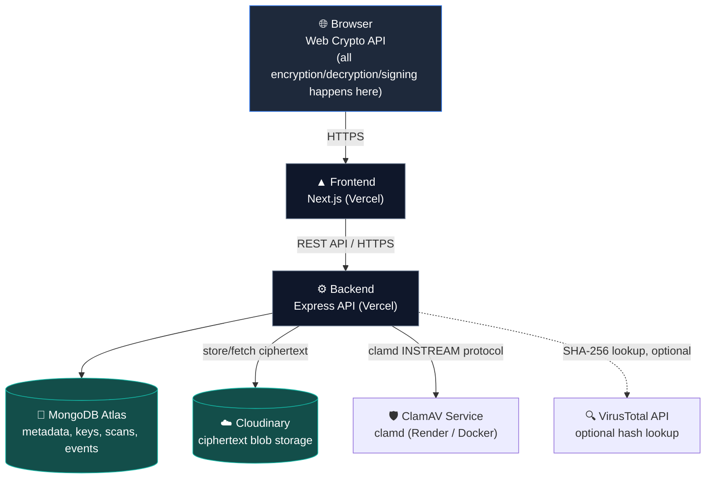
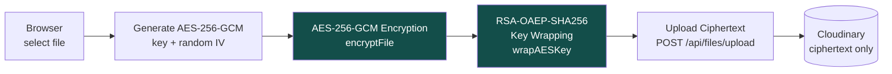
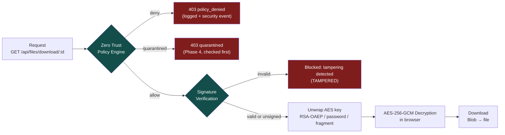
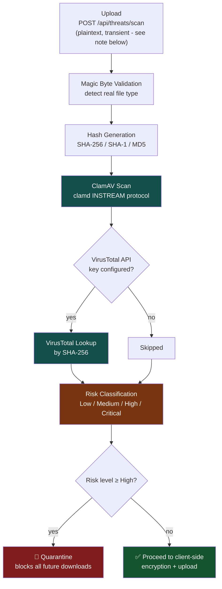
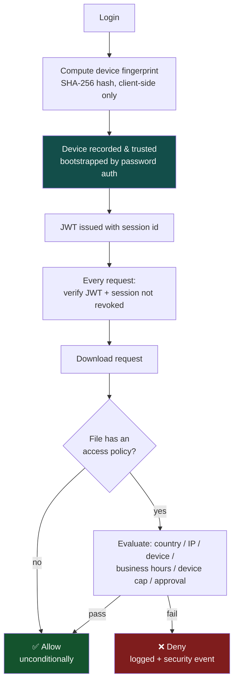
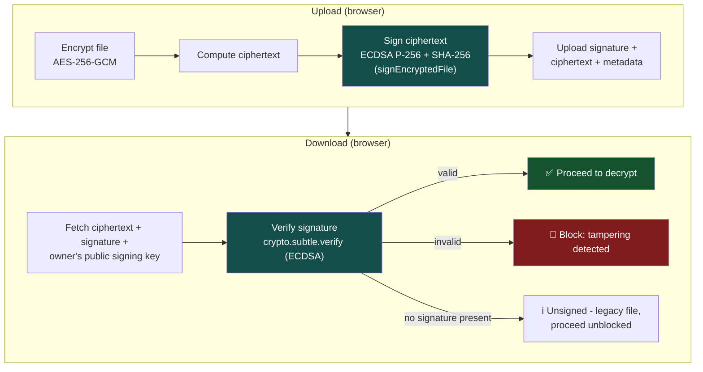

# SecureShare 🔒

[](LICENSE)
[](https://nodejs.org)
[](https://nextjs.org)
[](https://www.typescriptlang.org)
[](https://www.mongodb.com/atlas)
[](#-security-architecture-roadmap)
[](#-key-features)

A production-ready, full-stack secure file sharing application that prioritizes **privacy, security, and simplicity**. Upload files with true end-to-end encryption, digital signatures, Zero Trust access control, and automated malware scanning — all with an intuitive UI and comprehensive audit logs.

**Documentation:** [Architecture](#-system-architecture) · [Security Model](SECURITY.md) · [Deployment Guide](DEPLOYMENT.md) · [Environment Variables](ENVIRONMENT_VARIABLES.md) · [Security Testing](SECURITY_TESTING.md) · [Changelog](CHANGELOG.md)

## 🎯 Overview

SecureShare enables users to securely share files without exposing sensitive data. Files are encrypted **in the browser** before they ever leave your device, using true end-to-end, zero-knowledge encryption (AES-256-GCM + RSA-OAEP key wrapping via the Web Crypto API) — the server only ever stores ciphertext and wrapped keys, and can never read your files. Links can be password-protected, and can be set to expire or become unavailable after a certain number of downloads. Recipients receive a secure link with detailed access logs.

> Files uploaded before this migration used server-side encryption (`encryptionVersion: 1`) and remain downloadable unchanged for backward compatibility — see [Zero-Knowledge Encryption Architecture](#-zero-knowledge-encryption-architecture) below.

## 🗺️ Security Architecture Roadmap

SecureShare's security model was built in six independent, additive phases — each one layers a new guarantee on top of the last without breaking what came before. Every phase is backward compatible: a file created in Phase 1 still works correctly after Phases 2-6 shipped.

| Phase | Guarantee | Core Mechanism | Status |
|---|---|---|---|
| **1 — [Zero-Knowledge Encryption](#-zero-knowledge-encryption-architecture)** | Confidentiality — the server never sees plaintext | AES-256-GCM (browser) + RSA-OAEP-SHA256 key wrapping | ✅ Complete |
| **2 — [Digital Signatures](#️-phase-2-digital-signatures--integrity-verification)** | Authenticity & integrity — prove who uploaded it and that it's unmodified | ECDSA P-256 signatures over the ciphertext, verified before decryption | ✅ Complete |
| **3 — [Zero Trust Access Control](#️-phase-3-zero-trust-access-control)** | Access control — never trust a request just because it arrived | Device fingerprinting, revocable sessions, per-file policy engine | ✅ Complete |
| **4 — [Malware Scanning](#-phase-4-malware-scanning--threat-detection)** | Content safety — catch malicious files before they're stored | Magic bytes, ClamAV, VirusTotal, risk classification, auto-quarantine | ✅ Complete |
| **5 — [Data Loss Prevention](#-phase-5-data-loss-prevention-dlp)** | Data hygiene — catch secrets/PII before they're shared | Pattern-based detectors, Luhn validation, configurable allow/warn/block/require-approval policy | ✅ Complete |
| **6 — [Centralized SIEM & SOC](#-phase-6-centralized-siem--security-operations-center)** | Visibility — one correlated view across every prior phase | Unified event taxonomy, severity levels, rule-based correlation engine, SOC dashboard | ✅ Complete |

See [SECURITY.md](SECURITY.md) for the consolidated threat model and [CHANGELOG.md](CHANGELOG.md) for what shipped in each phase.

---

## ✨ Key Features

### Security
- **True Client-Side End-to-End Encryption**: files are encrypted in the browser with AES-256-GCM before upload; the AES key is wrapped with RSA-OAEP-SHA256 (per-user keypair, 3072-bit). The server never sees plaintext files or raw keys — a genuine zero-knowledge architecture.
- **Password Protection**: Optional password protection; for E2E files the password derives the unwrapping key entirely client-side (PBKDF2-SHA256) and is never sent to the server
- **Digital Signatures** (Phase 2): every upload is signed with a per-user ECDSA P-256 key; downloads verify the signature before decrypting, blocking tampered files outright
- **Zero Trust Access Policies** (Phase 3): optional per-file country/IP/device allowlists, business-hours windows, device caps, and approval requirements, plus device fingerprinting and revocable sessions
- **Malware Scanning & Quarantine** (Phase 4): every new upload is scanned pre-encryption (magic bytes, ClamAV, VirusTotal, MIME-mismatch/macro/archive heuristics) and automatically quarantined if flagged High/Critical risk
- **Data Loss Prevention** (Phase 5): plaintext text-based uploads are scanned for embedded secrets/PII before encryption, with a configurable allow/warn/require-approval/block policy
- **Centralized SIEM & SOC Dashboard** (Phase 6): every event from every phase above is normalized into one taxonomy with severity levels, automatically correlated into incidents, and surfaced in a unified Security Operations Center dashboard
- **Audit Logging**: Track all file downloads with IP, device, browser, country, policy decision, and scan result
- **Automatic Expiration**: Files automatically delete after expiry time
- **JWT Authentication**: Secure token-based user authentication with revocable sessions
- **Rate Limiting**: API rate limiting to prevent abuse (25 requests per 15 minutes)

### File Management
- **One-Time Download Links**: Set files to be downloadable only once
- **Limited Download Links**: Configure maximum download count (1-100 downloads)
- **Customizable Expiry**: Set file expiration from 1 hour to 30 days
- **Cloud Storage Integration**: Files stored securely on Cloudinary
- **File Revocation**: Revoke access to shared files at any time

### User Experience
- **Intuitive Dashboard**: View all uploaded files with stats and actions
- **Quick Share**: Copy share links with one click
- **Real-time Feedback**: Toast notifications for all actions (upload, download, errors)
- **Responsive Design**: Mobile-friendly UI built with Tailwind CSS
- **Modern Icons**: Beautiful UI components with Lucide Icons
- **File History**: View download logs and access statistics

### Backend Operations
- **Automatic Cleanup**: Cron job removes expired files daily
- **JWT Token Management**: Secure session management
- **MongoDB Integration**: Scalable document-based database
- **Rate Limiting**: Protect API from abuse with configurable limits

---

## 📸 Application Screenshots

> Screenshots below are placeholders — replace each `src` path with an actual image committed to a `docs/screenshots/` (or similar) directory, then remove this note.

| | |
|---|---|
| **Login**<br/> | **Dashboard**<br/> |
| **Upload**<br/> | **Download**<br/> |
| **Security Center**<br/> | **Threat Center**<br/> |
| **Trusted Devices**<br/> | **Active Sessions**<br/> |
| **Malware Detection**<br/> | **Quarantine**<br/> |
| **Security Events**<br/> | **Zero Trust Dashboard**<br/> |

---

## 🏗️ Tech Stack

### Frontend
- **Framework**: Next.js 16.1.1 (App Router)
- **Styling**: Tailwind CSS 4
- **HTTP Client**: Axios 1.13.2
- **UI Components**: Lucide React 0.562.0
- **Notifications**: react-hot-toast 2.6.0
- **Language**: TypeScript 5
- **Linting**: ESLint 9

### Backend
- **Runtime**: Node.js (LTS)
- **Framework**: Express 5.2.1
- **Database**: MongoDB 9.1.1 (Mongoose ODM)
- **Authentication**: JWT (jsonwebtoken 9.0.3)
- **File Handling**: Multer 2.0.2
- **Encryption**: Node.js crypto module
- **Password Hashing**: bcryptjs 3.0.3
- **Rate Limiting**: express-rate-limit 8.2.1
- **Scheduled Tasks**: node-cron 4.2.1
- **Cloud Storage**: Cloudinary
- **Development**: Nodemon 3.1.11

### DevOps & Infrastructure
- **Containerization**: Docker & Docker Compose
- **Database**: MongoDB Atlas (managed) or containerized `mongod` for local dev
- **Cloud Storage**: Cloudinary CDN
- **Frontend Hosting**: Vercel
- **Backend Hosting**: Vercel (serverless functions via `backend/api/index.js`) or any Node host
- **Malware Scanning**: ClamAV (`clamd`), typically run as a small Docker container on Render or alongside the backend
- **Optional Threat Intel**: VirusTotal API v3

See [DEPLOYMENT.md](DEPLOYMENT.md) for full setup instructions for each of these.

---

## 🏛️ System Architecture

### Overall system



The server (Backend) is intentionally the least-trusted component in this diagram: it only ever handles ciphertext, wrapped keys, hashes, and scan verdicts — never plaintext file content (with one narrow, documented exception, see the Threat Detection Flow below) and never a raw AES key or RSA/ECDSA private key.

### Encryption flow (Phase 1)



The AES key never reaches the server in raw form: it's either wrapped with the owner's RSA public key (for owner re-access), embedded in the share link's URL fragment (never transmitted), or wrapped with a password-derived key — see [Zero-Knowledge Encryption Architecture](#-zero-knowledge-encryption-architecture) for the full key model.

### Download flow (Phases 1-3 combined)



### Threat detection flow (Phase 4)



> **Note on plaintext exposure**: this scan step is the *one deliberate, narrowly-scoped exception* to SecureShare's zero-knowledge promise — the browser sends plaintext here, before any encryption, purely to be scanned. The buffer lives in memory only for this single request, is never written to disk or logged, and is discarded the moment the request completes. See [Phase 4](#-phase-4-malware-scanning--threat-detection) for the full reasoning.

### Zero Trust flow (Phase 3)



### Digital signature flow (Phase 2)



---

## 📂 Project Structure

```
SecureShare/
├── frontend/                      # Next.js client application
│   ├── app/
│   │   ├── page.tsx              # Home page
│   │   ├── layout.tsx            # Root layout
│   │   ├── login/                # Login page
│   │   ├── register/             # Registration page
│   │   ├── upload/               # File upload page
│   │   ├── dashboard/            # User dashboard
│   │   ├── security/             # Phase 3: Security Center (devices, sessions, events)
│   │   ├── threats/              # Phase 4: Threat Center (scans, quarantine, malware detections)
│   │   ├── soc/                  # Phase 6: Security Operations Center (unified SIEM dashboard)
│   │   └── file/[id]/            # File detail & download
│   ├── components/               # Reusable React components
│   │   ├── Navbar.tsx
│   │   ├── FileCard.tsx
│   │   ├── UnlockKeyModal.tsx    # Set-up/unlock prompt for the local RSA key
│   │   └── ToasterClient.tsx
│   ├── context/
│   │   └── CryptoKeyContext.tsx  # Holds the unwrapped RSA + ECDSA private keys in memory for the session
│   ├── lib/                      # Utilities & API client
│   │   ├── api.js
│   │   ├── ipTracking.ts
│   │   ├── security/
│   │   │   └── fingerprint.ts     # Phase 3: privacy-minimal device fingerprint hash (getDeviceId)
│   │   ├── severity.ts            # Phase 6: severity/category color + label maps for the SOC dashboard
│   │   └── crypto/                # Zero-knowledge crypto module (Web Crypto API only, no crypto-js)
│   │       ├── cryptoHelpers.ts   # Public entry point - re-exports everything below
│   │       ├── base64.ts          # base64 / base64url encode-decode helpers
│   │       ├── aes.ts             # AES-256-GCM key generation + raw import/export
│   │       ├── fileEncryption.ts  # encryptFile() / decryptFile() - the only place plaintext exists
│   │       ├── rsa.ts             # RSA-OAEP-SHA256 keypair + wrapAESKey()/unwrapAESKey()
│   │       ├── pbkdf2.ts          # PBKDF2-SHA256 password-derived key wrapping
│   │       ├── keyStorage.ts      # Encrypt/decrypt + IndexedDB persistence of private keys
│   │       ├── ecdsa.ts           # Phase 2: ECDSA P-256 signing keypair generation + import/export
│   │       ├── hash.ts            # Phase 2: SHA-256 hashing
│   │       └── signature.ts       # Phase 2: signEncryptedFile() / verifyEncryptedFileSignature()
│   ├── styles/                   # Global styles
│   └── package.json
│
├── backend/                       # Express API server
│   ├── api/
│   │   └── index.js              # Vercel API routes (optional)
│   ├── controllers/              # Business logic
│   │   ├── auth.controller.js
│   │   ├── user.controller.js
│   │   ├── device.controller.js   # Phase 3: trusted device list/removal
│   │   ├── session.controller.js  # Phase 3: active session list/revocation
│   │   ├── security.controller.js # Phase 3: unified security-event feed
│   │   ├── threat.controller.js   # Phase 4: pre-encryption scan, scan history, quarantine
│   │   ├── siem.controller.js     # Phase 6: dashboard, events, incidents, search, export, stats
│   │   └── file.controller.js
│   ├── models/                   # Mongoose schemas
│   │   ├── User.js
│   │   ├── Device.js              # Phase 3
│   │   ├── Session.js             # Phase 3
│   │   ├── SecurityEvent.js       # Phase 3 (extended in Phase 4 + Phase 6 with siemType/severity/category)
│   │   ├── ThreatScan.js          # Phase 4
│   │   ├── Incident.js            # Phase 6: correlated event groups
│   │   └── File.js
│   ├── routes/                   # API endpoints
│   │   ├── auth.routes.js
│   │   ├── user.routes.js
│   │   ├── device.routes.js       # Phase 3
│   │   ├── session.routes.js      # Phase 3
│   │   ├── security.routes.js     # Phase 3
│   │   ├── threat.routes.js       # Phase 4
│   │   ├── siem.routes.js         # Phase 6
│   │   └── file.routes.js
│   ├── middleware/               # Custom middleware
│   │   ├── auth.middleware.js     # Phase 3: also checks session revocation
│   │   └── rateLimit.js
│   ├── services/                 # Pure/orchestration logic, no Express coupling
│   │   ├── policyEngine.js        # Phase 3: Zero Trust download policy evaluation
│   │   ├── riskEngine.js          # Phase 4: classifyRisk() / shouldQuarantine()
│   │   ├── threatScanService.js   # Phase 4: orchestrates the full scan pipeline
│   │   ├── clamavScanner.js       # Phase 4: clamd INSTREAM protocol client
│   │   ├── virusTotalLookup.js    # Phase 4: optional VirusTotal hash lookup
│   │   └── siem/                  # Phase 6
│   │       ├── eventCatalog.js    # type -> siemType/severity/category/label mapping
│   │       ├── siemLogger.js      # logSecurityEvent() - the one place SecurityEvent is written
│   │       └── correlationEngine.js # pure rule evaluation + Incident grouping
│   ├── utils/                    # Helper functions
│   │   ├── cloudinary.js
│   │   ├── deviceContext.js       # Phase 3: dependency-free User-Agent parsing
│   │   ├── geoLookup.js           # Phase 3: best-effort country resolution from proxy headers
│   │   ├── magicBytes.js          # Phase 4: file-type detection by signature bytes
│   │   ├── fileHashes.js          # Phase 4: SHA-256/SHA-1/MD5 hashing
│   │   └── legacy/                # encryptionVersion 1 only — server-side AES-CBC (unused by new uploads)
│   │       ├── encrypt.js
│   │       └── decrpyt.js
│   ├── cron/
│   │   └── cleanup.js            # Scheduled file cleanup
│   ├── keys/                     # RSA key pair (generated)
│   │   ├── public.pem
│   │   └── private.pem
│   ├── server.js                 # Express app entry point
│   ├── package.json
│   └── Dockerfile
│
├── docker-compose.yml            # Development environment setup
├── LICENSE                        # MIT License
└── README.md                      # This file
```

---

## 🔐 Zero-Knowledge Encryption Architecture

SecureShare uses **true client-side end-to-end encryption**. All cryptography happens in the browser via the native [Web Crypto API](https://developer.mozilla.org/en-US/docs/Web/API/Web_Crypto_API) (`frontend/lib/crypto/`, no `crypto-js` or other JS crypto library) — the server only ever handles ciphertext and already-wrapped keys, and has no way to decrypt uploaded files.

### Threat model
- **In scope**: the server (and anyone who compromises it, including database backups or the Cloudinary bucket) should never be able to recover plaintext file contents or any user's RSA private key. A network observer between browser and server should see only ciphertext and wrapped keys.
- **Out of scope**: a compromised *browser/device* at encrypt or decrypt time (the endpoint that holds the AES key in memory), and loss of the share link/password with no other recovery path (see the device-bound trade-off below).

### Key model
- **Per-file AES-256-GCM key**: a brand-new, unique key + random 96-bit IV (`crypto.getRandomValues`) is generated for every file, entirely in the browser (`generateAESKey`, `encryptFile` in `frontend/lib/crypto/aes.ts` / `fileEncryption.ts`).
- **Per-user RSA-OAEP-SHA256 keypair (owner access, 2048-bit minimum, 3072-bit by default)**: each account gets its own keypair, generated client-side (`generateRSAKeyPair` in `rsa.ts`). The public key is uploaded to the server (`User.publicKey`); the private key is encrypted with a key derived from the user's login password via PBKDF2-SHA256 (`encryptPrivateKey`/`decryptPrivateKey` in `keyStorage.ts`) and stored **only in the browser's IndexedDB** — it never touches the server, and is never put in `localStorage`. This lets the file owner always re-decrypt their own files from the dashboard, using their own key.
- **Sharing**: for the recipient (who may not have an account), the same AES key is made available in one of two zero-knowledge ways:
  - **No password**: the raw AES key travels in the share link's URL *fragment* (`/file/:id#k=...`) — fragments are never transmitted to the server by the browser, so the key never appears in any network request.
  - **With a password**: the AES key is wrapped with a key derived from the share password via PBKDF2-SHA256 + a random salt (`wrapAESKeyWithPassword` in `pbkdf2.ts`). The wrapped key + salt are stored server-side, but the password itself is never sent to the server — the recipient's browser re-derives the key locally, and an AES-GCM authentication-tag failure is the "wrong password" signal (the server performs no password validation for these files).

### Architecture diagram

```
Upload (browser)                              Download (browser)
─────────────────                              ──────────────────
File                                            Encrypted blob + IV ◄── GET /files/download/:id
  │ generateAESKey()                            Wrapped key(s)     ◄── GET /files/file/:id/meta
  ▼
encryptFile() ── AES-256-GCM, random IV                │
  │                                              unwrapAESKey() / unwrapAESKeyWithPassword()
  ▼                                              (RSA-OAEP private key from IndexedDB, or
wrapAESKey() ── RSA-OAEP (owner)                  password-derived PBKDF2 key, or raw
wrapAESKeyWithPassword() (optional)               fragment key - never sent to the server)
  │                                                       │
  ▼                                                       ▼
POST /files/upload                              decryptFile() ── AES-256-GCM
  (ciphertext + wrapped key(s) + IV + metadata            │
   -- NEVER plaintext, NEVER a raw AES key)                ▼
  │                                              Blob ── triggered browser download
  ▼
Cloudinary (ciphertext only)                    Server never decrypts, never sees plaintext.
```

### Upload flow (client-side)
1. Browser generates a fresh AES-256-GCM key and encrypts the file locally (`encryptFile`) — plaintext never leaves the device.
2. The AES key is wrapped with the uploader's own RSA-OAEP public key (`wrapAESKey`), and either embedded in the share link fragment or wrapped with a password-derived key (`wrapAESKeyWithPassword`).
3. **(Phase 2)** The uploader's ECDSA P-256 private signing key signs the encrypted file (`signEncryptedFile`) — see below.
4. Only the ciphertext, the wrapped key(s), the signature/hash metadata, the IV, and other metadata are uploaded — the server stores the encrypted blob on Cloudinary as-is, with no server-side cryptography.

### Download flow (client-side)
1. Browser fetches file metadata (IV, wrapped key(s), signature) from `GET /files/file/:id/meta` and the encrypted bytes from `GET /files/download/:id`.
2. **(Phase 2)** If the file has a signature, the browser verifies it against the uploader's public signing key *before* touching the AES key or attempting decryption — see below. A failed verification aborts the download entirely.
3. The AES key is unwrapped locally — via the fragment key, the share password (`unwrapAESKeyWithPassword`), or the owner's own private key (`unwrapAESKey`, unlocked from IndexedDB with the login password).
4. The file is decrypted locally with AES-GCM (`decryptFile`) and handed to the browser as a downloadable Blob. AES-GCM's built-in authentication tag doubles as an integrity check — a wrong key, wrong password, or tampered ciphertext all surface as a decryption failure, mapped to a specific in-app error (wrong password / integrity verification failed / missing key / expired / revoked / network failure).

### Backward compatibility
Files uploaded before this migration (`File.encryptionVersion: 1`, the default) keep working exactly as before: server-side AES-256-CBC decryption with a single global RSA-2048 keypair (`backend/utils/legacy/`, `backend/keys/*.pem`). New uploads always use `encryptionVersion: 2` (client-side E2E) — the legacy path exists purely for old links. Digital signatures (Phase 2, below) are an *additive* layer on top of `encryptionVersion: 2` and are entirely optional per file — v2 files uploaded before Phase 2 shipped simply have no `signature`, and the download flow treats that as "unsigned," not an error.

### Trade-off: device-bound private keys
Because the RSA private key lives only in the browser's IndexedDB (never on the server), clearing browser storage or switching devices means losing owner-side access to previously uploaded files unless the original share link/password is still known. This is the deliberate cost of true zero-knowledge storage — the server holding a recovery copy of your private key would defeat the purpose. The same trade-off applies identically to the ECDSA signing key introduced in Phase 2.

---

## ✍️ Phase 2: Digital Signatures & Integrity Verification

Phase 1 (above) guarantees **confidentiality** — the server can't read your files. Phase 2 adds **authenticity and integrity**: a recipient can cryptographically prove that a downloaded file was (a) produced by the claimed uploader and (b) not altered in any way since it was signed — *before* spending any effort decrypting it. This closes a gap Phase 1 alone doesn't cover: AES-GCM's authentication tag proves the ciphertext wasn't corrupted *relative to whichever key you're using to decrypt*, but says nothing about who encrypted it in the first place, or whether a malicious actor with write access to storage could have substituted a different ciphertext + matching key material. A digital signature, tied to a specific user's long-lived signing identity, closes that gap.

### Trust model
- **Identity = signing keypair, not the account itself.** A user's authenticity, from a downloader's perspective, rests entirely on possession of the ECDSA private key that matches the `signingPublicKey` the server reports for that account. The server is trusted to correctly associate a `signingPublicKey` with the right `User` document (i.e., to not lie about whose key is whose) but is **not** trusted with the private key itself, and cannot forge a valid signature.
- **What a passing verification proves**: the encrypted file bytes are byte-for-byte identical to what was signed, and the signer held the private key matching the public key the server reports for the file's owner at query time.
- **What it does NOT prove**: that the plaintext content is what the recipient expects (only decryption + inspection tells you that), or that the account itself wasn't compromised at signing time (if an attacker steals a user's *password*, they could unlock that user's signing key too — signing protects against tampering *in transit/at rest*, not against a fully compromised account).
- **Server compromise**: even a fully malicious server cannot produce a valid signature for a file it tampers with, since it never has the private signing key. It *could* swap out `ownerSigningPublicKey` in the `/meta` response to point at a key it does control — but then the signature would need to have been produced with that same attacker-controlled key, which only helps an attacker who controls the *entire* round trip (metadata AND ciphertext AND signature), a strictly harder attack than tampering with ciphertext alone. This is a known limitation of any system where the verification key is fetched from the same server being defended against; a future hardening step (see below) would be pinning/out-of-band key verification.

### Key model (Phase 2 addition)
- **Per-user ECDSA P-256 signing keypair**, entirely separate from the RSA-OAEP encryption keypair (`generateSigningKeyPair` in `frontend/lib/crypto/ecdsa.ts`) — encryption and signing keys are never shared, since mixing their use case weakens both.
- Generated client-side, at the same moment as the RSA keypair (registration, or lazily backfilled on next unlock for accounts created before Phase 2 shipped).
- The public signing key is uploaded to the server (`User.signingPublicKey`, `PATCH /api/users/signingkey`).
- The private signing key is encrypted with the **same password-derived-key mechanism** already used for the RSA private key (PBKDF2-SHA256 → AES-GCM, `encryptPrivateKey`/`decryptPrivateKeyBytes` in `keyStorage.ts`) and stored **only in the browser's IndexedDB**, alongside the RSA key material, in the same per-user record.

### Verification workflow
1. **Sign (upload)**: after AES-GCM-encrypting the file, the browser computes `SHA-256(ciphertext)` and signs the ciphertext with `crypto.subtle.sign({ name: "ECDSA", hash: "SHA-256" }, signingPrivateKey, ciphertext)`. (The Web Crypto API's ECDSA sign/verify always hashes its input per the `hash` parameter — there's no separate "sign this already-computed digest" primitive — so signing the ciphertext with `hash: "SHA-256"` *is* signing SHA-256(ciphertext); a manually-computed `fileHash` is stored alongside purely as human-readable/audit metadata, and is never itself trusted as the basis for verification.)
2. **Upload**: `signature`, `fileHash`, `hashAlgorithm` ("SHA-256"), `signatureAlgorithm` ("ECDSA-P256-SHA256"), and `signedAt` are sent to the server alongside the existing ciphertext/wrapped-key/IV fields and stored on the `File` document.
3. **Fetch (download)**: the browser retrieves `signature` + the uploader's `ownerSigningPublicKey` from `GET /files/file/:id/meta`, and the ciphertext from `GET /files/download/:id`.
4. **Verify BEFORE decrypt**: `verifyEncryptedFileSignature` (in `signature.ts`) calls `crypto.subtle.verify(...)` over the downloaded ciphertext. This happens strictly before the AES key is ever unwrapped or used — a failed check means the file is never decrypted, full stop.
5. **Outcome**:
   - ✅ **Verified** — signature valid, proceed to decrypt normally. UI shows "Signature verified — this file is authentic and unmodified."
   - ⚠️ **Tampering detected** — signature present but invalid. Download is **blocked entirely**; UI shows a red tampering warning and the decrypt flow aborts (`TAMPERED` error).
   - ℹ️ **Unsigned** — no signature on this file (legacy `encryptionVersion: 1`, or a Phase-1-only `encryptionVersion: 2` upload). Decryption proceeds as before Phase 2 existed; UI shows a neutral "unsigned, integrity not cryptographically verified" notice rather than blocking, preserving full backward compatibility.

### New crypto modules
- **`frontend/lib/crypto/ecdsa.ts`** — ECDSA P-256 keypair generation, public/private key import-export, `decryptSigningPrivateKey`.
- **`frontend/lib/crypto/hash.ts`** — standalone SHA-256 hashing (`sha256`, `sha256Base64`).
- **`frontend/lib/crypto/signature.ts`** — the high-level `signEncryptedFile`/`verifyEncryptedFileSignature` pair that upload/download pages call directly, combining the two modules above.

### UI feedback
The upload page shows a "Signing file (ECDSA P-256)..." progress step during signing and a "Digitally signed" badge on success (or an "uploaded without a signature" notice if the local signing key isn't set up yet). The download page shows a "Verifying digital signature..." step before decryption begins, followed by one of: a green "Signature verified" badge, a red blocking tampering warning, or a neutral "unsigned file" notice.

### Known limitation & future hardening
As noted in the trust model, the signing public key used for verification is fetched from the same server whose compromise this feature partly defends against. A fully hardened design would let users independently verify each other's signing public keys out-of-band (e.g., a key fingerprint displayed on each user's profile that recipients can cross-check via a side channel) — this is a natural next step, not yet implemented.

---

## 🛡️ Phase 3: Zero Trust Access Control

Phase 1 secures *what* is stored (confidentiality) and Phase 2 secures *who produced it* (authenticity/integrity). Phase 3 adds a third, independent layer: **access control that never assumes a request is legitimate just because it arrived** — every download is evaluated against the requester's device, network, timing, and (optionally) identity, regardless of whether the file's encryption/signing checks pass. This is what "Zero Trust" means here: no implicit trust from network location, a valid-looking link, or a prior successful login — every access attempt is evaluated on its own merits, every time.

### Zero Trust model
- **Never trust, always verify**: possessing a share link (and even the correct decryption key) is necessary but not sufficient to download a policy-protected file — the request must also satisfy every rule configured on that file (see below).
- **Device trust is bootstrapped, not assumed**: a device becomes "trusted" for a user only after successfully authenticating with that user's password from it (see [Device fingerprinting](#device-fingerprinting) below) — trust is earned per-device, not inherited from the account.
- **Sessions are independently revocable**: authentication (a valid JWT) and session validity (that JWT's session hasn't been revoked) are checked separately on every request — logging in doesn't grant indefinite trust; a session can be cut off from the Security Center at any time, from any device, without changing the password.
- **Policy evaluation is additive, never assumed**: this whole layer is opt-in per file. A file with no policy configured is unaffected — it behaves exactly as it did in Phase 1/2. Zero Trust here means "verify every request against whatever rules exist," not "add friction by default."

### Device fingerprinting
Every login computes a **stable, privacy-minimal device identifier** in the browser (`frontend/lib/security/fingerprint.ts`) by hashing a fixed set of attributes with SHA-256:
- `navigator.userAgent`, `navigator.platform`, `navigator.language`
- `Intl.DateTimeFormat().resolvedOptions().timeZone`
- screen resolution + color depth
- a canvas rendering fingerprint (drawing fixed text/shapes to an offscreen `<canvas>` and hashing the resulting pixel data — a common browser/GPU/font-rendering signal that's stable per device but reveals nothing about the user)

**Only the resulting hash is ever sent to the server** — none of the raw attribute values are transmitted or stored, which is what keeps this "unnecessary personal data"-free: the server learns "this is the same device as last time," never the underlying fingerprint data itself (most of which — like the User-Agent string — it would see in every request's headers regardless).

A device that successfully authenticates (correct password) is recorded and trusted automatically (`Device` model, `backend/controllers/auth.controller.js`'s `login`) — this is the trust bootstrap: no separate approval workflow is required, since a correct password is already the credential proving "this is the account owner." A first-time device also emits a `new_device` security event.

### Session management
Login now embeds a random session id (`sid`) in the JWT and records a matching `Session` document (browser, OS, IP, country, device, timestamps). `backend/middleware/auth.middleware.js` checks, on every authenticated request, that the token's session hasn't been revoked — a session revoked from the Security Center is rejected on its very next request, without needing the token itself to expire or the password to change. Tokens issued before this existed carry no `sid` claim and are treated as untracked "legacy sessions" that skip the revocation check, so upgrading doesn't log anyone out.

### Access policy engine
`backend/services/policyEngine.js` is a **pure function** — no DB or network access — that evaluates a resolved request context against a file's optional `policy` subdocument and returns `{ decision: "allow" }` or `{ decision: "deny", reason }`. Being pure makes it trivial to unit test (every branch is a one-line assertion) and safe to reuse from any future call site.

Every check is independently opt-in (`backend/models/File.js`'s `policy` field):

| Field | Effect |
|---|---|
| `allowedCountries` | Only these ISO country codes (resolved from geo-IP headers, see below) may download |
| `allowedIPs` | Only these exact IP addresses may download |
| `allowedDevices` | Only these device fingerprint hashes may download |
| `businessHours` | Restrict downloads to a UTC hour range (supports overnight windows, e.g. 22:00-06:00) |
| `maxDevices` | Cap the number of *distinct* devices that may ever download this file |
| `requireApproval` | Require an authenticated requester on a trusted device (blocks anonymous/link-only access entirely) |

A file with **no policy fields set evaluates to `allow` unconditionally** — this is what preserves every file that existed before Phase 3, and every new file that doesn't opt into any restriction.

`GET/PATCH /api/files/file/:id/policy` (owner-only) let the uploader view/edit a file's policy after upload; the upload page also exposes an optional, collapsed-by-default "Advanced Security Policy" section for setting one at upload time.

**Country resolution** is a best-effort read of common CDN/proxy geo-IP headers (`CF-IPCountry`, `X-Vercel-IP-Country`, ...) — this app does not call any external geo-IP API or ship a MaxMind-style database (`backend/utils/geoLookup.js`). Locally, or on a host that doesn't inject one of those headers, country resolves to `"Unknown"`, and any `allowedCountries` restriction simply can't be satisfied (fails closed). Swap in a real geo-IP provider there for production deployments that need it.

### Extended audit logs
Every download attempt — allowed *or denied* — appends an entry to `File.logs[]`, now including `deviceId`, `browser`, `operatingSystem`, `country`, `decision` (`"allow"`/`"deny"`), and `denialReason` alongside the existing `ip`/`userEmail`/`time`. This means the same per-file audit trail the dashboard already showed (`/file/:id/logs`) now doubles as a full Zero Trust decision log for that file, with no separate query needed.

### Security Center
`frontend/app/security/page.tsx` (linked from the navbar) gives users one place to review and act on all of the above:
- **Trusted Devices** — every device that has ever logged in, with last-seen time/IP and a remove action (removing a device also revokes any sessions created from it)
- **Active Sessions** — every non-revoked session, with browser/OS/IP/country/login time, and a per-session revoke action (works even on the current session — revoking it logs that browser out on its next request)
- **Blocked Access Attempts** — every `download_denied` policy decision against the user's own files, with the specific reason
- **Recent Security Events** — new-device logins, device removals, and session revocations, in one activity feed

### Backward compatibility
Every Phase 3 addition is additive to the existing schema and strictly opt-in at evaluation time: `File.policy` defaults to an all-empty subdocument (`hasActivePolicy()` returns `false`, `evaluateDownloadPolicy()` returns `allow`), so every file created before Phase 3 - and every new file that doesn't configure a policy - downloads exactly as it did in Phase 1/2. Sessions predating the `sid` JWT claim skip the revocation check entirely rather than being rejected.

### Authentication
- **Registration**: Email & password → bcryptjs hashing (salt rounds: 10)
- **Login**: Credentials validated → JWT token generated, embedding a session id (`sid`) tied to a revocable `Session` record → device fingerprint (if provided) recorded/refreshed as a trusted device
- **Protected Routes**: All file operations require a valid JWT token whose session (if tracked) hasn't been revoked

### Access Control
- **One-Time Links**: After 1 download, link becomes inactive
- **Limited Downloads**: Configurable max downloads (1-100)
- **Time-Based Expiry**: Files auto-delete after specified duration
- **Password Protection**: Additional layer of security
- **Link Revocation**: Owner can revoke access anytime
- **Zero Trust Access Policy** (Phase 3, optional per file): country/IP/device allowlists, business-hours windows, max-device caps, and approval requirements — see above

---

## 🦠 Phase 4: Malware Scanning & Threat Detection

Phases 1-3 protect confidentiality, authenticity, and access — but none of them ask "is this file's *content* actually safe?" Phase 4 adds that layer: every new upload is scanned for malware and suspicious characteristics before it's ever stored, with automatic quarantine for anything dangerous.

### The zero-knowledge conflict, and how it's resolved

SecureShare's server never sees plaintext file bytes (Phase 1) — but malware scanning (magic-byte inspection, ClamAV, VirusTotal, MIME-mismatch detection) is fundamentally meaningless against ciphertext: encrypted data is high-entropy noise that doesn't match any signature and whose hash won't match any known-malware hash, regardless of what the underlying plaintext actually is. There is no way to reconcile "the server never sees plaintext" with "the server can meaningfully scan file content" — one of those has to give, even slightly.

SecureShare resolves this with a **deliberate, narrowly-scoped exception**: `POST /api/threats/scan` is the *one* endpoint where the browser sends plaintext file bytes to the server, and it does so **before** any client-side encryption happens, purely to be scanned. The buffer:
- exists only in memory for the duration of that single request (Multer's in-memory storage, never written to disk),
- is never logged, and
- goes out of scope (eligible for garbage collection) the moment the request handler returns.

Only the *scan verdict* (hashes, risk level, detected threat names, MIME info) is persisted, as a `ThreatScan` document — never the file content itself. The browser only proceeds to actually encrypt-and-upload the file (Phase 1's flow, unchanged) after this scan completes and clears; the resulting encrypted upload is still fully zero-knowledge from that point on. This is the same trade-off most real products that need both E2E encryption and malware scanning make - see [Threat model](#threat-model) in the Phase 1 section for the analogous reasoning about transient plaintext exposure windows.

The legacy `encryptionVersion: 1` upload path scans inline instead, with no separate request needed - it already receives plaintext server-side as part of its (non-zero-knowledge) design, so there's no additional exposure to reason about there.

### Scan pipeline

For every scanned file, `backend/services/threatScanService.js` runs, in parallel where possible:

1. **Magic-byte type detection** (`backend/utils/magicBytes.js`) — inspects the file's actual signature bytes (dependency-free, no external library) to determine its real type, independent of whatever filename/extension/MIME type the upload claims. Catches PDFs, images, archives, and — critically — executables (Windows PE `MZ`, Linux ELF).
2. **MIME-mismatch detection** — flags when the claimed type (from the browser) and the detected type (from magic bytes) disagree on something concrete (a generic/empty claimed type isn't itself suspicious, so it's never flagged).
3. **Hashing** (`backend/utils/fileHashes.js`) — SHA-256, SHA-1, and MD5 of the plaintext. SHA-256 is the one used for VirusTotal lookups and treated as the primary identity hash; MD5/SHA-1 are included only for interoperability with tooling that still keys on them.
4. **ClamAV scan** (`backend/services/clamavScanner.js`) — talks directly to a `clamd` daemon over its `INSTREAM` TCP protocol (no external npm wrapper), streaming the buffer in chunks. If `clamd` isn't reachable (not installed/running — the common case in a plain dev environment), the scan degrades gracefully to `status: "unavailable"` rather than failing the whole pipeline. Configure via `CLAMAV_HOST`/`CLAMAV_PORT` (default `127.0.0.1:3310`).
5. **VirusTotal lookup** (`backend/services/virusTotalLookup.js`, optional) — looks up the file's SHA-256 against VirusTotal's existing database (VT API v3) — it does *not* upload the file itself, keeping the "never transmit more plaintext-derived data than necessary" principle intact. Entirely skipped if `VIRUSTOTAL_API_KEY` isn't set.
6. **Extension/archive heuristics** — checks the claimed extension against a configurable dangerous-extension list (`.exe`, `.scr`, `.vbs`, `.ps1`, ...) and a macro-enabled Office extension list (`.docm`, `.xlsm`, ...), and inspects ZIP local file headers directly for the encryption bit (flags password-protected/encrypted archives, a common malware-delivery technique for evading content scanners).

### Risk engine

`backend/services/riskEngine.js` is a **pure, configurable function** (`classifyRisk`) that combines every signal above into one of four levels:

| Level | Triggered by |
|---|---|
| **Critical** | Confirmed malware (ClamAV or VirusTotal), OR a disguised executable (magic bytes say "binary," claimed type says otherwise — the mismatch *is* the attack), OR a dangerous extension combined with macros/encryption/mismatch |
| **High** | A dangerous extension or executable content on its own, macros combined with a MIME mismatch, or a VirusTotal "suspicious" (but below the confirmed-malicious threshold) verdict |
| **Medium** | Macros alone, an encrypted/password-protected archive, or a MIME mismatch alone |
| **Low** | None of the above |

`shouldQuarantine(riskLevel)` returns `true` for High and Critical - the dangerous-extensions list, macro-extensions list, and detected-executable-MIME-types list all live in one exported `RISK_CONFIG` object, so the rule set can be tuned (or a signal added) without touching any call site.

### Quarantine

A file whose scan resolves to High/Critical risk is marked `quarantined: true` on both its `ThreatScan` and (once the actual encrypted upload completes) its `File` document. `downloadFile` in `file.controller.js` checks this **before** anything else — before the Zero Trust policy engine, before any decryption — and unconditionally refuses to serve a single byte, logging the attempt and emitting a `file_quarantined` security event. There is no policy override that can un-block a quarantined file except the owner explicitly releasing it from the Threat Center (`POST /api/threats/quarantine/:id/release`) - a deliberate manual step for handling false positives, since ClamAV/magic-byte heuristics aren't infallible.

The upload itself is **not** hard-blocked server-side by a quarantine verdict (the API still accepts it, so it has something to quarantine and display) - the upload page's own UI refuses to proceed past a Critical/High scan result client-side, as a fail-fast UX measure, but the real security boundary is the download-time block, which holds even if that client-side gate is bypassed.

### Threat Center

`frontend/app/threats/page.tsx` (linked from the navbar) gives users:
- **Scan History** — every scan they've triggered, with filename, size, SHA-256, ClamAV/VirusTotal verdicts, and risk level
- **Quarantined Files** — files blocked from download, with a "Release" action for manual override
- **Malware Detections** — scans where ClamAV or VirusTotal actually confirmed a threat, with the detected names
- **Threat Statistics** — total scans, quarantine count, risk-level breakdown, malware-detection count

### Extended audit logs

`File.logs[]` entries (already extended in Phase 3 with device/policy context) now also snapshot `scanStatus` and `riskLevel` at download time, and a quarantine block produces its own `decision: "deny"` log entry with `denialReason: "File is quarantined due to a threat scan detection"` — consistent with how policy denials are already logged.

### Backward compatibility

`File.scanStatus` defaults to `"not_scanned"` and `quarantined` defaults to `false` — every file uploaded before Phase 4 is completely unaffected and remains downloadable exactly as before. New `encryptionVersion: 2` uploads are required to reference a completed scan (`scanId`, obtained from `POST /api/threats/scan`) going forward, so the protection is mandatory for anything created from here on, without touching anything that already exists.

---

## 🕵️ Phase 5: Data Loss Prevention (DLP)

Phase 4 asks "is this file dangerous?" Phase 5 asks a different question: "does this file accidentally contain something it shouldn't - a password, an API key, a customer's Aadhaar number?" DLP scans the plaintext of supported text-based files for embedded secrets and PII **before** encryption, and applies a configurable policy (allow/warn/require-approval/block) to decide whether the upload proceeds.

### The zero-knowledge conflict, and how it's resolved

Same fundamental tension as Phase 4: content inspection is meaningless against ciphertext, so DLP needs a moment of plaintext access. It reuses the exact pattern Phase 4 established - `POST /api/dlp/scan` is another narrowly-scoped exception where the browser sends plaintext bytes purely to be scanned, in-memory, for the duration of a single request, never logged or written to disk. Only the *scan verdict* (masked finding previews, severity, decision) is persisted as a `DLPScan` document - never the raw secret values themselves, which would just recreate a secret store inside the DLP database.

The legacy `encryptionVersion: 1` upload path scans inline, immediately after its Phase 4 malware scan and before encryption, for the same reason Phase 4's inline scan works there - it already has plaintext server-side.

### Detectors

`backend/services/dlp/detectors/` holds one small, dependency-free, pure module per secret/PII type - each exports `{ id, label, category, severity, detect(text) }`. Adding a new detector is just adding a file and registering it in `detectors/index.js`; nothing else needs to change.

| Detector | What it catches | Notes |
|---|---|---|
| `email` | Email addresses | Low severity, informational |
| `phone` | Phone numbers (international/local formats) | Broad pattern, higher false-positive rate |
| `credit_card` | Credit card numbers | **Luhn-validated** - candidate digit sequences that fail the checksum are discarded |
| `aadhaar` | Indian Aadhaar numbers | Regex + first-digit heuristic, not a full Verhoeff checksum |
| `pan` | Indian PAN numbers | 5-letter/4-digit/1-letter format |
| `passport` | Passport numbers | Deliberately broad (1-2 letters + 6-9 digits) - trades precision for recall |
| `aws_access_key` | AWS Access Key IDs | `AKIA`/`ASIA`/etc. prefix match |
| `aws_secret_key` | AWS Secret Access Keys | Only fires when a 40-char base64-shaped string appears near an `aws_secret_access_key`-style key name, to avoid flagging arbitrary hashes |
| `github_token` | GitHub Personal Access Tokens | `ghp_`/`gho_`/`ghu_`/`ghs_`/`ghr_` prefixes |
| `gitlab_token` | GitLab Personal Access Tokens | `glpat-` prefix |
| `google_api_key` | Google API Keys | `AIza` prefix |
| `openai_api_key` | OpenAI API Keys | `sk-`/`sk-proj-`/`sk-svcacct-` prefixes |
| `jwt_token` | JWT tokens | Three-part base64url `eyJ...` structure |
| `pem_private_key` | PEM private keys | `-----BEGIN ... PRIVATE KEY-----` blocks |
| `certificate` | X.509 certificates | Low severity - certs are normally public material |
| `password_assignment` | Hardcoded `password = "..."` style assignments | Placeholder values (`changeme`, `example`, ...) are ignored |
| `env_secret` | `.env`-style `KEY=VALUE` secrets | Key name must look secret-shaped (`SECRET`, `TOKEN`, `API_KEY`, ...); placeholders ignored |

Findings never store the raw matched value - only a masked preview (`backend/services/dlp/maskUtils.js`), e.g. `AK******LE`, enough for a human to recognize what was found without the DLP database itself becoming a leak.

### Supported file types

Only **text-based files** are scanned; DLP has nothing meaningful to say about binary content. `backend/services/dlp/textFileSupport.js` decides eligibility from extension, MIME type, and a printable-byte-ratio heuristic (the same style as `backend/utils/magicBytes.js`'s Phase 4 detection) - anything that doesn't look like text (images, video, most archives, executables) is **skipped gracefully**: the scan still completes and always resolves to `allow`, it just performs no content inspection. Text content is capped at 5MB per scan (`MAX_SCAN_BYTES`) to keep regex scan time bounded on very large files.

### Policy engine

`backend/services/dlp/dlpPolicyConfig.js` is a **pure, configurable function** (`resolveDecision`), following the same tunable-constant pattern as Phase 4's `RISK_CONFIG`. Four possible decisions, the most severe finding across the whole scan wins:

| Decision | Meaning |
|---|---|
| **Allow** | No action needed, upload proceeds silently |
| **Warn** | Upload proceeds, uploader sees a non-blocking warning |
| **Require Approval** | Upload is held until the uploader explicitly confirms via `POST /api/dlp/scans/:id/acknowledge`, then proceeds |
| **Block** | Upload is refused outright - the file is never encrypted or stored |

Default behavior: credentials/keys (AWS, GitHub, GitLab, Google, OpenAI, PEM private keys, hardcoded passwords, `.env` secrets) and credit card numbers are always **blocked** outright, regardless of the raw detector severity. Aadhaar/PAN/JWT findings **require approval**. Phone numbers and passports (higher false-positive patterns) only **warn**. Plain emails and certificates are **allowed**. Every one of these mappings lives in one exported config object (`SEVERITY_ACTION`, `DETECTOR_ACTION_OVERRIDES`), editable without touching any call site.

### DLP Center

`frontend/app/dlp/page.tsx` (linked from the navbar) gives users:
- **Scan History** — every DLP scan triggered, with matched pattern types, severity, and decision
- **Sensitive Data Findings** — scans with a non-`allow` decision, showing which detector categories fired
- **Blocked Uploads** — scans that resulted in a hard block
- **Top Detected Secret Types** — a ranked breakdown of the most frequently detected finding types
- **DLP Statistics** — total scans, policy violations, blocked-upload count, severity breakdown

### Upload pipeline integration

DLP runs **after the Phase 4 malware scan and before encryption**, in both upload paths:
- **v2 (zero-knowledge)**: `POST /api/dlp/scan` → verdict + `dlpScanId` returned to the browser → client encrypts locally → `POST /api/files/upload` must reference the (unconsumed) `dlpScanId`, same replay-protection pattern as Phase 4's `scanId`. A `require_approval` decision blocks the actual upload call unless the scan has been acknowledged first.
- **v1 (legacy)**: scans inline, immediately after the malware scan, before `encryptBuffer()`. Since v1 has no client round-trip, `require_approval` findings are also refused here (with a message pointing to the v2 flow, which supports the acknowledge step) - a documented limitation of the single-request legacy path.

### Extended audit logs

DLP outcomes are recorded as `SecurityEvent` entries (`dlp_blocked`, `dlp_warning`, `dlp_sensitive_data_detected`) - the same fire-and-forget, non-blocking pattern used for every other Phase 3/4 security event.

### Backward compatibility

`File.dlpStatus` defaults to `"not_scanned"`, `dlpRisk`/`dlpDecision` default to `null` - every file uploaded before Phase 5 is completely unaffected. New `encryptionVersion: 2` uploads are required to reference a completed DLP scan (`dlpScanId`) going forward, mirroring how Phase 4 made `scanId` mandatory for new uploads without touching anything that already existed.

### Limitations

- Pattern-based detection is inherently heuristic: passport and phone-number patterns in particular trade precision for recall and will produce false positives on similarly-shaped IDs. Detectors are tuned to reduce this (Luhn validation for cards, keyword-proximity for AWS secrets, placeholder-value filtering for passwords/`.env` secrets) but cannot eliminate it entirely.
- Aadhaar validation uses a first-digit heuristic, not the full Verhoeff checksum UIDAI actually uses - a false positive/negative is possible on edge cases.
- Only text-based files are inspected; secrets embedded inside binary formats (e.g. a password baked into a compiled binary, or an image's EXIF data) are not detected.
- Scanned content is capped at 5MB per file; matches beyond that offset in very large text files won't be found.

---

## 🎯 Phase 6: Centralized SIEM & Security Operations Center

Phases 1-5 each shipped a real security capability, but each one logged (or didn't log) its own events in its own way, with no shared severity scale, no cross-event correlation, and no single place to see "what's happening across my account right now." Phase 6 doesn't add a new detection capability - it **unifies observability** across everything that came before it, without touching any detection/crypto/policy logic itself.

```mermaid
flowchart LR
    A[Auth] --> L[logSecurityEvent]
    B[Zero Trust] --> L
    C[Threat Detection] --> L
    D[DLP] --> L
    E[Upload / Download] --> L
    F[Device / Session] --> L
    G[Digital Signatures<br/>client-reported] --> L
    L --> S[(SecurityEvent<br/>+ severity/category)]
    S --> CE[Correlation Engine]
    CE --> I[(Incident)]
    S --> API[/api/siem/*]
    I --> API
    API --> SOC[SOC Dashboard]
```

### Unified event taxonomy & severity

Every event from every prior phase is normalized into one canonical `siemType` (`LOGIN`, `REGISTER`, `SESSION_CREATED`, `UPLOAD`, `DOWNLOAD_ALLOWED`, `DOWNLOAD_DENIED`, `THREAT_FOUND`, `FILE_QUARANTINED`, `DLP_BLOCK`, `DLP_WARNING`, `DLP_SENSITIVE_DATA`, `SIGNATURE_VERIFIED`, `SIGNATURE_INVALID`, `DEVICE_NEW`, `DEVICE_REVOKED`, `SESSION_REVOKED`, `POLICY_VIOLATION`), one of ten `category` buckets (`AUTH`, `ENCRYPTION`, `SIGNATURE`, `ZERO_TRUST`, `THREAT`, `DLP`, `UPLOAD`, `DOWNLOAD`, `DEVICE`, `SESSION`), and a five-level `severity` (`INFO` < `LOW` < `MEDIUM` < `HIGH` < `CRITICAL`) - see `backend/services/siem/eventCatalog.js` for the full mapping.

A single service, `backend/services/siem/siemLogger.js`, is now the only place that writes a `SecurityEvent` document. Every controller that used to call `SecurityEvent.create(...)` directly now calls `logSecurityEvent(...)` instead, passing the exact same arguments - this is a pure logging indirection, not a change to any detection, crypto, or policy logic.

### Correlation engine → Incidents

A small, declarative, rule-based correlation engine (`backend/services/siem/correlationEngine.js`) runs after every event is logged and groups related events into an `Incident` when a pattern matches:

| Rule | Pattern | Severity |
|---|---|---|
| `malware-blocked-download` | A file is quarantined/flagged high-risk, then a download of that same file is later denied | Critical |
| `repeated-dlp-violations` | 3+ DLP blocks/warnings for the same account within an hour | High |
| `new-device-then-denied` | A new device appears, then access is denied for that account within the hour | Medium |

The rule-matching logic (`evaluateRules`) is a pure function with no database access, unit tested in `backend/tests/correlationEngine.test.js` - the same pure-function-testing pattern already used for the Phase 3/4/5 policy/risk/DLP engines. Correlation is purely observational: it groups and labels events for the SOC dashboard, and never blocks, delays, or alters the request that triggered it.

### SIEM REST API (`/api/siem`)

| Method | Endpoint | Description |
|--------|----------|-------------|
| `GET` | `/dashboard` | Snapshot: event counts, severity/category distribution, open incidents, critical alerts, recent incidents |
| `GET` | `/events` | Paginated, filterable event list (severity, category, type, device, country, file, incident, date range) |
| `GET` | `/incidents` | Filterable incident list; `GET /incidents/:id` for a single incident with its full event trail (powers the SOC's Incident Viewer) |
| `GET` | `/search` | Full-text search across event messages, filenames, IPs, devices, countries, and incident titles/summaries |
| `GET` | `/export` | Server-side CSV/JSON export honoring the same filters as `/events` |
| `GET` | `/stats` | Severity/category/type breakdowns plus a 30-day event timeline for the SOC dashboard's charts |
| `POST` | `/events/signature` | Narrowly-scoped, whitelisted endpoint for client-reported signature verification outcomes (see below) - the only SIEM write endpoint |

All routes are authenticated and scoped to the caller's own account (`owner: req.user.id`), matching every other dashboard in the app - there is no cross-user/admin view.

### Closing the signature-verification gap

Digital signature verification (Phase 2) happens entirely client-side by design (zero-knowledge architecture) - the server never learns whether a downloaded file's signature check passed. `POST /api/siem/events/signature` lets the frontend report that outcome (`verified` or `invalid` only - any other value is rejected) after `frontend/app/file/[id]/page.tsx`'s existing `verifySignature()` runs its ECDSA check. No cryptographic verification logic was added or changed on either side; this only lets an outcome that already exists client-side reach the event feed.

### Security Operations Center dashboard

`frontend/app/soc/page.tsx` (linked from the navbar as "Security Operations") is organized into five tabs:
- **Overview** — 8 stat cards (Security Events, Critical Events, Incidents, Threats, DLP Alerts, Sessions, Devices, Security Score), a risk gauge, Zero Trust event count, severity distribution, a Critical/High alerts panel, and side-by-side Recent Activity / Recent Incidents panels
- **Events** — the filterable, paginated, unified Live Event Feed with severity-colored status badges, animated via the same `EventTimeline`/`framer-motion` conventions used elsewhere in the app
- **Incidents** — every correlated incident; clicking one opens the **Incident Viewer** (a slide-over panel, `frontend/components/soc/IncidentViewer.tsx`) showing its title, severity, status, category, chronological event timeline, referenced files, and per-event evidence (raw metadata/IP/device/country, expandable)
- **Timeline** — a full chronological security timeline across the account
- **Analytics** — 9 Recharts panels: Security Activity, Threat Trend, Severity Distribution, Category Distribution, Incident Timeline, Incidents by Status, Risk Trend (a daily severity-weighted score), DLP Findings, and Zero Trust Events

Filtering (date, severity, category, device, country, file, incident) and a debounced full-text search across events and incidents are available from the Events tab, alongside server-generated CSV/JSON export honoring the active filters.

### Backward compatibility

`SecurityEvent`'s original 8-value `type` enum, and every field on it, is unchanged - the Audit Logs page (`/audit`) and `GET /api/security/events` keep working exactly as before. The new `siemType`/`severity`/`category`/`correlationId`/`metadata` fields are additive and optional; historical events simply lack them and appear as "uncategorized" in SIEM views. No detection, cryptography, Zero Trust, malware scanning, or DLP logic was modified - Phase 6 only integrates their existing outputs into the centralized event feed.

---

## 🎯 Phase 7: Threat Intelligence & IOC Intelligence

Phase 4 checks whether a file itself looks malicious (magic bytes, ClamAV, VirusTotal). Phase 7 asks a broader question: "does anything about this upload match something already known to be bad?" - cross-referencing file hashes (and, for on-demand text scans, embedded URLs/domains/emails/IPs) against Indicators of Compromise (IOCs), MITRE ATT&CK techniques, and YARA-style detection rules. It sits as an enrichment layer immediately after malware scanning + DLP and before the resulting SIEM event is emitted.

**Architecture** (`backend/services/threatIntel/`, mirroring the modular style of Phase 5's `services/dlp/` and Phase 6's `services/siem/`):

- **IOC database** (`models/IOC.js`) - the fast, offline-first lookup path. Types: IP, domain, URL, SHA256/SHA1/MD5, email, filename, certificate fingerprint. Each record carries `confidence` (0-100), `severity`, `source`, tags, and references.
- **Provider architecture** (`services/threatIntel/providers/`) - one file per external source (VirusTotal, AbuseIPDB, AlienVault OTX, URLHaus, OpenPhish, CIRCL), each exporting a uniform `lookup(type, value)` returning `{status, confidence, severity, threatNames}`. Every provider **gracefully skips** (`status: "skipped"`) if its API key env var is unset, and never throws - a `PROVIDERS` registry (`providers/index.js`) lets `iocLookupService.js` iterate them generically, exactly like `dlp/detectors/index.js`'s `DETECTORS` array. A provider erroring never breaks enrichment or blocks an upload.
- **IOC lookup engine** (`iocLookupService.js`) - checks the local IOC collection first, then fans out to applicable providers in parallel (`Promise.allSettled`), merging every result into one normalized confidence/severity verdict.
- **MITRE ATT&CK mapping** (`mitreMapping.js`) - a curated ~15-technique subset (not the full ATT&CK corpus) relevant to file-borne threats, keyed by keyword hints so IOC tags, YARA rule names, and descriptions can all drive it.
- **YARA rule support** (`yaraEngine.js`, `models/YaraRule.js`) - **note:** this is a simplified, documented rule matcher (a `strings:`/`condition:` subset supporting plain-text and regex patterns plus `any`/`all`/`N of them` conditions), not a native `libyara` binding, since compiled native bindings aren't guaranteed to install across every deployment target. Rules are stored in Mongo so they can be managed without a redeploy; a handful are auto-seeded on first boot (`ensureSeedRules()` in `server.js`).
- **Orchestrator** (`threatIntelEngine.js`) - ties hashes + (optionally) extracted text into IOC lookups, YARA matching, and MITRE mapping, returning one `threatScore`/`threatConfidence`/`severity` verdict.

**Upload pipeline integration**: by the time a file finishes uploading, the server no longer holds plaintext (zero-knowledge encryption already happened client-side) - so automatic enrichment in `backend/controllers/file.controller.js` runs against the file hashes already computed by the Phase 4 malware scan (`ThreatScan.hashes`), fired-and-forgotten via `threatIntelIntegration.js`'s `runThreatIntelScanAsync()`, the same non-blocking pattern every other post-upload side effect in this codebase already uses. For explicit indicator extraction from raw text/URLs (which requires actual plaintext), `POST /api/threat-intel/scan-text` mirrors Phase 4/5's "deliberate, scoped exception" pattern for pre-encryption scanning.

**SIEM integration**: six new event types were added additively to `eventCatalog.js`'s `TYPE_META` - `IOC_MATCH`, `IOC_LOOKUP`, `THREAT_INTEL_MATCH`, `MITRE_MAPPING`, `YARA_MATCH`, and `PROVIDER_ERROR` - all logged through the existing `logSecurityEvent()` with no changes to `siemLogger.js` itself.

**Dashboard**: `/threat-intelligence` (`frontend/app/threat-intelligence/page.tsx`) - IOC summary stat cards, a Threat Feed table with global IOC search (hash/IP/domain/URL/filename/email/MITRE ID/YARA rule name), Top IOC Types and Confidence Distribution charts, a Threat Timeline, MITRE ATT&CK technique badges, YARA match list, and CSV/JSON export. The Threat Center page (`/threats`) links to it and surfaces a live MITRE technique count.

**Backward compatibility**: every new field (`File.threatIntelScanId/threatScore/threatConfidence/iocMatchCount`) is additive with safe defaults - files uploaded before Phase 7 are completely unaffected, and enrichment failures never block or fail an upload.

---

## 🤖 Phase 8: Security Orchestration, Automation & Response (SOAR)

Phase 6 gives every prior phase a unified event feed and correlates related events into Incidents, but a human still has to act on them. Phase 8 closes that loop: configurable **Automation Rules** watch the same SecurityEvent stream, match a `trigger` (e.g. `THREAT_FOUND`, `IOC_MATCH`, `DLP_BLOCK`, `YARA_MATCH`) plus optional field conditions, and run a **Playbook** - an ordered list of response actions (quarantine a file, revoke a session, disable a device, notify someone, raise an incident) - automatically. This is a pure orchestration layer on top of Phases 4-7's existing detection outputs; it introduces no new detection logic of its own.

**Single interception point**: `backend/services/soar/soarEngine.js`'s `runSoarEngine(event)` is called from exactly one place - `backend/services/siem/siemLogger.js`, immediately after the existing correlation step - so no controller anywhere in the app had to change to wire this up. A guard (`event.category === "AUTOMATION"`) stops SOAR's own generated events (playbook start/complete/fail, notifications, etc.) from re-triggering itself.

**Rule engine** (`backend/models/AutomationRule.js`, `backend/services/soar/ruleMatcher.js`): `matchRules(event, rules)` is a pure, DB-free function (mirroring `correlationEngine.js`'s `evaluateRules`) that maps an event to a trigger via `eventTriggerFor()`, filters to enabled rules whose trigger matches and whose `conditions` (field/operator/value triples, e.g. `severity gte High`) all pass, and sorts by ascending `priority`. `MULTIPLE_FAILED_LOGINS` had no emitting event when this phase shipped - Phase 9 (IAM) closed that gap; `SESSION_COMPROMISED` still has none and remains accepted for forward compatibility only.

**Playbook engine** (`backend/models/Playbook.js`, `backend/services/soar/playbookRunner.js`): a named, reusable ordered list of steps, each mapping to a handler in the **action registry** (`backend/services/soar/actions/`, one file per action mirroring the `dlp/detectors/`-style module array): `quarantineFile`, `deleteFile`/`blockDownload` (soft-delete via the existing `File.revoked` field), `revokeSession`/`logoutUser` (the exact `Session.revoked` field `auth.middleware.js` already checks), `disableDevice` (`Device.revoked`/`trusted`), `markFileHighRisk`, `raiseIncident`, `notifyUser`/`notifyAdmin`/`sendEmail`, `generateSiemEvent`, `generateAuditLog`. Five example playbooks (Malware Response, Credential Leak Response, DLP Response, Suspicious Device Response, Known Malicious IOC Response) and their triggering rules are auto-seeded once at server startup (`ensureSeedPlaybooks()`).

**Honest limitation - no email exists**: this codebase has no SMTP/nodemailer integration. `notifyUser`/`notifyAdmin` create genuine in-app `Notification` records (plus a SIEM event); `sendEmail` is a documented alias for the same in-app mechanism, not real email delivery, kept as a distinct action name for spec compliance and future extension.

**Action history**: every rule firing is recorded as an `AutomationExecution` document (rule, playbook, every action's individual result/duration, overall status, and the incident it updated) - the audit trail behind the SOAR dashboard's Recent/Failed Executions views.

**Incident integration**: `backend/models/Incident.js` gained additive fields - `automationStatus`, `executedPlaybooks[]`, `actionTimeline[]`, `responseDurationMs` - populated by the SOAR engine after a correlated event's response completes, without touching `correlationEngine.js`'s existing incident-creation logic at all.

**Admin gating**: this is the first admin concept in the codebase. `User.isAdmin` (default `false` on every account) gates rule/playbook create/edit/delete/import via a new `backend/middleware/requireAdmin.js`, chained after the existing `auth` middleware and re-checking the User document on every request (never trusting the JWT's `isAdmin` convenience claim alone). Normal users can view rules/playbooks/executions/stats but only see automation that touched their own files.

**Dashboard**: `/soar` (`frontend/app/soar/page.tsx`) - rule/playbook management tables (admin-only mutation controls), a Recent Executions timeline, a Failed Executions list, Automation Success Rate / Action Distribution / Top Rules / Top Playbooks / Automation Frequency charts, and CSV/JSON export.

**Backward compatibility**: every schema change (`User.isAdmin`, `Incident`'s four new fields, the JWT's `isAdmin` claim) is additive with safe defaults - accounts, incidents, and tokens issued before Phase 8 are completely unaffected, and a rule/playbook misconfiguration or action failure never blocks the request that triggered it (playbook execution is fire-and-forget from `logSecurityEvent`'s perspective).

---

## 🔐 Phase 9: Identity & Access Management (IAM) + Multi-Factor Authentication

Every prior phase secures what happens after login; Phase 9 strengthens login itself - TOTP MFA, WebAuthn passkeys, a fuller role model, configurable security policies, and risk-based step-up authentication - all layered onto the existing email+password flow without replacing it. **Plain password login for an account that hasn't opted into MFA/passkeys behaves exactly as before.**

**Multi-Factor Authentication** (`backend/services/iam/totp.js`, `recoveryCodes.js`, `backend/controllers/mfa.controller.js`): TOTP via `otplib`, QR enrollment via `qrcode`, and one-time bcrypt-hashed recovery codes. Enrollment is two-step (`POST /api/mfa/setup` generates a *pending* secret, `POST /api/mfa/verify` only activates it once a real code proves possession), so an abandoned enrollment never half-enables MFA. Login integration: `backend/controllers/auth.controller.js`'s `login()` now returns `202 {mfaRequired, mfaToken}` instead of a token when MFA is required; `POST /api/mfa/verify-login` exchanges that short-lived, purpose-scoped token plus a code for the real session. **Trusted devices**: checking "trust this device" during MFA verification sets `Device.mfaTrustedUntil` 30 days out, skipping future challenges on that device (unless adaptive auth forces a step-up anyway).

**The one place a login is finalized**: `backend/services/iam/sessionIssuer.js`'s `issueSessionAndToken()` was extracted verbatim from the original inline login logic, so plain password login, MFA-verified login, and passkey login all produce identical Session/Device/JWT/SIEM behavior instead of three subtly different implementations.

**Passkeys (WebAuthn)** (`backend/models/Passkey.js`, `WebAuthnChallenge.js`, `backend/controllers/passkey.controller.js`, `@simplewebauthn/server` + `@simplewebauthn/browser`): full register/login/remove flow. RP ID/origin are read from `WEBAUTHN_RP_ID`/`WEBAUTHN_RP_NAME`/`WEBAUTHN_ORIGIN` (WebAuthn is inherently origin-bound - defaults to `localhost`/`http://localhost:3000` for local dev, must be set correctly in production).

**RBAC**: `User.role` (`user` / `moderator` / `security_analyst` / `administrator` / `org_owner`, default `user`) is layered on top of Phase 8's `isAdmin` boolean rather than replacing it - `backend/middleware/requireAdmin.js` now accepts either, so every existing Phase 8 admin-gated SOAR route keeps working unchanged. A new `requireRole.js` middleware gates finer-grained Phase 9 endpoints only (e.g. changing someone's role requires `org_owner`) - never retrofitted onto prior phases' routes.

**Security Policies** (`backend/models/SecurityPolicy.js`, `backend/services/iam/policyEngine.js`): a single global, admin-configurable policy (requireMFA, password expiry, session timeout, max sessions, allowed countries, block-untrusted-devices). Every evaluator is a pure function, and **most enforcement is a soft block** surfaced to the client (`passwordExpired`, `mfaSetupRequired` flags) rather than a hard denial, since this app has no self-service account-recovery flow - a hard block with no way back in would be a permanent lockout. The one hard block is the country restriction, since "try again from an allowed location" is actually recoverable.

**Adaptive Authentication** (`backend/services/iam/loginRiskEngine.js`): a pure `scoreLogin()` weighing a new device, a login IP matching a local Phase 7 IOC record, and a country change from the account's last session (extended to a four-tier CRITICAL model with VPN/Tor/impossible-travel signals in [Phase 9.5](#-phase-95-enterprise-authentication--adaptive-access)). A `High` (or, as of Phase 9.5, `Critical`) score forces an MFA/passkey step-up on an otherwise-trusted device (or, if no second factor is enrolled, surfaces `stepUpRecommended: true` and logs a severity-matched event) - detect and nudge, never lock out.

**SOAR integration**: failed logins are now logged (`login_failed`, previously nothing was recorded on a bad password at all) with a rolling 15-minute failure count in `metadata.recentFailureCount`. This finally gives Phase 8's dormant `MULTIPLE_FAILED_LOGINS` trigger a real source: `services/soar/ruleMatcher.js`'s `eventTriggerFor()` maps 3+ recent failures to that trigger, firing the newly seeded "Account Lockdown Response" playbook (`requireMfaStepUp` → `notifyUser`) - exactly the "Failed Logins → Require MFA → Notify User" flow, built entirely on the existing Phase 8 engine with no changes to `soarEngine.js`/`playbookRunner.js` themselves.

**Dashboard**: `/identity` (`frontend/app/identity/page.tsx`) - MFA enrollment/QR/recovery codes, Passkeys, Trusted Devices, Sessions, Roles (admin), Policies (admin), and Login History.

**Backward compatibility**: `User.mfa.enabled`, `role`, `passwordChangedAt`, `forceMfaOnNextLogin`, and `Device.mfaTrustedUntil` all default to values that leave every existing account and session completely unaffected - MFA/passkeys/policies are entirely opt-in (or admin-opted-in) on top of the login flow that has worked since Phase 1.

---

## 🛰️ Phase 9.5: Enterprise Authentication & Adaptive Access

Phase 9 built the IAM foundation; Phase 9.5 sharpens the risk engine it introduced and closes the gaps between what that phase's spec asked for and what shipped - a fourth (CRITICAL) risk tier, VPN/Tor/impossible-travel detection, an actually-enforced device-restriction and session-timeout policy, a dedicated devices dashboard, and analytics. **Nothing from Phase 9 was rewritten** - every change here extends the same `scoreLogin()`/`policyEngine.js`/SOAR trigger machinery already in place.

**Four-tier risk engine** (`backend/services/iam/loginRiskEngine.js`): `scoreLogin()` now weighs six signals (new device, IOC-matched IP, country change, VPN, Tor, impossible travel) into `Low`/`Medium`/`High`/`Critical`. `detectImpossibleTravel()` is a separate pure function - a country change within 120 minutes of the account's previous login is flagged (country-level only; this codebase has no lat/long geo-database, so it's a documented simplification, not a geodesic speed calculation).

**VPN/Tor detection** (`backend/services/iam/networkIntel.js`): local-only and honestly scoped - no external IP-intelligence API is called during login (the same "no network calls on the login hot path" rule Phase 9 already established for IOC lookups). Detection checks the Phase 7 `IOC` collection for `vpn`/`tor` tags plus a small, explicitly non-exhaustive static list of Tor directory authorities for out-of-the-box demonstrability. Real coverage requires importing a maintained exit-node list into the IOC collection - documented in the module itself as a deployment-time integration, not a built-in guarantee.

**Threat Intelligence-based IP reputation check before login**: reuses the exact same local `IOC` lookup Phase 9 introduced (`ipIocMatch`) - this *is* the "check IP reputation before login" requirement, deliberately kept local-only rather than calling Phase 7's external providers (VirusTotal/AbuseIPDB/etc.) synchronously during login, to avoid making every login's latency and availability depend on a third-party service.

**Device restrictions now actually enforced**: Phase 9 defined `SecurityPolicy.blockUntrustedDevices` but nothing checked it. `services/iam/policyEngine.js`'s new `evaluateDevicePolicy()` does now, as a hard block (unlike password expiry/MFA-enrollment) - the recovery is simply "log in from a known device," always possible for the genuine owner. A new `allowedDeviceIds` allow-list layers on top.

**Password policy, enforced at registration**: `evaluatePasswordPolicy()` checks a configurable minimum length and, optionally, upper/lower/digit/symbol complexity - applied to new accounts only, since this app has no forced-password-reset flow to retroactively apply a stricter policy to existing ones.

**Session timeout, now actually enforced**: Phase 9 defined `sessionTimeoutMinutes` but nothing checked it either. `backend/middleware/auth.middleware.js` now calls `evaluateSessionTimeout()` on every authenticated request (alongside, not replacing, the existing revoked-session check), backed by a short in-memory TTL cache on `SecurityPolicy.getPolicy()` so this adds no meaningful per-request DB load.

**Trusted Devices dashboard**: `/identity/devices` (`frontend/app/identity/devices/page.tsx`) - a dedicated, fuller device management view (first-seen/last-seen/last-IP/MFA-trust-expiry per device) alongside the existing summary table on `/identity` itself.

**SIEM/SOAR**: a new `impossible_travel` event (severity `CRITICAL`) and the `login` event's `siemType` relabeled `LOGIN_SUCCESS` (the "LOGIN" value is kept in the schema enum only so historical documents remain valid). Two new SOAR triggers - `IMPOSSIBLE_TRAVEL` (unconditional) and `CRITICAL_RISK_LOGIN` (conditional on `step_up_auth`'s `riskLevel` metadata, the same metadata-conditional pattern Phase 8 already used for `MITRE_CRITICAL`) - fire a newly seeded "Critical Risk Response" playbook: `requireMfaStepUp` → `raiseIncident` → `notifyUser`, exactly the spec's "Force MFA → Raise Incident → Notify User" flow.

**Analytics**: `GET /api/iam/stats` powers six new charts on `/identity` - Risk Levels, MFA Usage, Countries, Devices, and a Failed Logins timeline - computed from the `login`/`login_failed` SIEM events every login already produces (the `login` event now carries `riskLevel`/`riskScore`/`authMethod` in its metadata specifically to make this possible).

**Backward compatibility**: every new field (`SecurityPolicy.allowedDeviceIds/minPasswordLength/requirePasswordComplexity`) defaults to unrestricted/permissive values, the `LOGIN` siemType stays valid for old documents, and the new hard blocks (device restriction, session timeout) are opt-in via policy - an unconfigured installation behaves exactly as it did after Phase 9.

---

## 🚀 Getting Started

### Prerequisites
- Node.js 16+ and npm/yarn
- MongoDB 4.4+ (local or Atlas)
- Cloudinary account (free tier available)
- Docker & Docker Compose (for containerized setup)

### Installation

#### Option 1: Local Development (Recommended for Development)

**1. Clone the repository**
```bash
git clone https://github.com/yourusername/SecureShare.git
cd SecureShare
```

**2. Backend Setup**
```bash
cd backend
npm install
```

**3. Create RSA Keys** (if not already present)
```bash
node generateKeys.js
```

**4. Configure Backend Environment** (`backend/.env`)
```env
PORT=5000
MONGO_URI=mongodb://localhost:27017/secureshare
JWT_SECRET=your_super_secret_jwt_key_change_this_in_production
CLOUDINARY_CLOUD_NAME=your_cloudinary_name
CLOUDINARY_API_KEY=your_api_key
CLOUDINARY_API_SECRET=your_api_secret
RSA_PUBLIC_KEY_BASE64=your_base64_encoded_public_key
RSA_PRIVATE_KEY_BASE64=your_base64_encoded_private_key
```

**5. Start Backend**
```bash
npm run dev
# API runs on http://localhost:5000
```

**6. Frontend Setup** (in a new terminal)
```bash
cd frontend
npm install
```

**7. Configure Frontend Environment** (`frontend/.env.local`)
```env
NEXT_PUBLIC_API=http://localhost:5000/api
```

**8. Start Frontend**
```bash
npm run dev
# App runs on http://localhost:3000
```

#### Option 2: Docker Compose (Recommended for Production-like Setup)

```bash
cd SecureShare
docker-compose up --build
```

This starts:
- Backend API on `http://localhost:5000`
- Frontend on `http://localhost:3000`
- MongoDB on `localhost:27017`

To stop:
```bash
docker-compose down
```

---

## 📋 Environment Variables

### Backend (`backend/.env`)

| Variable | Description | Example |
|----------|-------------|---------|
| `PORT` | Server port | `5000` |
| `MONGO_URI` | MongoDB connection string | `mongodb://localhost:27017/secureshare` |
| `JWT_SECRET` | Secret key for JWT signing | `your_secret_key_here` |
| `CLOUDINARY_CLOUD_NAME` | Cloudinary cloud name | `your_cloud_name` |
| `CLOUDINARY_API_KEY` | Cloudinary API key | `123456789` |
| `CLOUDINARY_API_SECRET` | Cloudinary API secret | `your_api_secret` |
| `RSA_PUBLIC_KEY_BASE64` | Base64 RSA public key | (auto-generated) |
| `RSA_PRIVATE_KEY_BASE64` | Base64 RSA private key | (auto-generated) |
| `NODE_ENV` | Environment mode | `development` or `production` |
| `CLAMAV_HOST` | Hostname of a running `clamd` daemon (Phase 4). Optional - scans degrade to `"unavailable"` if unset/unreachable | `127.0.0.1` |
| `CLAMAV_PORT` | Port `clamd` is listening on (Phase 4) | `3310` |
| `VIRUSTOTAL_API_KEY` | VirusTotal API v3 key (Phase 4). Optional - hash lookups are skipped entirely if unset | (none by default) |

### Frontend (`frontend/.env.local`)

| Variable | Description | Example |
|----------|-------------|---------|
| `NEXT_PUBLIC_API` | API base URL (must include `/api`) | `http://localhost:5000/api` |

---

## 🔌 API Endpoints

### Authentication Routes (`/api/auth`)

| Method | Endpoint | Description | Auth Required |
|--------|----------|-------------|---|
| `POST` | `/register` | Register new user | No |
| `POST` | `/login` | Login user | No |
| `POST` | `/logout` | Logout (token invalidation) | Yes |

**Register Request:**
```json
{
  "name": "John Doe",
  "email": "john@example.com",
  "password": "securePassword123"
}
```

**Login Request:**
```json
{
  "email": "john@example.com",
  "password": "securePassword123"
}
```

**Response:**
```json
{
  "token": "eyJhbGciOiJIUzI1NiIs...",
  "user": {
    "id": "64d4a1b2c3d4e5f6g7h8i9j0",
    "name": "John Doe",
    "email": "john@example.com"
  }
}
```

### File Routes (`/api/files`)

| Method | Endpoint | Description | Auth Required |
|--------|----------|-------------|---|
| `POST` | `/upload` | Upload file (client-side pre-encrypted for `encryptionVersion=2`; requires a `scanId` from `POST /api/threats/scan`, Phase 4) | Yes |
| `GET` | `/my-files` | Get user's uploaded files | Yes |
| `GET` | `/file/:id/meta` | Get encryption metadata (IV, wrapped keys, filename) without file bytes | No |
| `GET` | `/download/:fileId` | Download file bytes (decrypted server-side for v1, raw ciphertext for v2) | No |
| `DELETE` | `/:fileId` | Delete/revoke file | Yes |
| `GET` | `/logs/:fileId` | Get download audit logs | Yes |
| `GET` | `/file/:id/policy` | Get a file's Zero Trust access policy (Phase 3, owner-only) | Yes |
| `PATCH` | `/file/:id/policy` | Set/update a file's Zero Trust access policy (Phase 3, owner-only) | Yes |

### User Routes (`/api/users`)

| Method | Endpoint | Description | Auth Required |
|--------|----------|-------------|---|
| `PATCH` | `/publickey` | Set/update your RSA-OAEP public key (base64 SPKI) | Yes |
| `GET` | `/publickey` | Get your own stored public key | Yes |
| `PATCH` | `/signingkey` | Set/update your ECDSA P-256 signing public key (base64 SPKI, Phase 2) | Yes |
| `GET` | `/signingkey` | Get your own stored signing public key | Yes |

### Device Routes (`/api/devices`, Phase 3)

| Method | Endpoint | Description | Auth Required |
|--------|----------|-------------|---|
| `GET` | `/` | List your trusted devices | Yes |
| `DELETE` | `/:deviceId` | Remove a trusted device (also revokes its sessions) | Yes |

### Session Routes (`/api/sessions`, Phase 3)

| Method | Endpoint | Description | Auth Required |
|--------|----------|-------------|---|
| `GET` | `/` | List your active (non-revoked) sessions | Yes |
| `DELETE` | `/:sessionId` | Revoke a session | Yes |

### Security Routes (`/api/security`, Phase 3)

| Method | Endpoint | Description | Auth Required |
|--------|----------|-------------|---|
| `GET` | `/events` | Recent security events (new devices, revocations, blocked downloads, quarantines) | Yes |

### Threat Routes (`/api/threats`, Phase 4)

| Method | Endpoint | Description | Auth Required |
|--------|----------|-------------|---|
| `POST` | `/scan` | Scan a plaintext file for malware/threats before encryption - the one endpoint that receives plaintext (see [Phase 4](#-phase-4-malware-scanning--threat-detection)); returns a `scanId` to reference from `POST /api/files/upload` | Yes |
| `GET` | `/scans` | Your scan history, newest first | Yes |
| `GET` | `/quarantined` | Files of yours currently quarantined | Yes |
| `GET` | `/stats` | Aggregate threat statistics (total scans, risk breakdown, malware detections) | Yes |
| `POST` | `/quarantine/:id/release` | Manually release a file from quarantine (owner override, e.g. for a false positive) | Yes |

### DLP Routes (`/api/dlp`, Phase 5)

| Method | Endpoint | Description | Auth Required |
|--------|----------|-------------|---|
| `POST` | `/scan` | Scan a plaintext file for secrets/PII before encryption - see [Phase 5](#️-phase-5-data-loss-prevention-dlp); returns a `dlpScanId` to reference from `POST /api/files/upload` | Yes |
| `POST` | `/scans/:id/acknowledge` | Confirm a `require_approval` finding so the upload can proceed | Yes |
| `GET` | `/scans` | Your DLP scan history, newest first | Yes |
| `GET` | `/scans/blocked` | Scans that resulted in a hard block | Yes |
| `GET` | `/stats` | Aggregate DLP statistics (scan volume, policy violations, blocked uploads, top detected types) | Yes |
| `GET` | `/policy` | The currently configured DLP policy (severity actions + per-detector overrides) | Yes |

### SIEM Routes (`/api/siem`, Phase 6)

| Method | Endpoint | Description | Auth Required |
|--------|----------|-------------|---|
| `GET` | `/dashboard` | Snapshot summary for the SOC dashboard overview - see [Phase 6](#-phase-6-centralized-siem--security-operations-center) | Yes |
| `GET` | `/events` | Paginated, filterable unified event list | Yes |
| `GET` | `/incidents` | Filterable incident list | Yes |
| `GET` | `/incidents/:id` | A single incident with its full correlated event trail | Yes |
| `GET` | `/search` | Full-text search across events and incidents | Yes |
| `GET` | `/export` | CSV/JSON export of filtered events | Yes |
| `GET` | `/stats` | Severity/category/type breakdowns + 30-day timeline | Yes |
| `GET` | `/catalog` | The event type → severity/category/label mapping, for frontend legends | Yes |
| `POST` | `/events/signature` | Report a client-side signature verification outcome (`verified`/`invalid` only) | Yes |

### Threat Intelligence Routes (`/api/threat-intel`, Phase 7)

| Method | Endpoint | Description | Auth Required |
|--------|----------|-------------|---|
| `POST` | `/scan-text` | On-demand IOC extraction/lookup over explicitly-submitted text and/or hashes - see [Phase 7](#-phase-7-threat-intelligence--ioc-intelligence) | Yes |
| `GET` | `/scans` | Your threat intelligence enrichment history, newest first | Yes |
| `GET` | `/stats` | IOC type/confidence/source/MITRE/YARA breakdowns for the dashboard | Yes |
| `GET` | `/search` | Global IOC search (hash, IP, domain, URL, filename, email, MITRE technique, YARA rule) | Yes |
| `GET` | `/iocs` | Browse the local IOC database, filterable by type/severity/status | Yes |
| `GET` | `/mitre` | The curated MITRE ATT&CK technique catalog | Yes |
| `GET` | `/yara-rules` | Stored YARA rules | Yes |
| `GET` | `/export` | CSV/JSON export of your threat intelligence scans | Yes |

### SOAR Routes (`/api/soar`, Phase 8)

| Method | Endpoint | Description | Auth Required |
|--------|----------|-------------|---|
| `GET` | `/rules` | List automation rules | Yes |
| `POST` | `/rules` | Create an automation rule - see [Phase 8](#-phase-8-security-orchestration-automation--response-soar) | Admin |
| `PUT` | `/rules/:id` | Edit a rule | Admin |
| `PATCH` | `/rules/:id/enabled` | Enable/disable a rule | Admin |
| `DELETE` | `/rules/:id` | Delete a rule | Admin |
| `GET` | `/playbooks` | List playbooks | Yes |
| `POST` | `/playbooks` | Create a playbook | Admin |
| `PUT` | `/playbooks/:id` | Edit a playbook | Admin |
| `DELETE` | `/playbooks/:id` | Delete a playbook | Admin |
| `POST` | `/playbooks/:id/clone` | Clone a playbook | Admin |
| `GET` | `/playbooks/:id/export` | Export a playbook as JSON | Admin |
| `POST` | `/playbooks/import` | Import a playbook from JSON | Admin |
| `GET` | `/action-types` | The list of registered response action types | Yes |
| `GET` | `/executions` | Automation execution history (own files only unless admin) | Yes |
| `GET` | `/executions/:id` | A single execution's full detail | Yes |
| `GET` | `/stats` | Success rate, response time, top rules/playbooks, action distribution | Yes |
| `GET` | `/export` | CSV/JSON export of execution history | Yes |

### MFA Routes (`/api/mfa`, Phase 9)

| Method | Endpoint | Description | Auth Required |
|--------|----------|-------------|---|
| `POST` | `/setup` | Generate a pending TOTP secret + QR code - see [Phase 9](#-phase-9-identity--access-management-iam--multi-factor-authentication) | Yes |
| `POST` | `/verify` | Confirm enrollment with a real code; activates MFA and issues recovery codes | Yes |
| `POST` | `/disable` | Disable MFA (requires current password) | Yes |
| `POST` | `/recovery/regenerate` | Invalidate and reissue recovery codes | Yes |
| `GET` | `/status` | `{enabled, recoveryCodesRemaining}` | Yes |
| `POST` | `/verify-login` | Second step of an MFA-gated login - exchanges the short-lived `mfaToken` + code for a session | No (pre-session) |

### Passkey Routes (`/api/passkeys` + `/api/auth/passkey`, Phase 9)

| Method | Endpoint | Description | Auth Required |
|--------|----------|-------------|---|
| `POST` | `/api/passkeys/register/options` | WebAuthn registration options | Yes |
| `POST` | `/api/passkeys/register/verify` | Verify and store a new passkey | Yes |
| `GET` | `/api/passkeys` | List your passkeys | Yes |
| `DELETE` | `/api/passkeys/:id` | Remove a passkey | Yes |
| `POST` | `/api/auth/passkey/options` | WebAuthn authentication options for an email | No |
| `POST` | `/api/auth/passkey/verify` | Verify a passkey assertion and issue a session | No |

### IAM Routes (`/api/iam`, Phase 9)

| Method | Endpoint | Description | Auth Required |
|--------|----------|-------------|---|
| `GET` | `/policy` | Read the current SecurityPolicy | Yes |
| `PUT` | `/policy` | Update the SecurityPolicy | Admin |
| `GET` | `/roles` | The list of valid roles | Admin |
| `GET` | `/users` | List users with their role | Admin |
| `PATCH` | `/users/:id/role` | Change a user's role | Org Owner |
| `GET` | `/login-history` | Your own login/MFA/passkey/policy event history | Yes |
| `GET` | `/stats` | Analytics for `/identity` - risk levels, MFA usage, countries, devices, failed logins - see [Phase 9.5](#-phase-95-enterprise-authentication--adaptive-access) | Yes |

**Upload Request:**
```json
{
  "file": <binary>,
  "password": "optional_password",
  "maxDownloads": 5,
  "expiryHours": 48
}
```

**Upload Response:**
```json
{
  "fileId": "64d4a1b2c3d4e5f6g7h8i9j0"
}
```

**File Details Response:**
```json
{
  "_id": "64d4a1b2c3d4e5f6g7h8i9j0",
  "filename": "document.pdf",
  "owner": "64d4a1b2c3d4e5f6g7h8i8k0",
  "maxDownloads": 5,
  "downloadCount": 2,
  "expiresAt": "2026-05-09T15:30:00Z",
  "passwordHash": "hashed_password",
  "revoked": false,
  "createdAt": "2026-05-07T15:30:00Z",
  "logs": [
    {
      "ip": "192.168.1.1",
      "userEmail": "recipient@example.com",
      "time": "2026-05-07T16:00:00Z"
    }
  ]
}
```

---

## 🧪 Testing the Application

### Test User Flow
1. **Register**: Navigate to `/register` and create account
2. **Login**: Login with your credentials
3. **Upload**: Go to `/upload`, select file, set expiry & max downloads
4. **Share**: Copy the share link from dashboard
5. **Download**: Open share link in incognito/new browser
6. **Verify**: Check download logs in dashboard

### Test Cases
- [ ] Register with valid email and password
- [ ] Login with incorrect credentials (should fail)
- [ ] Upload file and verify encryption
- [ ] Download file with valid link
- [ ] Download file after expiry (should fail)
- [ ] Download file after max downloads reached (should fail)
- [ ] Password-protected file download
- [ ] Revoke file access
- [ ] Check audit logs

---

## 🛠️ Development & Maintenance

### Running Tests (if tests exist)
```bash
cd backend
npm test

cd frontend
npm test
```

### Code Linting
```bash
cd frontend
npm run lint
```

### Building for Production

**Backend:**
```bash
cd backend
npm run build  # (if build script exists)
npm start      # Runs server.js
```

**Frontend:**
```bash
cd frontend
npm run build
npm start      # Starts optimized Next.js server
```

### Database Migrations
For Mongoose migrations:
```bash
npm install mongoose-migrate  # if using migration tool
```

### Monitoring & Logs
- **Backend Logs**: Check terminal or `/var/log/secureshare.log` in production
- **Frontend Errors**: Check browser console (F12)
- **API Health**: `GET /api/health` returns `{ "status": "ok", "uptime": ... }`

---

## 🐳 Docker Deployment

### Build Images Separately
```bash
# Backend
docker build -t secureshare-backend ./backend

# Frontend
docker build -t secureshare-frontend ./frontend

# Run containers
docker run -p 5000:5000 -e MONGO_URI=<uri> secureshare-backend
docker run -p 3000:3000 secureshare-frontend
```

### Production Considerations
- Use environment-specific `.env` files
- Enable HTTPS in production
- Configure CORS for specific domains
- Increase rate limit thresholds based on traffic
- Use managed MongoDB (Atlas) instead of local instance
- Enable Cloudinary automatic cleanup
- Set up regular backups
- Monitor API performance and errors

---

## 📊 Database Schema

### User Collection
```javascript
{
  _id: ObjectId,
  name: String,
  email: String (unique),
  password: String (hashed),
  publicKey: String, // base64 SPKI RSA-OAEP-SHA256 public key, generated client-side (E2E encryption)
  signingPublicKey: String, // base64 SPKI ECDSA P-256 public key, generated client-side (Phase 2 signing)
  createdAt: Timestamp,
  updatedAt: Timestamp
}
```

### File Collection
```javascript
{
  _id: ObjectId,
  filename: String,
  cloudinaryId: String,
  encryptionVersion: Number, // 1 = legacy server-side AES-256-CBC, 2 = client-side E2E AES-256-GCM
  mimeType: String,          // v2 only
  originalFilename: String,  // v2 only
  algorithm: String,         // v2 only, e.g. "AES-256-GCM"

  // v1 (legacy) fields
  encryptedKey: String (Base64),   // AES key RSA-wrapped with the global server keypair
  iv: String (Base64),             // 16-byte CBC IV (v1) or 12-byte GCM IV (v2 — same field, reused)
  passwordHash: String (optional), // bcrypt hash, v1 only

  // Phase 2 fields — optional, present only if the uploader signed the file. Absence means
  // "unsigned" (legacy or pre-Phase-2 upload), not an error.
  signature: String,          // base64 ECDSA signature over the ciphertext
  fileHash: String,           // base64 SHA-256 digest of the ciphertext (informational only)
  hashAlgorithm: String,      // "SHA-256"
  signatureAlgorithm: String, // "ECDSA-P256-SHA256"
  signedAt: Date,

  // v2 (client-side E2E) fields — server never sees the raw AES key
  wrappedOwnerKey: String,         // AES key wrapped with the owner's own RSA-OAEP public key
  wrappedPasswordKey: String,      // AES key wrapped with a PBKDF2(password)-derived key (optional)
  keySalt: String,
  keyIterations: Number,
  passwordKeyIvHint: String,

  owner: ObjectId (ref: User),
  oneTime: Boolean,
  maxDownloads: Number,
  downloadCount: Number,
  revoked: Boolean,
  expiresAt: Date,

  // Phase 4: malware/threat scan result, mirrored from the ThreatScan doc referenced by scanId.
  // Defaults keep every pre-Phase-4 file unaffected: scanStatus "not_scanned", quarantined false.
  scanId: ObjectId (ref: ThreatScan),
  scanStatus: String,   // "not_scanned" | "pending" | "completed" | "failed"
  riskLevel: String,    // "Low" | "Medium" | "High" | "Critical" | null
  quarantined: Boolean, // true blocks all downloads unconditionally, see downloadFile()

  // Phase 5: DLP scan result, mirrored from the DLPScan doc referenced by dlpScanId. Defaults
  // keep every pre-Phase-5 file unaffected: dlpStatus "not_scanned", dlpRisk/dlpDecision null.
  dlpScanId: ObjectId (ref: DLPScan),
  dlpStatus: String,    // "not_scanned" | "pending" | "completed" | "failed" | "skipped"
  dlpRisk: String,      // "None" | "Low" | "Medium" | "High" | "Critical" | null
  dlpDecision: String,  // "allow" | "warn" | "require_approval" | "block" | null

  // Phase 3: Zero Trust access policy. All fields optional/empty by default - a file with no
  // policy configured is unaffected (see backend/services/policyEngine.js).
  policy: {
    allowedCountries: [String],  // ISO country codes; empty = unrestricted
    allowedIPs: [String],        // empty = unrestricted
    allowedDevices: [String],    // device fingerprint hashes; empty = unrestricted
    businessHours: {
      enabled: Boolean,
      startHour: Number,  // UTC hour, 0-23
      endHour: Number      // UTC hour, 0-24
    },
    maxDevices: Number,          // 0 = unlimited distinct devices
    requireApproval: Boolean     // require an authenticated, trusted-device recipient
  },

  // Download logs - extended in Phase 3 with device/policy context and in Phase 4 with a scan
  // snapshot, populated for both allowed and denied attempts (decision/denialReason distinguish them).
  logs: [
    {
      ip: String,
      userEmail: String,
      time: Date,
      deviceId: String,
      browser: String,
      operatingSystem: String,
      country: String,
      decision: String,      // "allow" | "deny"
      denialReason: String,  // present only when decision === "deny"
      scanStatus: String,    // Phase 4 snapshot at download time
      riskLevel: String      // Phase 4 snapshot at download time
    }
  ],
  createdAt: Timestamp,
  updatedAt: Timestamp
}
```

### Device Collection (Phase 3)
```javascript
{
  _id: ObjectId,
  owner: ObjectId (ref: User),
  deviceId: String,       // client-generated fingerprint hash (see frontend/lib/security/fingerprint.ts)
  label: String,          // e.g. "Chrome on Windows"
  browser: String,
  operatingSystem: String,
  userAgent: String,
  firstSeenAt: Date,
  lastSeenAt: Date,
  lastIp: String,
  trusted: Boolean,
  revoked: Boolean,
  createdAt: Timestamp,
  updatedAt: Timestamp
}
```

### Session Collection (Phase 3)
```javascript
{
  _id: ObjectId,
  owner: ObjectId (ref: User),
  sessionId: String,   // matches the `sid` claim embedded in that login's JWT
  deviceId: String,
  browser: String,
  operatingSystem: String,
  ip: String,
  country: String,
  createdAt: Date,
  lastActiveAt: Date,
  revoked: Boolean
}
```

### SecurityEvent Collection (Phase 3, extended in Phase 4 & 5)
```javascript
{
  _id: ObjectId,
  owner: ObjectId (ref: User),
  type: String,   // "new_device" | "device_removed" | "session_revoked" | "download_denied" |
                  // "file_quarantined" | "dlp_blocked" | "dlp_warning" | "dlp_sensitive_data_detected"
  message: String,
  file: ObjectId (ref: File),   // present for download_denied / file_quarantined / dlp_* events
  filename: String,
  deviceId: String,
  ip: String,
  country: String,
  createdAt: Date
}
```

### ThreatScan Collection (Phase 4)
```javascript
{
  _id: ObjectId,
  owner: ObjectId (ref: User),
  fileId: ObjectId (ref: File),   // null until the scan is consumed by an actual upload
  originalFilename: String,
  fileSizeBytes: Number,

  claimedMimeType: String,        // what the browser claimed (File.type)
  detectedMimeType: String,       // what magic-byte inspection actually found
  mimeMismatch: Boolean,
  extension: String,
  dangerousExtension: Boolean,      // claimed filename ends in a dangerous extension
  dangerousDetectedType: Boolean,   // magic-byte content IS executable, regardless of claimed name
  hasMacros: Boolean,
  isEncryptedArchive: Boolean,
  magicBytesHex: String,          // first bytes of the file, hex-encoded, for display/audit only

  hashes: { sha256: String, sha1: String, md5: String },

  clamav: {
    status: String,        // "clean" | "infected" | "error" | "unavailable"
    engineVersion: String,
    scannedAt: Date,
    threatNames: [String]
  },
  virusTotal: {
    status: String,        // "skipped" | "clean" | "suspicious" | "malicious" | "unknown" | "error"
    maliciousCount: Number,
    suspiciousCount: Number,
    totalEngines: Number,
    threatNames: [String],
    checkedAt: Date
  },

  riskLevel: String,       // "Low" | "Medium" | "High" | "Critical"
  quarantined: Boolean,
  scanStatus: String,      // "pending" | "completed" | "failed"
  consumedByUpload: Boolean, // prevents a single scan result from backing more than one upload

  createdAt: Timestamp,
  updatedAt: Timestamp
}
```

### DLPScan Collection (Phase 5)
```javascript
{
  _id: ObjectId,
  owner: ObjectId (ref: User),
  fileId: ObjectId (ref: File),   // null until the scan is consumed by an actual upload
  originalFilename: String,
  fileSizeBytes: Number,

  supported: Boolean,       // false for binary/unsupported files - those are skipped gracefully
  skipReason: String,       // e.g. "binary_or_unsupported_type", present only when supported is false
  truncated: Boolean,       // true if the file exceeded the 5MB scan cap

  findings: [
    {
      detectorId: String,  // e.g. "aws_access_key", matches services/dlp/detectors/*.js `id`
      label: String,
      category: String,
      severity: String,    // "Low" | "Medium" | "High" | "Critical"
      count: Number,
      samples: [String]    // masked previews only, e.g. "AK******LE" - never raw values
    }
  ],
  matchedPatterns: [String], // detector ids that matched, for quick filtering

  severity: String,   // "None" | "Low" | "Medium" | "High" | "Critical"

  policy: Mixed,       // snapshot of the policy config applied at scan time, for audit purposes
  decision: String,    // "allow" | "warn" | "require_approval" | "block"
  scanStatus: String,  // "pending" | "completed" | "failed"

  acknowledged: Boolean,   // owner override for a "require_approval" decision
  acknowledgedAt: Date,
  consumedByUpload: Boolean, // prevents a single scan result from backing more than one upload

  createdAt: Timestamp,
  updatedAt: Timestamp
}
```

### Incident Collection (Phase 6)
```javascript
{
  _id: ObjectId,
  owner: ObjectId (ref: User),

  ruleId: String,      // which correlation rule created this, e.g. "malware-blocked-download"
  title: String,
  summary: String,

  category: String,    // same category enum as SecurityEvent
  severity: String,    // "INFO" | "LOW" | "MEDIUM" | "HIGH" | "CRITICAL"
  status: String,       // "open" | "investigating" | "resolved"

  file: ObjectId (ref: File),        // optional - present for file-scoped rules
  events: [ObjectId] (ref: SecurityEvent),
  eventCount: Number,

  firstEventAt: Date,
  lastEventAt: Date,

  createdAt: Timestamp,
  updatedAt: Timestamp
}
```

`SecurityEvent` (Phase 3, extended in Phase 6) additionally carries: `siemType` (canonical uppercase type), `severity`, `category`, `correlationId` (set once the correlation engine groups it into an `Incident`), and `metadata` (small structured extras). All five fields are optional and additive - see [Phase 6](#-phase-6-centralized-siem--security-operations-center) for the backward-compatibility notes.

---

## 🤝 Contributing

Contributions are welcome! Please follow these steps:

1. Fork the repository
2. Create a feature branch (`git checkout -b feature/amazing-feature`)
3. Commit your changes (`git commit -m 'Add amazing feature'`)
4. Push to the branch (`git push origin feature/amazing-feature`)
5. Open a Pull Request

### Development Best Practices
- Write clear, descriptive commit messages
- Keep functions small and focused
- Add comments for complex logic
- Test thoroughly before submitting PR
- Update documentation for new features

---

## 📝 License

This project is licensed under the MIT License. See [LICENSE](LICENSE) file for details.

---

## 🐛 Troubleshooting

### Common Issues

**MongoDB Connection Error**
- Ensure MongoDB is running: `mongod`
- Check `MONGO_URI` in `.env`
- Verify network access if using MongoDB Atlas

**Cloudinary Upload Fails**
- Verify `CLOUDINARY_CLOUD_NAME`, `CLOUDINARY_API_KEY`, and `CLOUDINARY_API_SECRET`
- Check Cloudinary account storage limits
- Ensure file size is within limits (default: 100MB)

**RSA Key Not Found** (legacy `encryptionVersion: 1` files only)
- Run `node generateKeys.js` in backend directory
- Or set `RSA_PUBLIC_KEY_BASE64` and `RSA_PRIVATE_KEY_BASE64` in `.env`
- This global keypair is only used to decrypt files uploaded before the client-side E2E migration — new uploads use per-user browser-generated keypairs instead (see [Zero-Knowledge Encryption Architecture](#-zero-knowledge-encryption-architecture))

**"No local key found for this device" / can't decrypt my own file**
- Your RSA private key lives only in this browser's IndexedDB, by design (see architecture doc) — it's never sent to the server
- If you cleared browser storage or switched devices, you'll need the original share link (with its `#k=...` fragment) or share password to recover the file; owner-side dashboard access to that specific file is otherwise lost

**Rate Limiting Issues**
- Check current rate limit: 25 requests per 15 minutes
- Modify in `backend/middleware/rateLimit.js` if needed

**JWT Token Expired**
- User needs to login again
- Token expiration is typically 24 hours
- Check `JWT_SECRET` configuration

**CORS Errors**
- Verify `NEXT_PUBLIC_API` points to correct backend URL
- Check CORS settings in `backend/server.js`

---

## 📞 Support & Contact

For issues, questions, or suggestions:
- Open an issue on GitHub
- Check existing issues for solutions
- Review [FAQ](#faq) below

### FAQ

**Q: How long are files stored?**
- A: Files expire based on `expiryHours` setting (default 24 hours, max 30 days)

**Q: Can I change file expiry after upload?**
- A: Currently no, but can be implemented. Users can revoke access.

**Q: Is this GDPR compliant?**
- A: The system supports GDPR through deletion of user data. Implement GDPR data export/deletion endpoints for compliance.

**Q: What encryption algorithm is used?**
- A: New uploads (`encryptionVersion: 2`) use client-side AES-256-GCM for file content, wrapped with RSA-OAEP-SHA256 (3072-bit) — see [Zero-Knowledge Encryption Architecture](#-zero-knowledge-encryption-architecture). Files uploaded before this migration (`encryptionVersion: 1`) remain on the legacy AES-256-CBC / RSA-2048 server-side flow.

**Q: Can the SecureShare server read my files?**
- A: No, not for files uploaded after this migration. Encryption and decryption happen entirely in your browser; the server only ever stores ciphertext and RSA/password-wrapped keys.

**Q: How does SecureShare know a file hasn't been tampered with?**
- A: Files uploaded with Phase 2 (digital signatures) are signed client-side with the uploader's ECDSA P-256 private key over a SHA-256 hash of the encrypted file. Downloaders verify that signature against the uploader's public signing key *before* decrypting — see [Phase 2: Digital Signatures & Integrity Verification](#️-phase-2-digital-signatures--integrity-verification). Files without a signature (legacy, or uploaded before Phase 2) are treated as unsigned, not tampered — signing is additive, not required.

**Q: How many users can the system handle?**
- A: Depends on infrastructure. MongoDB Atlas can scale horizontally. Consider load balancing for production.

**Q: What is Zero Trust access control, and is it required?**
- A: It's an optional, per-file layer (Phase 3) that evaluates every download attempt against configurable rules — allowed countries/IPs/devices, business-hours windows, a max-device cap, or a requirement that the recipient be an authenticated, trusted-device user. It's entirely opt-in: a file with no policy configured behaves exactly as before. See [Phase 3: Zero Trust Access Control](#️-phase-3-zero-trust-access-control).

**Q: What data does device fingerprinting collect?**
- A: None that leaves your browser in raw form. A SHA-256 hash of a fixed set of browser attributes (user agent, platform, language, timezone, screen size, and a canvas rendering signature) is computed locally and only that hash is sent to the server — enough to recognize "same device as last time," nothing else.

---

## 🚀 Future Enhancements

Planned features and improvements:
- [ ] Drag-and-drop file upload
- [ ] Bulk file operations
- [ ] Share with multiple recipients
- [ ] Download statistics dashboard
- [ ] Email notifications for uploads
- [ ] Two-factor authentication (2FA)
- [ ] File encryption in transit (TLS)
- [ ] Support for multiple file uploads in one link
- [ ] Advanced search and filtering
- [ ] API keys for programmatic access
- [ ] Webhooks for integrations
- [ ] Mobile app (React Native)
- [x] Zero Trust access control: device fingerprinting, session management, per-file access policies (Phase 3)
- [ ] Real geo-IP provider integration (currently a CDN-header stub, see Phase 3's country resolution)
- [ ] In-app approval workflow for `requireApproval` policy files (currently requires an already-trusted device)
- [x] End-to-end encryption on client side
- [x] Digital signatures / integrity verification (Phase 2 — ECDSA P-256)
- [ ] Social sharing options
- [ ] Multi-device sync for the local RSA/ECDSA private keys (currently device-bound, see architecture doc above)
- [ ] Out-of-band signing-key verification (key fingerprints/pinning), to remove trust in the server for key distribution (see Phase 2's "known limitation")

---

## 📚 Additional Resources

- [Next.js Documentation](https://nextjs.org/docs)
- [Express.js Guide](https://expressjs.com/)
- [MongoDB Manual](https://docs.mongodb.com/manual/)
- [Cloudinary Documentation](https://cloudinary.com/documentation)
- [Node.js Crypto Module](https://nodejs.org/api/crypto.html)
- [JWT.io](https://jwt.io/)

---

**Last Updated**: July 2026
**Version**: 4.0.0 (Phase 4 — Malware Scanning & Threat Detection)
**Status**: Production Ready ✅
